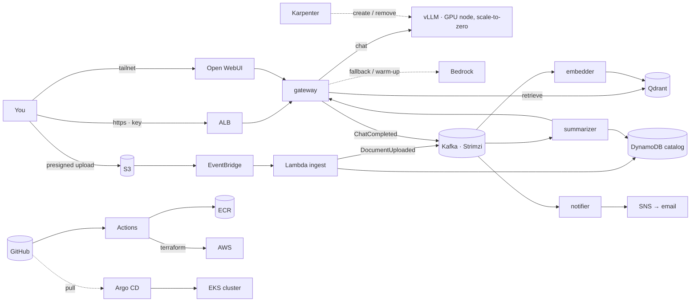

# PLAN — SteakLLM

A document-intelligence platform on AWS: drop a document in a bucket and it is ingested, indexed, summarized and tagged; chat over it from a browser; get alerted when a new document matches something you watch. Built as a portfolio project that a reviewer can rebuild from the README and defend in a design review.

Worked through with Claude under the teaching contract in `CLAUDE.md`: every step explained → shown → run → interpreted → checkpointed, one at a time. Tick boxes as we go. **Steps 1–2 are written in full; Steps 3–12 are architecture-level and get their full plan when we reach them.** Step 1 completed Aug 28 2026.

The earlier `../vllm_server/` project was the prototype. Nothing here depends on it; it can be torn down whenever we like.

---

## Decisions on record (Aug 28 2026)


| Question      | Decision                                                                                                                                                                                                                                                                        |
| ------------- | ------------------------------------------------------------------------------------------------------------------------------------------------------------------------------------------------------------------------------------------------------------------------------- |
| Cost posture  | Always-on small cluster, ~$100/mo idle target; GPU only on demand                                                                                                                                                                                                               |
| Product spine | Document intelligence (upload → index → summarize → alert → chat)                                                                                                                                                                                                           |
| Kafka's job   | Two logbooks:`documents` (pipeline events) and `chats` (usage events); each with independent consumer groups and replay                                                                                                                                                         |
| Lambda's job  | Event glue only: the S3 doorbell (validate · hash · record · produce) and the nightly GPU safety net. Never the model                                                                                                                                                        |
| The GPU       | Summoned by demand (Kafka lag or recent chats), removed after 15 idle minutes; Bedrock bridges the 3–5 minute cold start                                                                                                                                                       |
| Public door   | One: ALB + TLS + WAF in front of the gateway only, with a quota'd demo key. Everything else stays on the tailnet                                                                                                                                                                |
| Local dev LLM | Bedrock is the only local backend (the Mac has no NVIDIA GPU, so vLLM can't run there); a stub plays "vLLM is down" so the routing code is real from day one. vLLM itself arrives in the cluster at Step 9 with no service changes, because both speak the same OpenAI contract |

---

## The architecture in one page

**The story.** A user uploads a file through a presigned S3 URL. S3 tells EventBridge, EventBridge invokes the ingest Lambda, which validates the file, hashes it into a document ID, records `uploaded` in DynamoDB and writes one `DocumentUploaded` line into Kafka, then walks away. Three worker teams read that logbook at their own pace: the *embedder* chunks and embeds into Qdrant and writes `DocumentIndexed`; the *summarizer* asks the LLM (through the gateway, so it gets the same routing as chat) for a summary and tags, writes them to the catalog and emits `SummaryReady`; the *notifier* turns `SummaryReady` into an SNS alert when it matches the watch-list. Chat goes through a gateway that speaks the OpenAI contract and routes to vLLM on a GPU node that exists only while it's needed, or to Bedrock when it isn't. GitHub Actions tests, builds and scans every commit and runs Terraform; Argo CD keeps the cluster equal to the repo. The system map lives in `docs/system-map.html`.



**Routing policy (the gateway).** Every request asks "is vLLM healthy right now?" and routes on the answer; it never waits and never sticks. GPU off → Bedrock, and that request bumps the demand signal that summons the GPU. Warming → Bedrock. `/health` 200 → vLLM. Timeouts or errors → circuit breaker opens, Bedrock for a minute, then probe again. Every response carries `x-backend`. Switching mid-conversation is safe because the chat API is stateless. The summarizer, being asynchronous, waits for vLLM by default with a ten-minute maximum, then falls back to Bedrock (the `InsufficientInstanceCapacity` case, designed away).

**Security posture (the museum).** One public door: ALB with TLS and WAF, in front of the gateway only; nodes in private subnets; Grafana, Argo, Qdrant, Kafka and the Kubernetes API reachable only over the tailnet. Every request needs a key; the demo key is rate-limited per IP, token-capped per answer, capped per day, and can only search the demo collection. Each service wears its own IAM role; NetworkPolicies are default-deny. Uploads go through short-lived presigned URLs into a quarantine prefix; the bucket blocks public access. The public model has no tools and capped output. Budgets, per-key quotas, a one-node Karpenter cap and the nightly GPU kill put a lid on the wallet. ALB logs, gateway logs keyed by API key, and CloudTrail put every visitor on camera.

**Cost model (approximate, re-verify at execution).** EKS control plane ~$73/mo (cannot be paused). CPU node t4g.large ~$49 on-demand or ~$15–20 spot. ALB ~$16. NAT: ~$4 as an instance or ~$32 as a gateway. S3, ECR, DynamoDB, Lambda, EventBridge, SNS, Secrets Manager: ~$3–8. GPU g6.xlarge $0.81/hr only while summoned (each summon ≈ $0.07 of warm-up). Bedrock per token. Idle floor ≈ $100 with spot CPU node and NAT instance; ≈ $140 all on-demand.

**Every tool, its job, its rejected alternative.**


| Tool                                                           | Job                                                               | Alternative rejected                        |
| -------------------------------------------------------------- | ----------------------------------------------------------------- | ------------------------------------------- |
| Terraform                                                      | AWS from code: VPC, EKS, IAM, S3, DynamoDB, Lambda, Budgets       | Console clicks                              |
| GitHub Actions                                                 | CI: lint, test, build, scan, plan; CD for AWS via`apply` on merge | Jenkins                                     |
| Argo CD                                                        | CD for the cluster: cluster == git, pull-based, self-healing      | `kubectl apply` from CI                     |
| EKS                                                            | Place, heal, scale containers; schedule GPU pods                  | compose; k3s                                |
| Helm                                                           | Package manifests with per-environment values                     | Raw YAML                                    |
| Karpenter                                                      | Just-in-time GPU node, removed when empty                         | Managed node group + autoscaler             |
| KEDA                                                           | Turn demand (Kafka lag, recent chats) into replica counts         | HPA on CPU                                  |
| Kafka (Strimzi)                                                | Ordered, durable event log with independent readers and replay    | SQS (one reader, no replay); MSK (~$70+/mo) |
| Lambda                                                         | S3 doorbell; nightly GPU safety net                               | An always-running poller                    |
| EventBridge                                                    | Filtered routing of S3 events; schedules                          | S3 → Lambda direct                         |
| S3 / DynamoDB                                                  | Documents and weights; catalog and status                         | EBS; RDS                                    |
| Secrets Manager + ESO                                          | Secrets outside git and disk; rotation in one place               | `.env` files                                |
| IAM OIDC + Pod Identity                                        | Keyless CI; least-privilege hat per pod                           | Long-lived keys                             |
| ALB + ACM + WAF                                                | The one public door                                               | Tailnet-only; Cloudflare Tunnel             |
| Tailscale                                                      | The admin door                                                    | Bastion / VPN                               |
| Prometheus · Grafana · Alertmanager · Loki · OpenTelemetry | Numbers, charts, alerts, logs, traces                             | CloudWatch only                             |
| Bedrock                                                        | Serverless LLM: warm-up bridge, fallback, comparison              | GPU-off means chat-off                      |
| vLLM · Qdrant · TEI · Open WebUI                            | Inference engine, vectors, embeddings, chat UI                    | —                                          |

**Standing principles.** Contracts over components. Layered security, each layer testable. Config from durable places. Pin versions, then distrust the pin. Budgets before actions, dollars included. Cattle, not pets. Events are facts in the past tense. Idempotency everywhere (S3 and Kafka both deliver at-least-once). Cost follows demand, not the clock. Every tool has a written "why" and a named alternative.

**Codebase standards (what a reviewer expects; applied in the step that owns each).** Retry and dead-letter topics for every consumer (Step 6). Graceful shutdown on SIGTERM with offsets committed (6). A `DocumentDeleted` path that removes S3 object, vectors and catalog row (4, 6, 10). Backups and one restore drill: DynamoDB PITR, Qdrant snapshots, versioned state (10). Timeouts, retries and a circuit breaker in the gateway (6). Resource requests and limits, probes, non-root multi-stage Dockerfiles (6, 8). Lockfiles plus Renovate (3). `checkov` for Terraform and `kube-linter` for manifests in CI (3). JSON logs carrying document ID and trace ID (6). Two or three SLOs with panels (11). Upload size and type limits, per-key rate limits, OpenAPI spec (6, 8). A catalog page showing `uploaded → indexed → summarized` (6). `Makefile`, `.env.example`, `CONTRIBUTING.md`, PR template, `LICENSE`, per-environment Helm values (1, 8).

---

## Session ritual

**Start:** `git pull` → `pre-commit run --all-files` → (from Step 7) `kubectl get nodes` and Argo health → (from Step 9) confirm vLLM replicas are 0 unless working.
**End:** recap lessons → tick boxes here → commit and push → (from Step 9) vLLM replicas 0, GPU node gone → the meter is off.

---

## Step 1 — Set up the git repo (full plan)

*Goal: the project has a home on GitHub, a robot checks every commit for leaked secrets before it leaves the laptop, and the repo's shape already matches the architecture.*

*Concept. A repo is the source of truth for everything that follows: Terraform will build AWS from it, Argo will build the cluster from it, and the pipeline will only ever deploy what's in it. So the very first habits matter more than any file: nothing secret is ever committed (the prototype's key leak, made structurally impossible), `main` only changes through pull requests, and the directory layout tells a stranger where each concern lives.*

- [X]  **1.1 Project root.** Create the folder and work from it for the rest of the project.
  `mkdir -p ~/Everything/Project/SteakLLM/SteakLLM && cd ~/Everything/Project/SteakLLM/SteakLLM`
  *Done when:* `pwd` prints that path.
- [X]  **1.2 Tools on the Mac.** `git`, `aws`, `terraform` are already installed; add the rest.
  `brew install gh kubectl helm uv pre-commit gitleaks` then `brew install terraform-linters/tap/tflint`
  (TFLint left Homebrew's main catalog because part of its code is under HashiCorp's BUSL license; it lives in the maintainers' own tap now, like Terraform itself in `hashicorp/tap`. Homebrew installs nothing if one name in the list is unknown.)
  Install Docker Desktop or OrbStack (needed in Step 5).
  *Reading it:* each of `gh --version`, `kubectl version --client`, `helm version`, `uv --version`, `pre-commit --version`, `gitleaks version`, `tflint --version`, `docker --version` prints a version. Record them in `docs/field-notes.md` §1.
  *Done when:* all eight print a version.
- [X]  **1.3 GitHub identity.** Sign in from the terminal so `gh` can create repos and PRs for us.
  `gh auth login` (GitHub.com → HTTPS → login with browser).
  *Done when:* `gh auth status` shows your account, and `git config --global user.name` / `user.email` match it.
- [X]  **1.4 Initialize.** `main` from the first commit; no `master` rename later.
  `git init -b main`
  *Done when:* `git status` says "On branch main, No commits yet".
- [X]  **1.5 `.gitignore` before anything else.** The list is the prototype's incident log turned into a file:
  `*.tfstate`, `*.tfstate.*`, `.terraform/`, `*.tfvars` with `!*.example.tfvars`, `.env`, `.env.*` with `!.env.example`, `*.pem`, `*.key`, `.venv/`, `venv/`, `__pycache__/`, `*.pyc`, `.pytest_cache/`, `.DS_Store`, `.obsidian/`, `node_modules/`, `dist/`. Note what is deliberately *not* ignored: `.terraform.lock.hcl` is committed, because it pins provider versions (principle: pin, then distrust the pin).
  *Done when:* `git check-ignore -v terraform.tfstate .env secrets.pem` prints a matching rule for each.
- [X]  **1.6 Skeleton.** Directories mirror the architecture; each gets a one-line `README.md` saying what lives there.

  ```
  docs/{adr,runbooks,chaos}   infra/{bootstrap,network,eks,data,pipeline}
  platform/                   charts/
  services/{contracts,gateway,embedder,summarizer,notifier,ingest}
  compose/                    .github/{workflows,ISSUE_TEMPLATE}
  ```

  Root files: `README.md` (one-paragraph pitch + "work in progress"), `PLAN.md` (this file), `CLAUDE.md`, `LICENSE` (MIT), `Makefile` (targets `help`, `lint`, `test`, `up`, `down`, `demo` — stubs that echo "not yet"), `.env.example`, `.editorconfig`, `CONTRIBUTING.md` (the teaching loop in three lines), `.github/pull_request_template.md` (what changed · why · how tested · plan output attached?).
  *Done when:* `tree -L 2 -a -I .git` matches the layout above and `make help` lists the targets.
- [X]  **1.7 Pre-commit hooks.** The robot editor's first three checks, running on the laptop before a commit exists.
  `.pre-commit-config.yaml` with `gitleaks` (secret scan), `terraform_fmt` (from the `pre-commit-terraform` hooks), `ruff` and `ruff-format`, plus the standard `end-of-file-fixer` and `trailing-whitespace`.
  `pre-commit install && pre-commit run --all-files`
  *Reading it:* every hook reports `Passed` or `Skipped (no files to check)`.
  *Done when:* a deliberate test — write `AWS_SECRET_ACCESS_KEY=AKIA...` into a scratch file and try to commit it — is **blocked** by gitleaks; then delete the file.
- [X]  **1.8 Full-tree secret scan.** Belt and braces before the first push.
  `gitleaks detect --source . --verbose`
  *Done when:* "no leaks found".
- [X]  **1.9 First commit.**
  `git add -A && git commit -m "chore: repo skeleton, hooks, plan"`
  *Done when:* `git log --oneline` shows one commit and the hooks ran during it.
- [X]  **1.10 Create the GitHub repo and push.** Decide visibility now: branch protection on the free plan only works on **public** repos, and there is nothing secret in the tree (that's what 1.7 and 1.8 guarantee). Recommended: public from day one; the commit history becomes part of the portfolio.
  `gh repo create SteakLLM --public --source=. --remote=origin --push --description "Document intelligence on EKS: Kafka, Lambda, vLLM/Bedrock, GitOps"`
  *Done when:* `gh repo view --web` opens the repo with the skeleton and README visible.
- [X]  **1.11 Protect `main`.** Pull request required, at least one approval not required (solo), status checks required (we'll name them in Step 3), linear history, no force-push, no deletion.
  `gh api -X PUT repos/{owner}/SteakLLM/branches/main/protection --input protection.json` (we write the JSON together), or Settings → Branches in the UI.
  *Done when:* `git push origin main` with a direct commit is **rejected**, and the same change through a PR is accepted.
- [X]  **1.12 Prove the loop.** One tiny change (a word in the README) through the real path.
  `git switch -c chore/prove-the-loop` → edit → commit → `gh pr create --fill` → `gh pr merge --squash --delete-branch` → `git switch main && git pull`.
  *Done when:* the merge commit is on `main`, the branch is gone, and the hooks ran on the commit.
- [X]  **1.13 Renovate or Dependabot.** Turn on automated dependency PRs now, while the repo is empty, so every pin we add from here is watched from birth.
  `.github/dependabot.yml` covering `github-actions`, `pip` (uv), `docker`, `terraform`; weekly.
  *Done when:* the Dependabot tab shows the ecosystems enabled.
- [X]  **1.14 Field notes.** Open `docs/field-notes.md` with §1 setup snapshot (tool versions, repo URL) and an empty incident log.

**Step 1 done when:** the repo is on GitHub with the skeleton; hooks pass and a fake secret was proven to be blocked; `main` cannot be pushed directly and one PR has been merged; Dependabot is on; field notes exist. No AWS resource has been touched yet, and nothing costs money.

---

## Step 2 — Bootstrap AWS once, by hand (full plan)

*Goal: the pipeline gets the two things it cannot create for itself, a place to keep Terraform's state and an identity to borrow, plus the budget alarm that must exist before anything can spend. Cost of this step: pennies.*

*Concept. Terraform needs somewhere to remember what it built (state), and the pipeline needs an identity, but a pipeline with no identity can't create either. So one small module, `infra/bootstrap`, is applied once from the laptop with local state; then it moves its own state into the bucket it just made. From then on the laptop never applies again. The OIDC provider is the trust between GitHub and AWS: GitHub signs a short-lived token naming the repo and branch a job runs from, and AWS lends a role to jobs that match. Two roles: `plan` may read everything and take the state lock, from any branch or pull request; `apply` may change things, from `main` or the `production` environment only. ADR-0001 records why `apply` starts broad and how it will be narrowed.*

- [X]  **2.1 Preflight.** Who am I, which Terraform, what already exists.
  `aws sts get-caller-identity` · `terraform version` · `aws iam list-open-id-connect-providers` · `aws budgets describe-budgets --account-id "$(aws sts get-caller-identity --query Account --output text)" --query 'Budgets[].BudgetName'`
  *Reading it:* the identity is your own IAM user in the right account; Terraform is **1.10 or newer** (else `brew upgrade hashicorp/tap/terraform`); the OIDC list has no `token.actions.githubusercontent.com` entry (if it does, we import it rather than create a duplicate); the budget list shows what the prototype left behind, so the new one gets a distinct name.
  *Done when:* all four answered and noted in field notes §1.
- [X]  **2.2 The module.** Files in `infra/bootstrap/`: `versions.tf` (Terraform ≥ 1.10, providers pinned), `providers.tf` (region, default tags), `variables.tf`, `state-bucket.tf`, `github-oidc.tf`, `budgets.tf`, `outputs.tf`, `bootstrap.example.tfvars`. Copy the example to `terraform.tfvars` (git-ignored) and fill in `github_owner` and `budget_email`. Read each file together; every resource has a comment saying why it exists.
  *Done when:* `terraform fmt -check -recursive infra/bootstrap` prints nothing (formatted) and `terraform.tfvars` shows as ignored in `git status`.
- [X]  **2.3 Init, validate, plan.** From `infra/bootstrap/`:
  `terraform init` (downloads the two providers, writes `.terraform.lock.hcl`, which we commit) · `terraform validate` · `terraform plan -out=tfplan`
  *Reading it:* **13 to add, 0 to change, 0 to destroy**: `random_id`, the bucket and its four settings (versioning, encryption, public-access block, lifecycle), the OIDC provider, two roles, two policy attachments, one inline policy, one budget. Read the trust policies in the plan output: `aud` = `sts.amazonaws.com`, `sub` = `repo:<owner>/SteakLLM:*` for plan and the two exact subjects for apply.
  *Done when:* the count matches and the trust policies read as intended.
- [X]  **2.4 Apply and verify.**
  `terraform apply tfplan` → five outputs. Then prove each piece from outside Terraform:
  `aws s3api get-bucket-versioning --bucket "$(terraform output -raw tfstate_bucket)"` → `Enabled` · `aws iam get-role --role-name steakllm-ci-apply --query Role.AssumeRolePolicyDocument` → the two subjects · `aws budgets describe-budget --account-id <id> --budget-name steakllm-monthly --query 'Budget.BudgetLimit'` → `100 USD`.
  *Done when:* all three checks pass and the outputs are pasted into field notes §1 (the role ARNs and bucket name are not secrets).
- [X]  **2.5 Move the module's own state into the bucket.** Add `backend.tf` with the bucket name from the output, `key = "bootstrap/terraform.tfstate"`, `encrypt = true`, `use_lockfile = true`; then `terraform init -migrate-state` (answer `yes`) and `terraform plan`.
  *Reading it:* the plan says **No changes**; `aws s3 ls "s3://<bucket>/bootstrap/"` lists `terraform.tfstate`; the local `terraform.tfstate` is now empty and the `.backup` is git-ignored.
  *Done when:* state lives in S3 and the plan is clean.
- [X]  **2.6 Tell GitHub, and prove the trust.** Role ARNs and the bucket name are configuration, not secrets, so they go in as repository *variables*:
  `gh variable set AWS_REGION --body us-east-1` · `gh variable set TFSTATE_BUCKET --body "$(terraform output -raw tfstate_bucket)"` · `gh variable set AWS_PLAN_ROLE_ARN --body "$(terraform output -raw ci_plan_role_arn)"` · `gh variable set AWS_APPLY_ROLE_ARN --body "$(terraform output -raw ci_apply_role_arn)"`
  Add `.github/workflows/oidc-smoke.yml` (manual trigger; requests an OIDC token, assumes the plan role, prints the identity) and run it: `gh workflow run oidc-smoke.yml && gh run watch`.
  *Reading it:* the job's `get-caller-identity` shows `assumed-role/steakllm-ci-plan/...` and `gh secret list` prints **nothing**.
  *Done when:* the run is green with the assumed role visible, and the repo holds zero AWS secrets.
- [ ]  **2.7 Record it.** `docs/adr/0001-ci-identity.md` and `docs/adr/0002-terraform-state.md`; field notes §1 (bucket, role ARNs, account) and any incident; commit `infra/bootstrap/` with `.terraform.lock.hcl` through a PR.
  *Done when:* merged to `main`; this section ticked.

**Step 2 done when:** the bucket holds the bootstrap's own state; a GitHub workflow assumed the plan role with no stored key; the budget alarm exists; both ADRs are written; the laptop never needs to run `terraform apply` again.

---

## Steps 3–12 (architecture-level; each gets its full plan when we reach it)

- [ ]  **Step 3 — Build the CI/CD pipeline.** `ci.yml` on every push: `terraform fmt`/`validate`, `tflint`, `checkov`, `ruff`, `pytest`, `kube-linter`, `gitleaks`, Trivy. `plan.yml` on pull requests posts the Terraform plan as a comment. `apply.yml` on merge applies behind a GitHub Environment that waits for your approval. `release.yml` builds multi-arch images tagged with the git SHA, pushes them to ECR and bumps the tag in the Helm values (the commit Argo will later deploy). *Done when:* a pull request shows green checks and a plan comment, and the first real change (the ECR repositories the release workflow needs) was applied by the pipeline, not by hand.
- [ ]  **Step 4 — Write the event contracts.** `services/contracts`: a common envelope (`id`, `type`, `version`, `time`, `doc_id`, `trace_id`, `source`) and five events, `DocumentUploaded`, `DocumentIndexed`, `SummaryReady`, `DocumentDeleted`, `ChatCompleted`, as JSON schemas with a compatibility test (version 1 fields never change meaning). The idempotency rules are written down here: document ID is the sha256 of the bytes; Qdrant point ID is hash(doc_id, chunk index); every consumer must be safe to run twice. *Done when:* schemas validate, the compatibility test runs in CI, and the folder README explains the rules in plain words.
- [ ]  **Step 5 — Build the local dev stack.** `compose/`: single-node Kafka (KRaft), MinIO standing in for S3, DynamoDB Local, Qdrant, TEI with a small CPU embedding model, Open WebUI, and Bedrock as the gateway's LLM backend (the Mac can't run vLLM), with a stub backend that plays "vLLM is down" so the health-check, fallback and circuit-breaker code is exercised locally. `make up`, `make demo` (drops a sample PDF), `make down`. *Done when:* the stack boots on the Mac and a demo file flows from MinIO to a searchable, summarized document.
- [ ]  **Step 6 — Build the five services, locally, with tests.** The gateway (FastAPI: OpenAI `/v1` with `llm` and `docs` models, the routing policy with health checks and a circuit breaker, per-key quotas, presigned uploads, the catalog page, OpenAPI), the embedder, the summarizer, the notifier, and the ingest function (one module, Lambda handler plus local runner). Each with a multi-stage non-root Dockerfile, probes, JSON logs carrying document and trace IDs, retry and dead-letter topics, graceful shutdown, and unit plus integration tests in CI. The delete path is implemented here. First chaos drill: kill the embedder mid-batch, restart, no duplicates. *Done when:* drop a file → searchable and summarized within 60 s locally, the drill passes and is written up, and images are in ECR.
- [ ]  **Step 7 — Build the network and the cluster with Terraform.** VPC across two AZs with private subnets for nodes, the NAT decision (instance vs gateway) recorded as an ADR, free gateway endpoints for S3 and DynamoDB; EKS with one always-on CPU node group (t4g.large) and the core add-ons; Argo CD installed by Terraform and pointed at `platform/`. Every resource tagged `Project=steakllm`. Then the drill: `terraform destroy` and `apply`, timed. *Done when:* one node is Ready, Argo is synced, the rebuild time is recorded, and the budget alarm has not fired.
- [ ]  **Step 8 — Deploy the platform services by GitOps.** Merging YAML into `platform/` brings up kube-prometheus-stack, Loki, Strimzi with the `documents` and `chats` topics plus retry and dead-letter topics, Qdrant, TEI, Open WebUI, External Secrets bound to Secrets Manager, Pod Identity roles per service, the ALB with ACM and WAF in front of the gateway only, the Tailscale operator for Grafana and Argo, and default-deny NetworkPolicies. *Done when:* everything is Synced and Healthy, a forbidden network path is proven blocked, `https://<domain>/healthz` answers and Grafana does not answer from the internet.
- [ ]  **Step 9 — Add the GPU pool with Karpenter and move vLLM in.** A Karpenter NodePool limited to one g6.xlarge with a GPU taint, the NVIDIA device plugin, model weights mirrored in S3 (no NAT egress per cold start), the vLLM chart at zero replicas, and KEDA scaling it on Kafka lag or recent chats with a fifteen-minute idle scale-down. The nightly Lambda terminates any GPU that survives. The prototype instance can be destroyed once this works. *Done when:* summon-to-`/health` 200 is under eight minutes with no clicks, idle removes the node, and the load-test table is recorded.
- [ ]  **Step 10 — Wire the cloud event pipeline and run the drills.** The documents bucket (public access blocked, quarantine prefix, lifecycle rules, EventBridge notifications), the ingest Lambda in the VPC with a dead-letter queue, DynamoDB with point-in-time recovery, SNS with your email subscribed, and the workers deployed by Argo. Then the drills, each written up in `docs/chaos/`: kill the embedder mid-batch, delete the Kafka broker pod, disable the Lambda during uploads, replay the log to rebuild Qdrant from nothing, exercise the delete path, and restore the catalog from a backup. *Done when:* upload → searchable and a summary email in under 90 s, and all six drills pass.
- [ ]  **Step 11 — Bedrock fallback, tracing, alerts and the cost dashboard.** Bedrock model access and the gateway's role; the routing policy live with `x-backend` on every response; `ChatCompleted` feeding a usage and cost dashboard (tokens per GPU-hour and $/Mtok beside Bedrock's price); OpenTelemetry traces propagated through Kafka headers; Alertmanager rules with a runbook each; the SLOs written down with a panel each; a nightly eval job over a fixed question set on both backends. *Done when:* with the GPU at zero chat still answers via Bedrock and the dashboard shows the split, one trace spans upload to summary, and every alert has a runbook.
- [ ]  **Step 12 — Polish for the portfolio.** README with the pitch, the system map, the tool table, the cost table, a demo GIF, rebuild instructions and the drill results; ADRs for every "why" (Kafka vs SQS, EKS vs k3s, Strimzi vs MSK, NAT instance vs gateway, Karpenter vs node groups, Lambda vs in-cluster ingest, DynamoDB vs Postgres, ALB vs tailnet-only, create/destroy vs stop/start GPU); demo mode on the public door with the quota'd key and the demo collection; a five-minute walkthrough; `docs/design-review.md` with the twenty questions a reviewer will ask. *Done when:* a stranger can understand and rebuild the system from the README and try the demo without being able to spend your money.

---

## Stretch (pick by curiosity)

- [ ]  Batch job queue: a `jobs` topic with paced workers (backpressure against the single GPU)
- [ ]  Spot GPU node with interruption handling (two-minute warning → drain → Bedrock takes over)
- [ ]  Kafka with three brokers across AZs, `min.insync.replicas=2`
- [ ]  Bedrock Knowledge Bases vs our pipeline on the same documents
- [ ]  LiteLLM in front of the gateway for per-team keys and rate limits
- [ ]  Big-metal session: DeepSeek V4-Flash on rented H200s, served through the same gateway as `model=flash`
