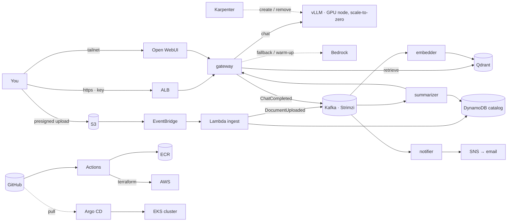

# PLAN — SteakLLM

A document-intelligence platform on AWS: drop a document in a bucket and it is ingested, indexed, summarized and tagged; chat over it from a browser; get alerted when a new document matches something you watch. Built as a portfolio project that a reviewer can rebuild from the README and defend in a design review.

Worked through with Claude under the teaching contract in `CLAUDE.md`: every step explained → shown → run → interpreted → checkpointed, one at a time. Tick boxes as we go. **Steps 1–2 are written in full; Steps 3–12 are architecture-level and get their full plan when we reach them.** Step 1 completed Aug 28 2026.

The earlier `../vllm_server/` project was the prototype. Nothing here depends on it; it can be torn down whenever we like.

---

## Decisions on record (Aug 28 2026)


| Question      | Decision                                                                                                                                                                                                                                                                        |
| ------------- | ------------------------------------------------------------------------------------------------------------------------------------------------------------------------------------------------------------------------------------------------------------------------------- |
| Cost posture  | **Amended Sep 3 2026 (Thomas): the cluster runs only while we develop.** Designed as always-on (~$100/mo idle); from Step 7's end, `eks` is removed at the end of every session and rebuilt at the start (Step 8.11 makes that two make targets, ~15 min down / ~25 min up). The network ($0.22/day) stays. Revisit at Step 12 for the demo. GPU only on demand, unchanged |

| Product spine | Document intelligence (upload → index → summarize → alert → chat)                                                                                                                                                                                                           |
| Kafka's job   | Two logbooks:`documents` (pipeline events) and `chats` (usage events); each with independent consumer groups and replay                                                                                                                                                         |
| Lambda's job  | Event glue only: the S3 doorbell (validate · hash · record · produce) and the nightly GPU safety net. Never the model                                                                                                                                                        |
| The GPU       | Summoned by demand (Kafka lag or recent chats), removed after 15 idle minutes; Bedrock bridges the 3–5 minute cold start                                                                                                                                                       |
| Public door   | One: ALB + TLS + WAF in front of the gateway only, with a quota'd demo key. Everything else stays on the tailnet. **Amended Sep 3 2026 (Thomas): the public door, its domain, certificate and WAF are deferred to Step 12; until then the gateway too is reached only over the tailnet, and no load balancer exists**                                                                                                                                                                |
| Embeddings    | **Ollama** serves the embedding model (`all-minilm`, 384-dim — the model the local stack has used since Step 5; `bge-small` was the original pick and stays a Step 11 evaluation candidate) both locally and in the cluster, behind the OpenAI `/v1/embeddings` contract. TEI publishes no arm64 image and the always-on node is Graviton (Step 5.1); the contract is the API, so the server stays swappable (ADR-0005) |
| Local dev LLM | Bedrock is the only local backend (the Mac has no NVIDIA GPU, so vLLM can't run there); a stub plays "vLLM is down" so the routing code is real from day one. vLLM itself arrives in the cluster at Step 9 with no service changes, because both speak the same OpenAI contract |

---

## The architecture in one page

**The story.** A user uploads a file through a presigned S3 URL. S3 tells EventBridge, EventBridge invokes the ingest Lambda, which validates the file, hashes it into a document ID, records `uploaded` in DynamoDB and writes one `DocumentUploaded` line into Kafka, then walks away. Three worker teams read that logbook at their own pace: the *embedder* chunks and embeds into Qdrant and writes `DocumentIndexed`; the *summarizer* asks the LLM (through the gateway, so it gets the same routing as chat) for a summary and tags, writes them to the catalog and emits `SummaryReady`; the *notifier* turns `SummaryReady` into an SNS alert when it matches the watch-list. Chat goes through a gateway that speaks the OpenAI contract and routes to vLLM on a GPU node that exists only while it's needed, or to Bedrock when it isn't. GitHub Actions tests, builds and scans every commit and runs Terraform; Argo CD keeps the cluster equal to the repo. The system map lives in `docs/system-map.html`.



**Routing policy (the gateway).** Every request asks "is vLLM healthy right now?" and routes on the answer; it never waits and never sticks. GPU off → Bedrock, and that request bumps the demand signal that summons the GPU. Warming → Bedrock. `/health` 200 → vLLM. Timeouts or errors → circuit breaker opens, Bedrock for a minute, then probe again. Every response carries `x-backend`. Switching mid-conversation is safe because the chat API is stateless. The summarizer, being asynchronous, waits for vLLM by default with a ten-minute maximum, then falls back to Bedrock (the `InsufficientInstanceCapacity` case, designed away).

**Security posture (the museum).** One public door: ALB with TLS and WAF, in front of the gateway only; nodes in private subnets; Grafana, Argo, Qdrant, Kafka and the Kubernetes API reachable only over the tailnet. Every request needs a key; the demo key is rate-limited per IP, token-capped per answer, capped per day, and can only search the demo collection. Each service wears its own IAM role; NetworkPolicies are default-deny. Uploads go through short-lived presigned URLs into a quarantine prefix; the bucket blocks public access. The public model has no tools and capped output. Budgets, per-key quotas, a one-node Karpenter cap and the nightly GPU kill put a lid on the wallet. ALB logs, gateway logs keyed by API key, and CloudTrail put every visitor on camera.

**Cost model (approximate, re-verify at execution).** EKS control plane ~$73/mo (cannot be paused). CPU node t4g.large ~$49 on-demand or ~$15–20 spot. ALB ~$16. NAT: ~$4 as an instance or ~$32 as a gateway. S3, ECR, DynamoDB, Lambda, EventBridge, SNS, Secrets Manager: ~$3–8. GPU g6.xlarge $0.81/hr only while summoned (each summon ≈ $0.07 of warm-up). Bedrock per token. Idle floor ≈ $100 with spot CPU node and NAT instance; ≈ $140 all on-demand.

**Every tool, its job, its rejected alternative.**


| Tool                                                           | Job                                                               | Alternative rejected                        |
| -------------------------------------------------------------- | ----------------------------------------------------------------- | ------------------------------------------- |
| Terraform                                                      | AWS from code: VPC, EKS, IAM, S3, DynamoDB, Lambda, Budgets       | Console clicks                              |
| GitHub Actions                                                 | CI: lint, test, build, scan, plan; CD for AWS via`apply` on merge | Jenkins                                     |
| Argo CD                                                        | CD for the cluster: cluster == git, pull-based, self-healing      | `kubectl apply` from CI                     |
| EKS                                                            | Place, heal, scale containers; schedule GPU pods                  | compose; k3s                                |
| Helm                                                           | Package manifests with per-environment values                     | Raw YAML                                    |
| Karpenter                                                      | Just-in-time GPU node, removed when empty                         | Managed node group + autoscaler             |
| KEDA                                                           | Turn demand (Kafka lag, recent chats) into replica counts         | HPA on CPU                                  |
| Kafka (Strimzi)                                                | Ordered, durable event log with independent readers and replay    | SQS (one reader, no replay); MSK (~$70+/mo) |
| Lambda                                                         | S3 doorbell; nightly GPU safety net                               | An always-running poller                    |
| EventBridge                                                    | Filtered routing of S3 events; schedules                          | S3 → Lambda direct                         |
| S3 / DynamoDB                                                  | Documents and weights; catalog and status                         | EBS; RDS                                    |
| Secrets Manager + ESO                                          | Secrets outside git and disk; rotation in one place               | `.env` files                                |
| IAM OIDC + Pod Identity                                        | Keyless CI; least-privilege hat per pod                           | Long-lived keys                             |
| ALB + ACM + WAF                                                | The one public door                                               | Tailnet-only; Cloudflare Tunnel             |
| Tailscale                                                      | The admin door                                                    | Bastion / VPN                               |
| Prometheus · Grafana · Alertmanager · Loki · OpenTelemetry | Numbers, charts, alerts, logs, traces                             | CloudWatch only                             |
| Bedrock                                                        | Serverless LLM: warm-up bridge, fallback, comparison              | GPU-off means chat-off                      |
| vLLM · Qdrant · Ollama · Open WebUI                         | Inference engine, vectors, embeddings (behind `/v1/embeddings`), chat UI | TEI: no arm64 image (ADR-0005)             |

**Standing principles.** Contracts over components. Layered security, each layer testable. Config from durable places. Pin versions, then distrust the pin. Budgets before actions, dollars included. Cattle, not pets. Events are facts in the past tense. Idempotency everywhere (S3 and Kafka both deliver at-least-once). Cost follows demand, not the clock. Every tool has a written "why" and a named alternative.

**Codebase standards (what a reviewer expects; applied in the step that owns each).** Retry and dead-letter topics for every consumer (Step 6). Graceful shutdown on SIGTERM with offsets committed (6). A `DocumentDeleted` path that removes S3 object, vectors and catalog row (4, 6, 10). Backups and one restore drill: DynamoDB PITR, Qdrant snapshots, versioned state (10). Timeouts, retries and a circuit breaker in the gateway (6). Resource requests and limits, probes, non-root multi-stage Dockerfiles (6, 8). Lockfiles plus Renovate (3). `checkov` for Terraform and `kube-linter` for manifests in CI (3). JSON logs carrying document ID and trace ID (6). Two or three SLOs with panels (11). Upload size and type limits, per-key rate limits, OpenAPI spec (6, 8). A catalog page showing `uploaded → indexed → summarized` (6). `Makefile`, `.env.example`, `CONTRIBUTING.md`, PR template, `LICENSE`, per-environment Helm values (1, 8).

---

## Session ritual

**Start:** `git pull` → `pre-commit run --all-files` → (from Step 7, dev-time posture) if the cluster is down: `gh workflow run apply.yml`, approve the gates, `aws eks update-kubeconfig`, the Argo bootstrap (see `platform/README.md`) — `make cluster-up` from 8.11 — then `kubectl get nodes` and Argo health → (from Step 9) confirm vLLM replicas are 0 unless working.
**End:** recap lessons → tick boxes here → commit and push → (from Step 7, dev-time posture) `gh workflow run teardown.yml -f module=eks -f confirm=eks` and approve (from 8.11: `make cluster-down`, which first removes the ALB), confirm `aws eks describe-cluster` says not found and `aws elbv2 describe-load-balancers` is empty → (from Step 9) vLLM replicas 0, GPU node gone → the meter is off but for the network's $0.22/day.

---

## Step 1 — Set up the git repo (full plan)

*Goal: the project has a home on GitHub, a robot checks every commit for leaked secrets before it leaves the laptop, and the repo's shape already matches the architecture.*

*Concept. A repo is the source of truth for everything that follows: Terraform will build AWS from it, Argo will build the cluster from it, and the pipeline will only ever deploy what's in it. So the very first habits matter more than any file: nothing secret is ever committed (the prototype's key leak, made structurally impossible), `main` only changes through pull requests, and the directory layout tells a stranger where each concern lives.*

- [X]  **1.1 Project root.** Create the folder and work from it for the rest of the project.
  `mkdir -p ~/Everything/Project/SteakLLM/SteakLLM && cd ~/Everything/Project/SteakLLM/SteakLLM`
  *Done when:* `pwd` prints that path.
- [X]  **1.2 Tools on the Mac.** `git`, `aws`, `terraform` are already installed; add the rest.
  `brew install gh kubectl helm uv pre-commit gitleaks` then `brew install terraform-linters/tap/tflint`
  (TFLint left Homebrew's main catalog because part of its code is under HashiCorp's BUSL license; it lives in the maintainers' own tap now, like Terraform itself in `hashicorp/tap`. Homebrew installs nothing if one name in the list is unknown.)
  Install Docker Desktop or OrbStack (needed in Step 5).
  *Reading it:* each of `gh --version`, `kubectl version --client`, `helm version`, `uv --version`, `pre-commit --version`, `gitleaks version`, `tflint --version`, `docker --version` prints a version. Record them in `docs/field-notes.md` §1.
  *Done when:* all eight print a version.
- [X]  **1.3 GitHub identity.** Sign in from the terminal so `gh` can create repos and PRs for us.
  `gh auth login` (GitHub.com → HTTPS → login with browser).
  *Done when:* `gh auth status` shows your account, and `git config --global user.name` / `user.email` match it.
- [X]  **1.4 Initialize.** `main` from the first commit; no `master` rename later.
  `git init -b main`
  *Done when:* `git status` says "On branch main, No commits yet".
- [X]  **1.5 `.gitignore` before anything else.** The list is the prototype's incident log turned into a file:
  `*.tfstate`, `*.tfstate.*`, `.terraform/`, `*.tfvars` with `!*.example.tfvars`, `.env`, `.env.*` with `!.env.example`, `*.pem`, `*.key`, `.venv/`, `venv/`, `__pycache__/`, `*.pyc`, `.pytest_cache/`, `.DS_Store`, `.obsidian/`, `node_modules/`, `dist/`. Note what is deliberately *not* ignored: `.terraform.lock.hcl` is committed, because it pins provider versions (principle: pin, then distrust the pin).
  *Done when:* `git check-ignore -v terraform.tfstate .env secrets.pem` prints a matching rule for each.
- [X]  **1.6 Skeleton.** Directories mirror the architecture; each gets a one-line `README.md` saying what lives there.

  ```
  docs/{adr,runbooks,chaos}   infra/{bootstrap,network,eks,data,pipeline}
  platform/                   charts/
  services/{contracts,gateway,embedder,summarizer,notifier,ingest}
  compose/                    .github/{workflows,ISSUE_TEMPLATE}
  ```

  Root files: `README.md` (one-paragraph pitch + "work in progress"), `PLAN.md` (this file), `CLAUDE.md`, `LICENSE` (MIT), `Makefile` (targets `help`, `lint`, `test`, `up`, `down`, `demo` — stubs that echo "not yet"), `.env.example`, `.editorconfig`, `CONTRIBUTING.md` (the teaching loop in three lines), `.github/pull_request_template.md` (what changed · why · how tested · plan output attached?).
  *Done when:* `tree -L 2 -a -I .git` matches the layout above and `make help` lists the targets.
- [X]  **1.7 Pre-commit hooks.** The robot editor's first three checks, running on the laptop before a commit exists.
  `.pre-commit-config.yaml` with `gitleaks` (secret scan), `terraform_fmt` (from the `pre-commit-terraform` hooks), `ruff` and `ruff-format`, plus the standard `end-of-file-fixer` and `trailing-whitespace`.
  `pre-commit install && pre-commit run --all-files`
  *Reading it:* every hook reports `Passed` or `Skipped (no files to check)`.
  *Done when:* a deliberate test — write `AWS_SECRET_ACCESS_KEY=AKIA...` into a scratch file and try to commit it — is **blocked** by gitleaks; then delete the file.
- [X]  **1.8 Full-tree secret scan.** Belt and braces before the first push.
  `gitleaks detect --source . --verbose`
  *Done when:* "no leaks found".
- [X]  **1.9 First commit.**
  `git add -A && git commit -m "chore: repo skeleton, hooks, plan"`
  *Done when:* `git log --oneline` shows one commit and the hooks ran during it.
- [X]  **1.10 Create the GitHub repo and push.** Decide visibility now: branch protection on the free plan only works on **public** repos, and there is nothing secret in the tree (that's what 1.7 and 1.8 guarantee). Recommended: public from day one; the commit history becomes part of the portfolio.
  `gh repo create SteakLLM --public --source=. --remote=origin --push --description "Document intelligence on EKS: Kafka, Lambda, vLLM/Bedrock, GitOps"`
  *Done when:* `gh repo view --web` opens the repo with the skeleton and README visible.
- [X]  **1.11 Protect `main`.** Pull request required, at least one approval not required (solo), status checks required (we'll name them in Step 3), linear history, no force-push, no deletion.
  `gh api -X PUT repos/{owner}/SteakLLM/branches/main/protection --input protection.json` (we write the JSON together), or Settings → Branches in the UI.
  *Done when:* `git push origin main` with a direct commit is **rejected**, and the same change through a PR is accepted.
- [X]  **1.12 Prove the loop.** One tiny change (a word in the README) through the real path.
  `git switch -c chore/prove-the-loop` → edit → commit → `gh pr create --fill` → `gh pr merge --squash --delete-branch` → `git switch main && git pull`.
  *Done when:* the merge commit is on `main`, the branch is gone, and the hooks ran on the commit.
- [X]  **1.13 Renovate or Dependabot.** Turn on automated dependency PRs now, while the repo is empty, so every pin we add from here is watched from birth.
  `.github/dependabot.yml` covering `github-actions`, `pip` (uv), `docker`, `terraform`; weekly.
  *Done when:* the Dependabot tab shows the ecosystems enabled.
- [X]  **1.14 Field notes.** Open `docs/field-notes.md` with §1 setup snapshot (tool versions, repo URL) and an empty incident log.

**Step 1 done when:** the repo is on GitHub with the skeleton; hooks pass and a fake secret was proven to be blocked; `main` cannot be pushed directly and one PR has been merged; Dependabot is on; field notes exist. No AWS resource has been touched yet, and nothing costs money.

---

## Step 2 — Bootstrap AWS once, by hand (full plan)

*Goal: the pipeline gets the two things it cannot create for itself, a place to keep Terraform's state and an identity to borrow, plus the budget alarm that must exist before anything can spend. Cost of this step: pennies.*

*Concept. Terraform needs somewhere to remember what it built (state), and the pipeline needs an identity, but a pipeline with no identity can't create either. So one small module, `infra/bootstrap`, is applied once from the laptop with local state; then it moves its own state into the bucket it just made. From then on the laptop never applies again. The OIDC provider is the trust between GitHub and AWS: GitHub signs a short-lived token naming the repo and branch a job runs from, and AWS lends a role to jobs that match. Two roles: `plan` may read everything and take the state lock, from any branch or pull request; `apply` may change things, from `main` or the `production` environment only. ADR-0001 records why `apply` starts broad and how it will be narrowed.*

- [X]  **2.1 Preflight.** Who am I, which Terraform, what already exists.
  `aws sts get-caller-identity` · `terraform version` · `aws iam list-open-id-connect-providers` · `aws budgets describe-budgets --account-id "$(aws sts get-caller-identity --query Account --output text)" --query 'Budgets[].BudgetName'`
  *Reading it:* the identity is your own IAM user in the right account; Terraform is **1.10 or newer** (else `brew upgrade hashicorp/tap/terraform`); the OIDC list has no `token.actions.githubusercontent.com` entry (if it does, we import it rather than create a duplicate); the budget list shows what the prototype left behind, so the new one gets a distinct name.
  *Done when:* all four answered and noted in field notes §1.
- [X]  **2.2 The module.** Files in `infra/bootstrap/`: `versions.tf` (Terraform ≥ 1.10, providers pinned), `providers.tf` (region, default tags), `variables.tf`, `state-bucket.tf`, `github-oidc.tf`, `budgets.tf`, `outputs.tf`, `bootstrap.example.tfvars`. Copy the example to `terraform.tfvars` (git-ignored) and fill in `github_owner` and `budget_email`. Read each file together; every resource has a comment saying why it exists.
  *Done when:* `terraform fmt -check -recursive infra/bootstrap` prints nothing (formatted) and `terraform.tfvars` shows as ignored in `git status`.
- [X]  **2.3 Init, validate, plan.** From `infra/bootstrap/`:
  `terraform init` (downloads the two providers, writes `.terraform.lock.hcl`, which we commit) · `terraform validate` · `terraform plan -out=tfplan`
  *Reading it:* **13 to add, 0 to change, 0 to destroy**: `random_id`, the bucket and its four settings (versioning, encryption, public-access block, lifecycle), the OIDC provider, two roles, two policy attachments, one inline policy, one budget. Read the trust policies in the plan output: `aud` = `sts.amazonaws.com`, `sub` = `repo:<owner>/SteakLLM:*` for plan and the two exact subjects for apply.
  *Done when:* the count matches and the trust policies read as intended.
- [X]  **2.4 Apply and verify.**
  `terraform apply tfplan` → five outputs. Then prove each piece from outside Terraform:
  `aws s3api get-bucket-versioning --bucket "$(terraform output -raw tfstate_bucket)"` → `Enabled` · `aws iam get-role --role-name steakllm-ci-apply --query Role.AssumeRolePolicyDocument` → the two subjects · `aws budgets describe-budget --account-id <id> --budget-name steakllm-monthly --query 'Budget.BudgetLimit'` → `100 USD`.
  *Done when:* all three checks pass and the outputs are pasted into field notes §1 (the role ARNs and bucket name are not secrets).
- [X]  **2.5 Move the module's own state into the bucket.** Add `backend.tf` with the bucket name from the output, `key = "bootstrap/terraform.tfstate"`, `encrypt = true`, `use_lockfile = true`; then `terraform init -migrate-state` (answer `yes`) and `terraform plan`.
  *Reading it:* the plan says **No changes**; `aws s3 ls "s3://<bucket>/bootstrap/"` lists `terraform.tfstate`; the local `terraform.tfstate` is now empty and the `.backup` is git-ignored.
  *Done when:* state lives in S3 and the plan is clean.
- [X]  **2.6 Tell GitHub, and prove the trust.** Role ARNs and the bucket name are configuration, not secrets, so they go in as repository *variables*:
  `gh variable set AWS_REGION --body us-east-1` · `gh variable set TFSTATE_BUCKET --body "$(terraform output -raw tfstate_bucket)"` · `gh variable set AWS_PLAN_ROLE_ARN --body "$(terraform output -raw ci_plan_role_arn)"` · `gh variable set AWS_APPLY_ROLE_ARN --body "$(terraform output -raw ci_apply_role_arn)"`
  Add `.github/workflows/oidc-smoke.yml` (manual trigger; requests an OIDC token, assumes the plan role, prints the identity) and run it: `gh workflow run oidc-smoke.yml && gh run watch`.
  *Reading it:* the job's `get-caller-identity` shows `assumed-role/steakllm-ci-plan/...` and `gh secret list` prints **nothing**.
  *Done when:* the run is green with the assumed role visible, and the repo holds zero AWS secrets.
- [X]  **2.7 Record it.** `docs/adr/0001-ci-identity.md` and `docs/adr/0002-terraform-state.md`; field notes §1 (bucket, role ARNs, account) and any incident; commit `infra/bootstrap/` with `.terraform.lock.hcl` through a PR.
  *Done when:* merged to `main`; this section ticked.

**Step 2 done when:** the bucket holds the bootstrap's own state; a GitHub workflow assumed the plan role with no stored key; the budget alarm exists; both ADRs are written; the laptop never needs to run `terraform apply` again.

---

## Step 3 — Build the CI/CD pipeline (full plan)

*Goal: from here on, every change is tested by robots before merge, and every infrastructure change is applied by the pipeline, never the laptop. The proof at the end: the ECR repositories arrive on `main` through a PR and are created in AWS by the `apply` role — the first real resources we never touch by hand.*

*Concept. Three workflows, one per question. `ci.yml` answers "is this commit healthy?" — the same checks pre-commit runs on the laptop, plus slower ones, on every push, so nothing depends on any laptop being set up. `plan.yml` answers "what would this PR do to AWS?" — it assumes the read-only plan role and posts the Terraform diff as a PR comment, so the reviewer reads code *and* consequences. `apply.yml` answers "make it so" — on merge to `main` it assumes the apply role, but only after pausing inside a GitHub Environment that waits for a human click; that click is the second key on the nuclear lock, and the `environment:production` OIDC subject means the apply role literally cannot be borrowed without it. Checks that need code we haven't written yet (pytest — Step 6, kube-linter — Step 8, Trivy — Step 6) join `ci.yml` in their own steps; `release.yml` (build and push service images) moves to Step 6 with the services themselves — a build workflow with nothing to build proves nothing. Cost: $0 in AWS; GitHub Actions on a private repo has 2,000 free minutes/month, our runs are minutes-long, and the budget alarm guards the rest.*

- [X]  **3.1 Preflight.** What the pipeline inherits: which workflows exist, what branch protection currently requires (from 1.11: `status_checks: null`), which OIDC subjects the roles trust (from 2.6: both name and ID forms), and that `gh secret list` is still empty.
  `ls .github/workflows` · `gh api repos/{owner}/SteakLLM/branches/main/protection --jq .required_status_checks` · `aws iam get-role --role-name steakllm-ci-plan --query 'Role.AssumeRolePolicyDocument.Statement[0].Condition'` · `gh secret list`
  *Done when:* all four answered and consistent with Steps 1–2's records.
- [X]  **3.2 `ci.yml` — the hygiene gate.** On every push and PR, jobs in parallel, each named so 3.3 can require them: **`gitleaks`** (full history, catches what a laptop without hooks pushed), **`terraform`** (`fmt -check -recursive`, then per-module `init -backend=false` + `validate` — no AWS access needed, so no role assumed), **`tflint`** (rules the compiler doesn't have: deprecated syntax, wrong instance types), **`checkov`** (static security scan of Terraform: public buckets, open security groups, missing encryption), **`ruff`** (lint + format check on all Python, today just the guard hook). Pin every action by version; Dependabot watches the pins from birth (1.13).
  *Done when:* the PR that adds `ci.yml` shows all five jobs green on itself.
- [X]  **3.3 Require the checks.** Update branch protection: the five job names become `required_status_checks` (strict mode: branch must be up to date with `main` before merge). From now on red X = unmergeable, the laptop hooks become a convenience, and CI is the enforcement.
  `gh api -X PATCH repos/{owner}/SteakLLM/branches/main/protection/required_status_checks --input -`
  *Done when:* a PR with a deliberately unformatted `.tf` file is blocked from merging, and fixing it unblocks it. Delete the test branch after.
- [X]  **3.4 `plan.yml` — consequences on every PR.** On `pull_request` touching `infra/**`: OIDC → `steakllm-ci-plan` (this is the first *real* use of 2.6's smoke-tested trust), `terraform init` against the S3 backend (the role's inline policy allows exactly this: read state, take the lock), `terraform plan -no-color`, and post the plan as a sticky PR comment (updated in place on each push, not appended). Matrix over `infra/*` modules — today only `bootstrap`.
  *Done when:* a no-op PR touching `infra/` shows a comment containing "No changes."
- [X]  **3.5 The `production` environment — the human gate.** Create GitHub Environment `production` with yourself as required reviewer. Jobs that reference it pause until approved, and — the part that makes it security rather than ceremony — their OIDC token's subject becomes `environment:production`, which is what the apply role's trust policy has been waiting for since 2.4. No approval, no matching subject, no credentials.
  `gh api -X PUT repos/{owner}/SteakLLM/environments/production --input -` (reviewer = your user id)
  *Done when:* the environment exists with one required reviewer shown in Settings → Environments.
- [X]  **3.6 `apply.yml` — make it so.** On `push` to `main` touching `infra/**`: job pinned to `environment: production`, OIDC → `steakllm-ci-apply`, `terraform plan -out=tfplan` then `terraform apply tfplan` (plan and apply in one job so what's applied is exactly what was just planned against post-merge state). Concurrency group per module so two merges queue instead of racing for the state lock.
  *Done when:* the workflow exists on `main`; its first real run is 3.8.
- [X]  **3.7 The first pipeline-managed module: `infra/ecr`.** Terraform for the five image repositories (`gateway`, `embedder`, `summarizer`, `notifier`, `ingest`): scan-on-push, lifecycle policy keeping the last ~10 images (untagged expire after 7 days — image storage is billable, ~$0.10/GB/mo), immutable tags. Own state key `ecr/terraform.tfstate` in the same bucket. Written on a branch, **never applied from the laptop**.
  *Done when:* the PR shows five green checks and a plan comment reading **10 to add** (5 repositories + 5 lifecycle policies).
- [X]  **3.8 Merge, approve, verify.** Merge the PR → `apply.yml` starts → pauses at `production` → you approve → apply runs as `steakllm-ci-apply`. Then prove it from outside: `aws ecr describe-repositories --query 'repositories[].repositoryName'` shows the five, and the CloudTrail event for `CreateRepository` names the assumed role, not your user.
  *Done when:* five repositories exist, created by the role; the laptop ran nothing but read commands.
- [X]  **3.9 Record it.** ADR-0003 (apply behind a human-approved Environment; rejected: auto-apply on merge, and plan-and-apply from the same PR run). Field notes: incidents, the pipeline's shape, first pipeline apply timestamp. Note `release.yml` deferred to Step 6 with the services it builds. Commit through a PR — which now must itself pass the very pipeline it documents.
  *Done when:* merged to `main`; this section ticked.

**Step 3 done when:** every PR shows the five checks and (for infra changes) a plan comment; merges to `main` apply only after your click, as the apply role; the five ECR repositories exist without the laptop ever running `terraform apply` for them; ADR-0003 is on `main`.

---

## Step 4 — Write the event contracts (full plan)

*Goal: before any service exists, the five messages they will pass through Kafka are written down as machine-checkable schemas, with a test that stops anyone from changing their meaning, and the idempotency rules that make at-least-once delivery safe. Cost: $0.*

*Concept. In an event-driven system the services never call each other; they leave notes in the logbook (Kafka) and read notes others left. The notes are the only agreement between them, so they are the first thing to write and the last thing to change — "contracts over components". Each note is an **event**: a fact in the past tense (`DocumentUploaded`, never `UploadDocument`), wrapped in a common **envelope** (who wrote it, when, about which document, which request it belongs to) so every reader handles every note the same way before looking inside. The contract language is **JSON Schema**: a JSON document that describes the shape another JSON document must have — required fields, types, patterns — checkable by a library in any language. Versioning is by file (`DocumentUploaded.v1`), and version 1 is frozen: fields may be *added* as optional, never removed or retyped; a breaking change is a new file, `v2`, that readers opt into. The **compatibility test** enforces that mechanically against a golden copy. Finally, both S3 and Kafka deliver **at least once** — a note may arrive twice — so the rules that make a second delivery harmless are written here as code: the document ID is `sha256` of the bytes (the same file always gets the same ID), the vector-store point ID is a deterministic hash of `(doc_id, chunk_index)` (re-embedding overwrites rather than duplicates), and every consumer is designed as an upsert keyed on those IDs. This is also the project's first Python package, so `uv`, `pytest` and the `ruff` rules get their real shape here, and `pytest` joins `ci.yml` earlier than the Step 3 summary assumed — the compatibility test must run in CI to mean anything.*

- [X]  **4.1 Preflight.** What exists and what we'll build on: `services/contracts/` (a README stub from 1.6), `uv` and its Python, and what the `ruff` hook already enforces.
  `ls services/contracts` · `uv --version` · `uv python list --only-installed` · `grep -A3 ruff .pre-commit-config.yaml`
  *Done when:* folder confirmed empty but present; a Python ≥ 3.12 available to `uv`.
- [X]  **4.2 The package skeleton.** `services/contracts/` becomes a `uv` project with the *src layout*: `pyproject.toml` (name `steakllm-contracts`, deps `jsonschema`, dev deps `pytest`), `src/steakllm_contracts/__init__.py`, `schemas/`, `examples/`, `tests/`. `uv sync` creates `.venv/` (git-ignored) and `uv.lock` (committed — the Python pin; Dependabot's `uv` job finally has a manifest and its weekly failure ends).
  *Done when:* `uv run python -c "import steakllm_contracts"` works and `uv.lock` exists.
- [X]  **4.3 The envelope.** `schemas/envelope.v1.schema.json` (JSON Schema 2020-12): `id` (UUID, unique per event, the dedupe key), `type` (one of the five names), `version` (integer, 1), `time` (RFC 3339 UTC), `doc_id` (64 hex chars, the sha256; `null` only for `ChatCompleted`), `trace_id` (32 hex, W3C trace-id, follows one request across every service), `source` (which service wrote it), `data` (the event-specific body, defined per event). Every field has a `description` — the schema is the documentation.
  *Done when:* `uv run python -c` validation of a hand-written envelope passes, and one with a bad `doc_id` fails with a readable message.
- [X]  **4.4 The five events.** One file each, `schemas/<Name>.v1.schema.json`, composing the envelope with `allOf` and fixing `type`, then defining `data`: `DocumentUploaded` (bucket, key, size, content type, sha256 — the same value as `doc_id`, on purpose), `DocumentIndexed` (collection, chunk count, embedding model), `SummaryReady` (summary, tags, model, backend `vllm|bedrock`, token counts), `DocumentDeleted` (reason), `ChatCompleted` (session, model, backend, token counts, latency, hashed key id, retrieved doc ids). Plus `examples/<Name>.json`, one valid example each — the fixtures every service's tests will reuse.
  *Done when:* `tests/test_examples.py` validates all five examples against their schemas, and a deliberately broken example fails.
- [X]  **4.5 The idempotency rules as code.** `src/steakllm_contracts/ids.py`: `doc_id(bytes) -> str` (sha256 hex) and `point_id(doc_id, chunk_index) -> str` (UUIDv5 in a fixed namespace, so the same chunk always maps to the same point). `tests/test_ids.py` proves determinism and that two different chunks never collide in the examples. The README states the three rules in plain words: same bytes → same ID; same chunk → same point; every consumer is an upsert, so running twice equals running once.
  *Done when:* tests pass and the README's rules section reads clearly to a non-engineer.
- [X]  **4.6 The compatibility test.** `tests/golden/v1.json` freezes, for each schema, the required fields and each field's type. `tests/test_compat.py` asserts the live schemas still contain every golden required field with the same type — additions are fine, removals and retypes fail with a message that says "this is a breaking change: create v2". The golden file is updated only by an explicit, reviewed commit.
  *Done when:* the test passes; temporarily deleting a required field from a schema makes it fail with that message; the change is reverted.
- [X]  **4.7 `pytest` joins `ci.yml`.** A sixth job: `uv sync` and `uv run pytest` in every `services/*` that has a `pyproject.toml`; added to the required checks in `.github/branch-protection.json` and PUT to GitHub. From here, breaking a contract is unmergeable.
  *Done when:* the PR shows six green checks, and `required_status_checks` lists `pytest`.
- [X]  **4.8 Record it.** ADR-0004 (JSON Schema, file-versioned, additive-only; rejected: Avro + Schema Registry, Protobuf, "Pydantic models are the contract"). Field notes: close the Dependabot `uv` open item, incidents. Plain-words README in `services/contracts/`. PR.
  *Done when:* merged to `main`; this section ticked.

**Step 4 done when:** five event schemas plus the envelope validate their examples; the compatibility test guards v1 in CI as a required check; `doc_id` and `point_id` exist as tested code; the folder README explains the rules in plain words; ADR-0004 is on `main`.

---

## Step 5 — Build the local dev stack (full plan)

*Goal: the whole platform's supporting cast runs on the Mac with one command, so Step 6's services can be built and tested against real Kafka, real object storage, a real vector store and a real LLM without touching the cluster. Cost: $0 for everything except Bedrock, which bills per token (pennies for this step); the meter is the Mac's RAM.*

*Concept. Every cloud component gets a **stand-in** that speaks the same protocol: MinIO for S3 (same API, same `aws s3` commands with `--endpoint-url`), DynamoDB Local for DynamoDB, a single-node Kafka for the cluster's Strimzi Kafka, Qdrant and TEI exactly as they will run in the cluster, and Bedrock itself for the LLM (the Mac has no NVIDIA GPU, so vLLM cannot run here — decision on record). The stand-ins are wired together by **Docker Compose**: one YAML file describing containers, their ports, volumes, health checks and start order, so `make up` is reproducible and `make down` leaves nothing behind. Kafka runs in **KRaft** mode — the broker keeps its own metadata, no ZooKeeper — which is what Strimzi will run too. **TEI** (Text Embeddings Inference) serves the embedding model `BAAI/bge-small-en-v1.5` on CPU: 384 dimensions, the same number already baked into the `DocumentIndexed` example. A tiny **stub** answers `503` on `/health` and plays "vLLM is down", so the gateway's routing policy (health check → fallback → circuit breaker) is exercised locally from day one and Step 9 needs no service changes. The services that will do the real work arrive in Step 6; here a throwaway `demo.py` drives every component through its API — the same calls the services will make — so the flow is proven before any service exists, and the script becomes the checklist for Step 6.*

- [X]  **5.1 Preflight.** Docker running and how much memory it is allowed (the stack wants ~5 GB); CPU architecture (`arm64` — every image must publish an arm64 build or run under slow emulation); which ports are free (9092 Kafka, 9000/9001 MinIO, 8000 DynamoDB, 6333 Qdrant, 8080 TEI, 8081 stub, 3000 Open WebUI); whether the account can see Bedrock models (`aws bedrock list-foundation-models --query 'modelSummaries[?contains(modelId, `haiku`) || contains(modelId, `nova`)].modelId'`); and the arm64 availability of each image (`docker manifest inspect`).
  *Reading it:* an image with no `arm64` manifest gets a noted alternative before we depend on it. Bedrock model *visibility* is not *access* — 5.6 handles access.
  *Done when:* all answered and noted in field notes §1; nothing pulled yet.
- [X]  **5.2 `.env` for the stack.** Grow `.env.example` with every value the stack needs (MinIO root user/password — dev-only defaults, documented as such; bucket, table and topic names; `AWS_PROFILE`/region for Bedrock; `BEDROCK_MODEL_ID`; `EMBEDDING_MODEL`). Copy to `.env` (git-ignored) and fill in the two real values (profile, model id). Compose reads `.env` automatically.
  *Done when:* `git check-ignore .env` matches; `.env.example` has no real value in it; `docker compose config` renders without warnings.
- [X]  **5.3 `compose/compose.yaml` — storage.** MinIO (with console) plus a one-shot `minio-init` container that creates the `documents` bucket; DynamoDB Local plus `dynamodb-init` that creates the `catalog` table (`doc_id` key, on-demand); Qdrant with a named volume. Every long-running service has a `healthcheck`; init containers use `depends_on: condition: service_healthy`.
  *Reading it:* `docker compose ps` shows `healthy` for the three, `exited (0)` for the inits.
  *Done when:* `aws --endpoint-url http://localhost:9000 s3 ls` lists `documents`; `aws --endpoint-url http://localhost:8000 dynamodb list-tables` lists `catalog`; `curl localhost:6333/healthz` answers.
- [X]  **5.4 Kafka, KRaft, single node.** The `apache/kafka` image with the KRaft env (one node is controller and broker), two listeners (inside the compose network and `localhost:9092` for the Mac), and a `kafka-init` container creating the topics from the contracts: `documents`, `documents.retry`, `documents.dlq`, `chats` — the retry and dead-letter topics the Step 6 consumers require.
  *Reading it:* produce a line with the container's `kafka-console-producer.sh`, consume it back with `kafka-console-consumer.sh --from-beginning`; topics listed with their partition counts.
  *Done when:* the round trip works from the Mac and all four topics exist.
- [X]  **5.5 Ollama and the vLLM-is-down stub.** Ollama (arm64-native; the TEI plan died in 5.1) serving `all-minilm` — 384 dimensions, the number already in the `DocumentIndexed` example — behind the OpenAI-compatible `/v1/embeddings` route, so the server stays swappable. Weights pulled once by an init container into a named volume. The stub: the smallest container that answers `503 Service Unavailable` on `/health` and `/v1/*` — the shape of a dead vLLM. Both healthchecked with real calls (`ollama list`; the stub's check asserts the 503).
  *Reading it:* `curl -s localhost:11434/v1/embeddings -d '{"model":"all-minilm","input":"steak"}'` returns one vector; `python -c` confirms `len == 384`; `curl -i localhost:8081/health` shows `503`.
  *Done when:* both true.
- [X]  **5.6 Bedrock access.** In the console, request access for one small chat model (`Anthropic Claude Haiku` or `Amazon Nova Micro` — whichever 5.1 showed; the cheapest that follows instructions). From the terminal: `aws bedrock-runtime converse --model-id "$BEDROCK_MODEL_ID" --messages '[{"role":"user","content":[{"text":"Reply with the single word: ready"}]}]' --query 'output.message.content[0].text'`. State the price per million tokens before the first call; each call here costs a fraction of a cent.
  *Done when:* the reply is `ready` and the model id is in `.env`; nothing else in AWS changed.
- [X]  **5.7 Open WebUI and `make up` / `make down`.** Open WebUI in the stack, pointed at the gateway's future address (`http://gateway:8000/v1`) with signup disabled and an admin account from `.env`. The `Makefile` targets become real: `up` = `docker compose up -d --wait`, `down` = `docker compose down` (volumes kept), `nuke` = `down -v` (human-only, states what is lost), `ps`, `logs`.
  *Reading it:* `make up` prints every service `Healthy`; the console at `localhost:3000` loads; `make down` and `docker ps` is empty.
  *Done when:* up → healthy → down, twice, with the second `up` faster (volumes cached).
- [X]  **5.8 `make demo` — the flow, by hand.** `compose/demo.py`, a `uv` script with inline dependencies (PEP 723: `# /// script` header, so `uv run compose/demo.py` needs no install), using the contracts package for `doc_id`, `point_id` and `validate`. It: (1) uploads `compose/sample/quarterly-report.pdf` to MinIO under `quarantine/`; (2) computes `doc_id`, builds a `DocumentUploaded`, validates it, produces it to `documents`; (3) consumes it back; (4) extracts text, chunks it, embeds each chunk with TEI, upserts into Qdrant with `point_id`; (5) writes the catalog row `indexed`; (6) searches Qdrant with a question and prints the best chunk; (7) asks Bedrock for a summary and three tags, validates a `SummaryReady`, produces it, writes the row `summarized`; (8) runs itself twice and shows the same point count and one catalog row — the idempotency rules, demonstrated.
  *Reading it:* the printed search hit is from the PDF; the summary is about the PDF; Qdrant's point count is identical after the second run.
  *Done when:* `make demo` twice → searchable, summarized, no duplicates; runtime and RAM noted in field notes §4.
- [X]  **5.9 Record it.** ADR-0005 (Compose with protocol-faithful stand-ins; rejected: LocalStack for everything, kind/k3d cluster on the laptop, mocking S3/Kafka in tests). Field notes: image versions and arm64 status, boot time, RAM at rest, Bedrock model and its price, incidents. `compose/README.md` plain words. PR. End with `make down`.
  *Done when:* merged to `main`; this section ticked; stack down.

**Step 5 done when:** `make up` brings MinIO, DynamoDB Local, Kafka, Qdrant, TEI, the stub and Open WebUI to healthy on the Mac; Bedrock answers from the terminal; `make demo` drives a PDF from MinIO to a searchable, summarized document with a catalog row, and running it twice proves idempotency; ADR-0005 is on `main`; `make down` leaves nothing running.

---

## Step 6 — Build the five services, locally, with tests (full plan)

*Goal: the five workers exist as real code — tested, containerised, running against the local stack — and a file dropped into MinIO becomes searchable and summarized within 60 seconds with no human in the loop. The first chaos drill passes, and the images are in ECR. Cost: Bedrock per token (pennies), ECR storage (~$0.10/GB-month once images exist), CI minutes (free on a public repo).*

*Concept. Every service is a `uv` project cast from the contracts mould (Step 4), and they share one small library, `steakllm-common`, so the five services don't reimplement the same four things: **settings** from the environment (pydantic-settings — the `.env` keys become typed fields, missing ones fail at start-up, not at 3 a.m.), **JSON logs** carrying `doc_id` and `trace_id` on every line (so Loki can follow one document across five services in Step 8), the **consumer loop** (read a batch, handle each event idempotently, commit offsets; on failure retry with backoff, then park the event on `documents.retry`, then on `documents.dlq` — a dead-letter topic is where one poison message goes so it never blocks the log), and **graceful shutdown** (on SIGTERM finish the batch in hand, commit offsets, exit — Kubernetes sends SIGTERM and waits 30 s; a worker that ignores it loses or duplicates work). Three workers are consumers (embedder, summarizer, notifier); ingest is an S3-event handler with a local runner; the gateway is a FastAPI server speaking the OpenAI contract. Each gets a multi-stage, non-root **Dockerfile** (build in one stage with `uv`, copy only the environment into a slim runtime stage that runs as an unprivileged user), liveness and readiness **probes** (`/healthz` answers "process alive", `/readyz` answers "dependencies reachable"), and unit tests with **moto** (an in-process fake of S3/DynamoDB — fast, no stack) plus integration tests against `make up` that run in CI too. The **routing policy** lives in the gateway: probe vLLM's `/health` with a short timeout; 200 → vLLM, anything else → Bedrock and bump the demand signal; after N failures the **circuit breaker** opens and Bedrock is used for a minute without probing, then one probe is let through (half-open). The stub plays the dead vLLM. The **delete path** is built here: `DocumentDeleted` makes the embedder drop the document's points, the summarizer clear its summary, and ingest remove the object and the row. The first **chaos drill** — kill the embedder mid-batch, restart, no duplicates — is the idempotency rules meeting reality. Finally **`release.yml`** (deferred from Step 3) builds multi-arch images tagged with the git SHA and pushes them to the five ECR repositories through a dedicated, ECR-push-only role; the Helm-values bump waits for the charts (Step 8).*

**Movement I — the shared shape**

- [X]  **6.1 Preflight and the service template.** `make up` healthy; `make demo` still green; Python 3.12 via `uv`; Docker `buildx` for multi-arch builds (`docker buildx ls`). Then the decisions on record before code: five independent `uv` projects plus one shared library (not a workspace — ADR-0006), the Kafka consumer-group names, the retry/DLQ policy (3 attempts with backoff → `documents.retry` → 3 more → `documents.dlq`), the log line shape (`ts, level, service, msg, doc_id, trace_id, event_id, …`), and the probe routes.
  *Done when:* preflight answered; the template and policies are written into `services/README.md` and Thomas has read them.
- [X]  **6.2 `services/common` — `steakllm-common`.** `settings.py` (every `.env` key as a typed field; local defaults only for endpoints), `logging.py` (JSON to stdout, `bind(doc_id=…, trace_id=…)`), `kafka.py` (producer with key = `doc_id`; the consumer loop: batch, idempotent handler, offsets committed after the batch, retry/DLQ routing, SIGTERM-aware), `clients.py` (S3, DynamoDB, Qdrant, embeddings, Bedrock — one factory each, endpoint from settings), `health.py` (a tiny `/healthz` `/readyz` server for consumers, which have no HTTP otherwise). Unit tests with moto and a fake broker; one integration test that round-trips the consumer loop on the local stack, including a forced failure landing in `documents.dlq`.
  *Done when:* `uv run pytest` green in `services/common`; the DLQ integration test shows the parked event with its error in the headers.

**Movement II — the five services**

- [X]  **6.3 Ingest.** `services/ingest`: `handler(event, context)` in the Lambda shape (an S3 `ObjectCreated` record from EventBridge): fetch metadata, enforce size and MIME limits, stream-hash (`doc_id_from_stream`), write the catalog row `uploaded`, produce `DocumentUploaded`; a second entry point handles `ObjectRemoved` → `DocumentDeleted` + row removal. A local runner (`uv run steakllm-ingest watch`) polls MinIO's bucket notifications (MinIO can publish to Kafka natively, but the handler must be exercised, so the runner feeds it synthetic records). Rejections (too big, wrong type) go to a `rejected/` prefix and a `DocumentDeleted` with reason `quarantine_rejected`.
  *Done when:* unit tests (moto) cover accept / reject / delete; `make demo`'s step 1 is replaced by the runner producing the same event.
- [X]  **6.4 Embedder.** `services/embedder`: consumes `documents`; on `DocumentUploaded`: fetch, verify sha256, extract text (PDF, Markdown, plain text), chunk, embed via `/v1/embeddings`, upsert with `point_id`, catalog `indexed`, produce `DocumentIndexed`; on `DocumentDeleted`: delete the document's points (by `doc_id` filter). Batch size and concurrency from settings. KEDA will scale it on lag in Step 9; nothing here assumes one replica.
  *Done when:* unit tests for chunking, idempotent upsert and delete; integration: an event on the topic becomes points in Qdrant; a second identical event changes nothing.
- [X]  **6.5 Summarizer.** `services/summarizer`: consumes `documents`; on `DocumentUploaded`: fetch the text (reuse the embedder's extractor from common), call the **gateway's** `/v1/chat/completions` with `model=llm` (so it inherits the routing policy — it never talks to Bedrock or vLLM directly), parse the JSON summary + tags, catalog `summarized`, produce `SummaryReady` with `backend` and token counts from the gateway's response headers. The wait-for-vLLM policy: `prefer_vllm_for_seconds` (default 600) then fall back — locally the stub is always down, so the fallback path is what runs. On `DocumentDeleted`: clear summary and tags.
  *Done when:* unit tests with a fake gateway; integration: a `SummaryReady` appears with `backend=bedrock`.
- [X]  **6.6 Notifier.** `services/notifier`: consumes `documents`; on `SummaryReady`: match tags and summary against a watch-list (settings: a list of terms; Step 10 moves it to DynamoDB), and send through a **sink** — `stdout` locally, SNS in the cloud (same interface, chosen by settings). Idempotent by event id (a resent `SummaryReady` must not send twice: the sink records sent event ids in the catalog row).
  *Done when:* unit tests for matching and dedupe; integration: a matching summary prints one notification, a replay prints none.
- [X]  **6.7 Gateway, part 1 — chat and the routing policy.** `services/gateway` (FastAPI): `/healthz`, `/readyz`, `/v1/models` (`llm`, `docs`), `/v1/chat/completions` for `llm` with streaming; the backend chooser: probe vLLM `/health` (300 ms timeout) → vLLM (OpenAI passthrough) or Bedrock (Converse, translated to the OpenAI response shape); circuit breaker (open after 3 failures, 60 s, half-open probe); every response carries `x-backend` and `x-tokens-in/out`; `ChatCompleted` produced to `chats`. API keys from settings (a map of hashed key → name and quotas), `Authorization: Bearer` required, 401 otherwise.
  *Done when:* unit tests for the chooser and the breaker (state machine, no network); integration: with the stub down every answer is `x-backend: bedrock`; Open WebUI at `localhost:3000` chats through the gateway.
- [X]  **6.8 Gateway, part 2 — documents.** `model=docs`: embed the question, search Qdrant (top-k, demo collection for the demo key), build the prompt with citations (doc id, chunk), answer through the same chooser. Per-key quotas (requests per minute, tokens per day — in-memory now, DynamoDB in Step 10) → 429 with `Retry-After`. `POST /v1/uploads` → presigned MinIO/S3 PUT URL into `quarantine/` with size and type limits; `DELETE /v1/documents/{doc_id}` → `DocumentDeleted`. `GET /catalog` — one HTML page: every document with `uploaded → indexed → summarized`, summary, tags. OpenAPI at `/docs` with descriptions.
  *Done when:* integration: presigned upload → the runner ingests → `docs` answers a question about the file with a citation; the catalog page shows the three stages; a key over quota gets 429.

**Movement III — containers, the end-to-end test, the drill, the release**

- [X]  **6.9 Dockerfiles and the services in Compose.** One multi-stage `Dockerfile` per service (`uv` build stage → `python:3.12-slim` runtime, `USER app`, `HEALTHCHECK`), built with the context at `services/` so `common` and `contracts` are visible; `.dockerignore`. Compose gains a `services` profile with the five, probes wired to healthchecks, `make up` starts them; Open WebUI now lists `llm` and `docs`. Image sizes recorded.
  *Done when:* `make up` shows twelve healthy services; `docker images` shows five images under 400 MB each (Ollama excluded). *(Sep 2: twelve healthy ✓; images 422–460 MB ✗ — recorded as an open item, target unchanged.)*
- [x]  **6.10 The end-to-end test.** `tests/e2e/test_pipeline.py` at the repo root: upload a file through the gateway's presigned URL, poll the catalog until `summarized`, ask `docs` about it — asserting the whole trip takes **under 60 s**. Runs against `make up` locally and in CI (`ci.yml` gains an `e2e` job that boots the stack on the runner; Bedrock via OIDC with the plan role granted `bedrock:InvokeModel` — a laptop-applied bootstrap change, recorded).
  *Done when:* the test passes locally and in CI, timing printed and recorded.
- [x]  **6.11 Chaos drill 1 — kill the embedder mid-batch.** Upload ten files, `docker kill` the embedder while it is working, restart it, wait. Assert: every document reaches `indexed`, Qdrant holds exactly `sum(chunk_count)` points, no duplicates, offsets committed. Write it up in `docs/chaos/01-embedder-kill.md`: what we expected, what happened, what we changed.
  *Done when:* the drill passes twice and the write-up is on the branch. *(Sep 2 2026: passed runs 2, 3, 4 and the SIGTERM contrast — 10/10 indexed, 50/50 points, offsets at end, 0 parked. Two findings changed code: the loop now stops after the record in hand with explicit offsets and a 10 s session timeout (Incident 24), and ingest no longer re-announces an already-recorded key (Incident 25). Write-up: `docs/chaos/01-embedder-kill.md`.)*
- [x]  **6.12 `release.yml` and the images in ECR.** A third CI role, `steakllm-ci-release` (bootstrap, laptop-applied, trust `main` only, permissions: ECR push to the five repositories and nothing else — narrower than apply, recorded in ADR-0001's spirit). `release.yml` on push to `main` touching `services/**`: `buildx` multi-arch (arm64 for the Graviton node, amd64 for runners and colleagues), tags `sha-<7>` and `main`, Trivy image scan (fail on critical), push to ECR. `ci.yml` gains Trivy config scanning of the Dockerfiles. The Helm-values bump waits for Step 8's charts.
  *Done when:* `aws ecr describe-images` shows five images tagged with the merge SHA, pushed by the release role (CloudTrail), scanned on push with no criticals. *(Sep 2 2026: role, `release.yml` and the Trivy config job written and validated locally — plan 2 to add, checkov/tflint clean, 0 Dockerfile misconfigurations, 0 fixable CRITICALs in the images. Tags are `sha-<7>` only: the ECR repositories are IMMUTABLE by decision (5.x), so a moving `main` tag cannot exist there; the Helm values pin the SHA. The role trusts `main` only, so the first real release — and this box — comes with PR #17's merge in 6.13. **Verified after the merge:** run 33684077969 on `3432f6a`, five images `sha-3432f6a` as OCI indexes with `linux/arm64` + `linux/amd64`, 96–104 MiB compressed; CloudTrail: 15 of 15 `PutImage` calls by `assumed-role/steakllm-ci-release/GitHubActions`, none by any other identity; Trivy 0 fixable CRITICALs. One gap: ECR's basic scan-on-push did not scan the index or its platform children — open item in the field notes; Trivy in the workflow is the gate.)*
- [x]  **6.13 Record it.** ADR-0006 (five projects + one library vs a workspace; retry/DLQ policy; consumers idempotent by design), field notes (timings, image sizes, incidents), `services/README.md` in plain words, `README.md` roadmap. PR — through the pipeline that now runs six checks plus e2e.
  *Done when:* merged; this section ticked; `make down`. *(Sep 2 2026: PR #17 squash-merged as `3432f6a`, 99 files; ADR-0006 on `main`; ticked in this follow-up PR because a box is ticked on evidence, and the first release only exists after the merge.)*

**Step 6 done when:** drop a file → searchable and summarized within 60 s locally with no human step, end to end, in CI too; chaos drill 1 passes and is written up; five images are in ECR pushed by the release role; the delete path removes object, points, summary and row; ADR-0006 is on `main`.

---

## Step 7 — Build the network and the cluster with Terraform (full plan)

*Goal: the cloud has a place for the workers to live — a private network with one cheap way out, a Kubernetes cluster with one always-on ARM node, and Argo CD watching `platform/` — all of it from code, applied by the pipeline, and rebuildable from nothing in a measured number of minutes. This is the step where the meter turns on: ≈ $105/month from 7.3 onward (EKS control plane $73, one t4g.large spot node ≈ $20, NAT instance ≈ $3 plus its public IPv4 $3.65, 40 GB gp3 $3.20, control-plane logs ≈ $1–2). The $100 budget's 80 % alarm will therefore fire during the first full month; that is the alarm working, not a fault.*

*Concept. A **VPC** is a private network we draw ourselves: an address range (`10.42.0.0/16`) cut into **subnets**, each living in one **availability zone** (an AZ is a separate data-centre building; two of them means one building can fail). Nodes go in **private subnets**, which have no route from the internet; the only things in the **public subnets** are the load balancer (Step 8) and the **NAT**, the one door *out* — nodes need it to pull images and call AWS APIs. AWS sells a managed NAT gateway (≈ $32/month plus per-GB) or you run a tiny instance that does the same job (≈ $3/month); we take the instance and write down why (ADR-0007), and we give S3 and DynamoDB **gateway endpoints**, which are free private roads to those two services so that traffic never touches the NAT at all. **EKS** is AWS running the Kubernetes control plane for us (the brain: API server, scheduler, etcd) for $0.10/hour; we supply the **node** — one t4g.large (2 vCPU, 8 GB, Graviton/ARM, the reason every image is built for arm64) bought as **spot** (spare capacity at ~60 % off, which AWS may reclaim with two minutes' notice; for one node behind Argo's self-healing that is a fair trade — ADR-0008). **Add-ons** are the cluster's own plumbing (networking for pods, DNS, the storage driver, the **Pod Identity** agent that gives each pod its own IAM hat, metrics). **Access entries** are the list of AWS identities allowed to talk to the cluster's API: the apply role and Thomas's laptop identity, nobody else. The cluster's API endpoint is the one place this plan bends the museum's "one public door" rule, and says so: Tailscale (the admin door) is deployed *by* Argo in Step 8, so in Step 7 the endpoint is reachable from exactly one address — Thomas's, as a `/32` — and Step 8 flips it to private-only the moment the tailnet works. That same fact settles how Argo arrives: the summary said "installed by Terraform", but Terraform runs in CI, and CI can reach the cluster's API only if that API is open to the internet, which the rails forbid. So Terraform builds everything that needs only the AWS API (network, cluster, node, add-ons, access) and **Argo CD is bootstrapped once, by hand, from the laptop, in a drill we name as such** — the only `helm install` a human ever runs — and from then on Argo manages itself and everything else from `platform/` (the "app of apps" pattern: one root Application that points at a folder of Applications). Finally the **rebuild drill**: tear it all down, time it, build it again, time that; a cluster you cannot rebuild from git is a pet, and the number goes in the README.*

**Movement I — decisions and the network**

- [x]  **7.1 Preflight and the decisions.** Two ADRs drafted before any resource: ADR-0007 *NAT instance vs NAT gateway* (instance: fck-nat AMI on t4g.nano, one AZ, ≈ $3/month; the trade is a single point of failure for egress that only delays image pulls and API calls — accepted for a $100 platform, with the gateway as the documented upgrade) and ADR-0008 *one spot node in a managed node group, and how Argo arrives* (spot vs on-demand; Argo bootstrap by named drill vs by Terraform; the `/32` interim endpoint). Thomas's current public address becomes the GitHub variable `TF_VAR_ADMIN_CIDR` (`gh variable set TF_VAR_ADMIN_CIDR --body "$(curl -s https://checkip.amazonaws.com)/32"` — a home address is personal data, so it is a repository variable, never a file in git). Read-only checks: the account's VPC and Elastic-IP quotas (`aws service-quotas get-service-quota --service-code vpc --quota-code L-F678F1CE`, `--service-code ec2 --quota-code L-0263D0A3`), the newest EKS version in standard support (`aws eks describe-cluster-versions --query 'clusterVersions[?status==`STANDARD_SUPPORT`].clusterVersion'`), and the budget's current actual spend (`aws budgets describe-budget --account-id $(aws sts get-caller-identity --query Account --output text) --budget-name steakllm-monthly --query 'Budget.CalculatedSpend.ActualSpend'`).
  *Done when:* both ADRs are on the branch with the alternatives filled in, the variable is set, the quotas leave room (≥ 1 VPC, ≥ 1 EIP), the EKS version is pinned in the plan below (1.36), and Thomas has said the month's cost out loud. *(Ticked Sep 3 2026 after the fact: ADR-0007/0008 landed with PR #19, `TF_VAR_ADMIN_CIDR` and `TF_VAR_ADMIN_PRINCIPAL_ARN` set Sep 2, cost acknowledged at each gate.)* *(Preflight Sep 2 2026: VPC quota 5, 1 used (the default VPC); EIP quota 5, 0 used; fck-nat 1.4.0 arm64 AMI available; six AZs; budget month-to-date $0; an older $50 budget from the prototype also exists and will alarm at $40.)*
- [x]  **7.2 `infra/network`.** A module in the `ecr` mould (own state key `network/terraform.tfstate`, `default_tags` with `Module = "network"`): `aws_vpc` `10.42.0.0/16` with DNS hostnames on; two public subnets (`10.42.0.0/20`, `10.42.16.0/20`) tagged `kubernetes.io/role/elb = 1`; two private subnets (`10.42.128.0/18`, `10.42.192.0/18` — big, because every pod gets a VPC address) tagged `kubernetes.io/role/internal-elb = 1` and `karpenter.sh/discovery = steakllm` (Step 9 finds them by that tag); an internet gateway and a public route table; the NAT instance (`aws_instance` on the fck-nat arm64 AMI looked up by `data "aws_ami"`, `t4g.nano`, `source_dest_check = false`, a security group that admits only the VPC range, an Elastic IP) and a private route table whose default route is the instance's network interface; gateway endpoints for S3 and DynamoDB attached to both route tables. Outputs: `vpc_id`, `public_subnet_ids`, `private_subnet_ids`, `nat_instance_id`. Locally: `terraform fmt`, `validate -backend=false`, `tflint`, `checkov`; add `network` to the matrices in `plan.yml` and `apply.yml`; PR; read the plan comment (expect ≈ 20 to add); merge; approve the `production` gate.
  *Reading it:* the plan's resource list is the network drawn in words — count the subnets (4), route tables (2), endpoints (2), and check that the private route table's `0.0.0.0/0` points at a `network_interface_id`, not a `nat_gateway_id`.
  *Done when:* `apply.yml` succeeded as the apply role; `aws ec2 describe-vpcs --filters Name=tag:Project,Values=steakllm` shows the VPC; `describe-subnets` shows four; `describe-route-tables` shows the private table's default route on the NAT instance's ENI and both tables carrying the two endpoint prefix lists; the NAT instance is `running` with its EIP; the state object `network/terraform.tfstate` exists in the state bucket. *(Sep 2 2026: first apply, PR #19, 28 added in ~2 min — everything checked out except the NAT: the static ENI was never attached (Incident 26, a dependency loop in the ASG-attaches-on-boot design). Second apply (PR #20, 2 added / 3 destroyed): the ENI is the instance's primary interface — verified: `i-00d8b8045183fd6b7` running with `eni-0f0a…` at device 0 carrying `54.163.228.48`, source/dest check off, ASG gone, SSM Online, state object updated 00:47Z Sep 3.)*

**Movement II — the cluster**

- [x]  **7.3 `infra/eks`, part 1 — the control plane (the meter turns on).** Own state key `eks/terraform.tfstate`; reads the network's outputs through `data "terraform_remote_state"` (the plan role can read that state; the apply role can write this one). `aws_eks_cluster` named `steakllm` at **1.36** (the default and newest standard-support version on Sep 2 2026), `authentication_mode = "API"`, `bootstrap_cluster_creator_admin_permissions = false` (the creator is the apply role; it gets an explicit access entry instead), endpoint **private and public, public restricted to `var.admin_cidr`** (the interim recorded in ADR-0008; Step 8 sets `endpoint_public_access = false`), control-plane logs `api`, `audit`, `authenticator` to CloudWatch (retention 14 days), the cluster IAM role with `AmazonEKSClusterPolicy`, subnets = the private subnets. Access entries: the apply role and the laptop's identity (`data "aws_caller_identity"` is the apply role in CI, so the laptop principal is a variable, `TF_VAR_admin_principal_arn`, a repository variable — an ARN is not a secret), both with `AmazonEKSClusterAdminPolicy` at cluster scope. Cost from this apply: $0.10/hour, $73/month, and it cannot be paused, only torn down. PR → plan → merge → gate → apply (≈ 10 minutes for the control plane).
  *Reading it:* `aws eks describe-cluster --name steakllm --query 'cluster.[status,version,resourcesVpcConfig.endpointPublicAccess,resourcesVpcConfig.publicAccessCidrs,accessConfig.authenticationMode]'` — `ACTIVE`, the pinned version, `true`, exactly one `/32`, `API`.
  *Done when:* that line reads as above; `aws eks update-kubeconfig --name steakllm` then `kubectl get --raw /healthz` prints `ok` from the laptop (the `/32` works) and `kubectl get nodes` prints *No resources found* (no node yet, and the API is answering). *(Sep 3 2026, PR #21 → `7430fbc`, apply run 33701406746: 8 added, the cluster in 10 m 36 s; `ACTIVE 1.36 True 1 API STANDARD`; `/healthz` → `ok`; no nodes; `kubectl auth whoami` = the laptop user; 0 add-ons; 6 log streams. **Meter on at 01:07Z Sep 3.**)*
- [x]  **7.4 `infra/eks`, part 2 — the node and the add-ons.** The node IAM role (`AmazonEKSWorkerNodePolicy`, `AmazonEC2ContainerRegistryPullOnly`, `AmazonEKS_CNI_Policy`); `aws_eks_node_group` `cpu`: `t4g.large`, `ami_type = AL2023_ARM_64_STANDARD`, `capacity_type = SPOT`, min 1 / desired 1 / max 2, 40 GB gp3 via a launch template, labels `steakllm.io/pool = cpu`, in the private subnets; add-ons `vpc-cni`, `coredns`, `kube-proxy`, `eks-pod-identity-agent`, `metrics-server`, and `aws-ebs-csi-driver` with a **Pod Identity association** to an IAM role holding `AmazonEBSCSIDriverPolicy` (the first pod to wear its own hat — Step 8's Kafka, Qdrant and Prometheus volumes depend on it); a `gp3` StorageClass is Step 8's job (it is a Kubernetes object, so it arrives through git). Add-on versions pinned to the defaults `aws eks describe-addon-versions` reports for the cluster version. PR → plan → merge → gate → apply (≈ 5 minutes for the node).
  *Reading it:* `kubectl get nodes -o wide` — one node, `Ready`, `arm64`, a `10.42.1xx`/`10.42.2xx` private address and *no* external IP; `kubectl get pods -A` — `aws-node`, `coredns` ×2, `kube-proxy`, `eks-pod-identity-agent`, `ebs-csi-controller` ×2, `metrics-server` all `Running`; `aws eks list-addons` shows six, each `ACTIVE`.
  *Done when:* the above, plus the **egress drill, named as such**: `kubectl run egress --rm -it --restart=Never --image=public.ecr.aws/docker/library/alpine -- wget -qO- https://checkip.amazonaws.com` prints the NAT instance's Elastic IP (the node reached the internet through our $3 door), and `kubectl top node` prints CPU and memory (metrics-server works). The pod is gone when the command returns; nothing else was applied by hand. *(Sep 3 2026, PR #22 → `8cc1a65`, apply run 33702666327: 15 added in ~3 min — node group 1 m 57 s, add-ons 7–46 s. `ip-10-42-179-129` Ready, arm64, SPOT, us-east-1a, no external IP; 10 kube-system pods Running; six add-ons ACTIVE; `kube-system/ebs-csi-controller-sa` Pod Identity association. Egress drill: the pod answered `54.163.228.48`, the NAT's EIP; `kubectl top node` 52m CPU / 605Mi. Meter: + ≈ $22/month.)*

**Movement III — GitOps and the rebuild**

- [x]  **7.5 The Argo bootstrap drill (named as such).** In git first: `platform/argocd/values.yaml` (chart `argo-cd` from `argoproj.github.io/argo-helm`, version pinned; `configs.params."server.insecure" = true` because TLS terminates on the tailnet or the ALB later; no ingress; resource requests and limits; `nodeSelector` on the cpu pool) and `platform/root.yaml`, the root `Application` that watches `platform/` in this repository with `syncPolicy.automated` (`prune`, `selfHeal`) — and `platform/argocd/application.yaml`, an Application for Argo itself so that after the bootstrap Argo adopts and manages its own installation (app of apps). Merge that PR (nothing happens yet: there is no Argo to notice it). Then the one-time hand step, from the laptop, once: `helm repo add argo https://argoproj.github.io/argo-helm && helm install argocd argo/argo-cd --version <pinned> -n argocd --create-namespace -f platform/argocd/values.yaml`, then `kubectl apply -f platform/root.yaml`. From that moment the rule holds again: nothing reaches the cluster except through git.
  *Reading it:* `kubectl -n argocd get applications` — `root` and `argocd`, both `Synced` / `Healthy`; `kubectl -n argocd port-forward svc/argocd-server 8080:80` (a tunnel from the laptop, not an exposure) and the UI at `http://localhost:8080` shows the tree; the admin password comes from `kubectl -n argocd get secret argocd-initial-admin-secret -o jsonpath='{.data.password}' | base64 -d` and is rotated in Step 8 behind the tailnet.
  *Done when:* both Applications `Synced`/`Healthy`; a deliberate drift (`kubectl -n argocd scale deploy argocd-repo-server --replicas=2`, part of this named drill) is reverted by self-heal within a minute; `platform/README.md` says how to bootstrap and that it is done exactly once per cluster. *(Sep 3 2026, PR #23 → `81f6d14`; drill run by Thomas: helm release deployed 01:23:16Z, root applied 01:23:50Z, `argocd` Application created 01:23:53Z; both `Synced`/`Healthy`; 43 resources tracked; self-heal reverted `argocd-repo-server` from 2 to 1 replicas in **6 s**; five Argo pods Running on the cpu node.)*
- [x]  **7.6 The rebuild drill.** Tearing down is a pipeline action, not a laptop one: `.github/workflows/teardown.yml` on `workflow_dispatch` with a typed input that must equal the module name, behind the `production` environment (same gate as apply), running Terraform's destroy command for one module — `eks` first (the node group and add-ons go with it), then `network`. Thomas dispatches each with the explicit statement of what is lost (the cluster, its node, every Kubernetes object including Argo; then the VPC and the NAT's Elastic IP). Time each. Then rebuild: dispatch `apply.yml` for `network`, then `eks`; re-run 7.5's bootstrap drill (the one hand step, again, timed); record every number in `docs/field-notes.md` §4 and in `docs/runbooks/cluster-rebuild.md` (the steps, the times, the order, the one hand step).
  *Reading it:* a teardown plan that lists exactly the resources apply created and nothing from another module's state; `kubectl get nodes` failing (no cluster) then succeeding (one node Ready) with timestamps.
  *Done when:* teardown → apply → bootstrap measured end to end (expect ≈ 25–35 minutes), one node Ready, Argo `Synced`, and `aws budgets describe-budget … CalculatedSpend.ActualSpend` still below the 80 % line. *(Sep 3 2026: **40 min** 01:30:34Z → 02:10:35Z — eks teardown 10 min, network 3 min, rebuild 22 min with three gate waits (cluster 13 m 22 s), bootstrap ≈ 1 min, Argo Synced/Healthy 02:11:14Z; self-heal 6 s; egress pod saw the new EIP 54.235.98.175; budget actual $0.00 of $100 (a day's lag). Over the estimate by five minutes: EKS creation varies 10–13 min and each approval waits on a human. `docs/runbooks/cluster-rebuild.md` filled in.)*
- [x]  **7.7 Record it.** ADR-0007 and ADR-0008 marked accepted; field notes (times, costs, incidents); `infra/README.md` module map (which state key, who applies it, in what order); the session ritual at the top of this file now includes `kubectl get nodes` and Argo health; README roadmap. PR through the pipeline.
  *Done when:* merged; this section ticked; the meter statement written down: what runs while nobody is working, and what it costs per day. *(Sep 3 2026: ADR-0007/0008 accepted, ADR-0003 amended (one gate per module; gated teardown), `infra/README.md` module map, runbook, field notes. **Meter statement:** while nobody is working, the cluster's control plane ($2.40/day), one spot t4g.large (≈ $0.64/day), the NAT instance and its IPv4 (≈ $0.22/day), 40 GB gp3 (≈ $0.11/day) and cents of logs keep running — **≈ $3.40/day, ≈ $105/month**. Nothing summons a GPU yet. To stop the meter: the teardown workflow, eks then network; 40 minutes to bring back.)*

**Step 7 done when:** one node is Ready in a private subnet, Argo is `Synced` and managing itself, egress goes through the NAT instance, S3 and DynamoDB have private roads, the rebuild time is recorded in the README, and the budget alarm has not fired.

---

## Step 8 — Deploy the platform services by GitOps (full plan)

*Goal: merging YAML into `platform/` is the only way anything reaches the cluster, and by the end of the step that YAML brings up everything the workers will need: monitoring and logs, Kafka with the four topics, Qdrant, Ollama, Open WebUI, secrets flowing from Secrets Manager, an IAM hat per service, the admin door (Tailscale) for Grafana, Argo and the gateway, and default-deny network rules. *(The public door — ALB + TLS + WAF — is deferred to Step 12 by Thomas's decision of Sep 3 2026; until then nothing answers from the internet.)* Cost while the cluster is up: control plane $2.40/day, the t4g.xlarge spot node ≈ $1.70/day, NAT ≈ $0.22/day, ~110 GB of volumes ≈ $0.30/day, Secrets Manager ≈ $0.05/day — ≈ $4.70/day, and ≈ $0.25/day while it is down. Under the dev-time posture (Decisions, Sep 3 2026) all of it exists only while we work; 8.11 makes the teardown leave nothing billing behind.*

*Concept. Everything in this step is an **Argo CD Application** in `platform/apps/`: a small file that says "this Helm chart, this version, these values, this namespace", and Argo makes it so. Most components come from someone else's chart (kube-prometheus-stack, Loki, Strimzi, Qdrant, External Secrets, the load-balancer controller, Tailscale) with our values beside it in `platform/<name>/values.yaml`; the gateway comes from our own chart in `charts/gateway`. **Persistent volumes** are EBS disks the cluster creates through the storage driver from Step 7 (a **StorageClass** says "gp3, encrypted, expandable"); they are the state — Kafka's log, Qdrant's vectors, Prometheus's history — and they die with the cluster under the dev-time posture, which is fine before Step 10's backups because everything in them is test data the pipeline can regenerate. **Strimzi** is an operator: a controller that turns a `Kafka` resource in YAML into a running Kafka (KRaft, one node here) and a `KafkaTopic` into a topic. **External Secrets Operator** (ESO) copies secrets from Secrets Manager into Kubernetes Secrets on a schedule, so a rotated secret reaches pods without a deploy; it reads Secrets Manager wearing its own IAM hat through **Pod Identity**, as does every service that touches AWS (the gateway for S3/Bedrock, the embedder for S3, the notifier for SNS; Step 10 wires the rest). *(Deferred to Step 12, kept here so the terms are defined once:)* the **AWS Load Balancer Controller** watches `Ingress` objects and builds an **ALB** (a managed layer-7 load balancer) for them — the one public door, with an **ACM** certificate (free TLS from AWS, validated through **Route 53**, AWS's DNS) and a **WAF** web ACL (a managed firewall of request rules: rate limits, known-bad patterns) in front. The **Tailscale operator** puts chosen Services on our private **tailnet** (a WireGuard mesh: the laptop and the cluster talk directly, encrypted, no port open to the internet) — that is how Grafana and Argo are reached, and once it works the cluster's API endpoint goes private-only, closing Step 7's `/32` interim. **NetworkPolicies** are the museum's interior doors: default-deny in every namespace, then explicit allows (gateway → Qdrant, embedder → Kafka, …), proven by a request that must fail. Two facts shape the order: the operators (ESO, load-balancer controller, Strimzi, Tailscale) are installed before the things that use them, and anything created by a controller *outside* Kubernetes (the ALB, its security groups, Tailscale devices) must be deleted by that controller before the cluster goes — the teardown workflow learns that in 8.11.*

**Movement I — decisions and the AWS side**

- [x]  **8.1 Preflight and the decisions.** *Thomas's answers (Sep 3 2026): **no domain yet — the public door waits until everything else is ready (Step 12)**; node → t4g.xlarge; Tailscale account exists (OAuth client to create); embeddings stay on `all-minilm` for now.* Read-only and on paper: (a) the **domain** — deferred: the public door needs a name, but Thomas chose to buy it when the rest is ready (Step 12; `steakllm.com` $16/yr and `steakllm.dev` $17/yr were available on Sep 3 2026); (b) the **Tailscale** account (free tier, up to 100 devices) and an OAuth client for the operator, created in the Tailscale admin console — its id and secret go into Secrets Manager, never git; (c) the **memory budget** for one t4g.large (8 GiB): Argo ≈ 0.6, Kafka 1.0, Prometheus + Grafana + Alertmanager ≈ 1.3, Loki + collector ≈ 0.5, Qdrant 0.3, Ollama + `bge-small` ≈ 0.8, Open WebUI 0.7, ESO + LB controller + Tailscale + CoreDNS ≈ 0.5, system 0.6 → ≈ 6.3 GiB requested against 7.4 usable; decide now whether the node stays t4g.large (tight, no headroom for the workers in Step 10) or becomes **t4g.xlarge** (16 GiB, spot ≈ $0.053/h ≈ $1.27/day) — the plan below assumes xlarge, one variable in `infra/eks` (ADR-0009); (d) the **embedding model** on the cluster must be the one the local stack uses (`all-minilm`, 384-dim, Step 5) until Step 11's evaluation says otherwise — the Decisions table's `bge-small` is corrected to say so; (e) `checkov` and `tflint` run on `infra/platform` like every module; `kube-linter` is added to `ci.yml` for `platform/` and `charts/` (a Codebase-standards item owned by this step).
  *Done when:* the node-size decision and the deferral of the public door are written into ADR-0009 with their alternatives, the Tailscale OAuth client exists (its values in Secrets Manager after 8.2), the memory table is in `docs/field-notes.md` §2, and Thomas has said the step's daily cost out loud. *(Sep 3 2026: ADR-0009 (public door deferred to Step 12, t4g.xlarge, `all-minilm`, Ollama image kept); Tailscale `tag:k8s` owner and OAuth client created by Thomas; memory table written (≈ 7.1 GiB platform, 8.6 with workers, of 14.5); `kube-linter` gate green; cost while up ≈ $4.70/day, down ≈ $0.25/day; spot xlarge $0.071/h at the time.)*
- [x]  **8.2 `infra/platform` — what the cluster's tenants need from AWS.** A new module (state key `platform/terraform.tfstate`, reads `eks` and `network` state). *(The hosted zone, the ACM certificate and the WAF web ACL that were planned here moved to Step 12 with the public door.)* **Secrets Manager** secret shells — `steakllm/gateway` (API keys, demo key), `steakllm/tailscale` (OAuth client), `steakllm/grafana` (admin password) — created empty by Terraform and filled by Thomas with `aws secretsmanager put-secret-value` from his terminal (values never in git, never in a plan); **IAM roles for Pod Identity** with least-privilege inline policies: `external-secrets` (read `steakllm/*` secrets), `gateway` (S3 get/put on the documents bucket prefix, Bedrock invoke on the one model), `embedder` (S3 get), `notifier` (SNS publish to one topic — the topic itself is Step 10's), and the **Pod Identity associations** binding each role to `<namespace>/<service-account>`. `plan.yml` and `apply.yml` matrices gain `platform`. The node-size change from 8.1 lands in `infra/eks` in the same PR (a node group update: the group rolls the node, ~5 minutes, Argo re-schedules everything).
  *Reading it:* the plan lists three secrets with no values, four roles, four associations — and the `eks` plan shows the node group's instance type changing in place.
  *Done when:* applied; the secrets exist and have been filled (`aws secretsmanager describe-secret` shows a `LastChangedDate`); `aws eks list-pod-identity-associations` shows five (the EBS driver plus four); the node reports the new size. *(Sep 3 2026, PR #28 → `ca85582`, fix PR #29 → `a35895c` after Incident 27 (no spot capacity for t4g.xlarge alone; node group now a menu of t4g/m6g/m7g.xlarge; lock freed and node group imported from the laptop): 3 secrets (gateway and grafana filled with minted values, tailscale awaiting Thomas), 5 associations, 6 add-ons, node `m7g.xlarge` SPOT Ready. The `/32` had gone stale with the laptop's address — refreshed via the variable and one eks apply, as ADR-0008 foresaw.)*

**Movement II — storage, observability, the operators**

- [x]  **8.3 StorageClass and the first Applications.** `platform/apps/storage.yaml` → `platform/storage/`: a `gp3` StorageClass (encrypted, `WaitForFirstConsumer`, `allowVolumeExpansion`), set as default and the EKS-provided `gp2` un-defaulted. Then `platform/apps/external-secrets.yaml` (ESO chart, pinned) with a `ClusterSecretStore` that reads Secrets Manager through Pod Identity, and one `ExternalSecret` (`steakllm/grafana` → a Secret in `monitoring`) as the proof. Then `platform/apps/tailscale.yaml` (the operator; its OAuth secret via an ExternalSecret). *(The load-balancer controller moved to Step 12 with the public door.)*
  *Reading it:* `kubectl -n argocd get applications` grows to five, all `Synced`/`Healthy`; `kubectl get storageclass` shows `gp3 (default)`; `kubectl -n monitoring get secret grafana-admin` exists and its data matches Secrets Manager (compare a hash, never print it).
  *Done when:* the above; a `PersistentVolumeClaim` of 1 Gi from a throwaway pod binds on gp3 and is deleted with it (a named check, like the egress drill); `kubectl -n external-secrets get clustersecretstore` says `Valid`. *(Sep 3 2026, PR #30 → `b43951c`; Argo bootstrapped on the rebuilt cluster in 37 s; six Applications Synced/Healthy within 100 s; gp3 default, gp2 un-defaulted; ClusterSecretStore `store validated`; `grafana-admin` and `gateway-keys` SecretSynced, Grafana's password hash equal on both sides; PVC check: Bound on gp3, pod wrote and read `hello`, claim and volume deleted after. The Tailscale operator Application waits for the OAuth secret — 8.9.)*
- [x]  **8.4 kube-prometheus-stack.** `platform/apps/monitoring.yaml` → `platform/monitoring/values.yaml`: Prometheus (15-day retention, 20 Gi gp3, scrapes the node, kubelet, CoreDNS, Argo, and every ServiceMonitor), Alertmanager (a null receiver until Step 11), Grafana (admin password from the ExternalSecret, no ingress, `ClusterIP`), the default rules with the node-exporter and kube-state-metrics. Resources capped per the memory table.
  *Reading it:* `kubectl -n monitoring get pods` all Running; `kubectl -n monitoring port-forward svc/kube-prometheus-stack-grafana 3000:80` and the "Kubernetes / Compute Resources / Cluster" dashboard shows one node with our pods.
  *Done when:* Prometheus's targets page shows every target `UP` (via port-forward), the Argo CD dashboard imported from `platform/monitoring/dashboards/` renders, and the memory table's predictions are checked against `kubectl top pods -A` and corrected in the field notes. *(Sep 3 2026, PRs #31/#32/#34: 16/16 targets up; Grafana 28 dashboards incl. ArgoCD, Kafka Metrics and Loki from grafana.com in the `platform` folder, datasources Prometheus/Loki/Alertmanager; `kubectl top` at this point: argocd 526 Mi, monitoring 760 Mi, logging 246 Mi, kafka 202 Mi, external-secrets 91 Mi, kube-system 302 Mi — 2.9 GiB used of 16, node 19 %; table corrected in field notes §2.)*
- [x]  **8.5 Loki and the log collector.** `platform/apps/loki.yaml` → Loki in single-binary mode on a 20 Gi gp3 volume (7-day retention; S3 as the store is Step 10's backup decision) and Alloy (or Promtail) as the DaemonSet that ships every pod's stdout with `namespace`, `pod`, `container` labels; Grafana gets Loki as a data source through the stack's `additionalDataSources`.
  *Reading it:* in Grafana's Explore, `{namespace="argocd"} |= "reconcil"` returns lines; the JSON logs from Step 6 will parse with `| json` once the workers arrive (Step 10) — the promise Step 6 made about `doc_id` and `trace_id`.
  *Done when:* logs from every namespace are queryable, and a pod restarted on purpose (`kubectl -n monitoring delete pod -l app.kubernetes.io/name=alertmanager`, a named check) leaves its last lines in Loki. *(Sep 3 2026, PRs #31/#32 → `7cb349e`: Loki 7.3.0 single-binary on 20 Gi gp3, Alloy 1.12.1; blocked at first by Pod Security `baseline` on the namespace (Incident 28), running after `privileged`; Loki lists argocd, external-secrets, kafka, kube-system, logging, monitoring; the alertmanager restart check left 20 lines from the deleted pod; Grafana has Loki as a datasource.)*

**Movement III — the data services**

- [x]  **8.6 Strimzi and the two logbooks.** `platform/apps/strimzi.yaml` (the operator chart, pinned, watching the `kafka` namespace) and `platform/apps/kafka.yaml` → `platform/kafka/`: a `Kafka` resource in KRaft mode with one combined controller+broker node pool (20 Gi gp3, 1 GiB heap), `auto.create.topics.enable=false`, internal listener only (plain, inside the cluster; TLS between pods is a Step 10 hardening item), and four `KafkaTopic`s — `documents`, `documents.retry`, `documents.dlq` (3 partitions, 7-day retention) and `chats` (3 partitions, 30 days) — the same names and settings as `compose/` so the services need no change; a PodMonitor for the JMX metrics.
  *Reading it:* `kubectl -n kafka get kafka steakllm` `Ready`; `kubectl -n kafka get kafkatopics` shows four with `Ready: True`; `kubectl -n kafka run -it --rm kcat --image=edenhill/kcat:1.7.1 -- -b steakllm-kafka-bootstrap:9092 -L` (a named check) lists the four topics with 3 partitions each.
  *Done when:* the above, plus a produce-and-consume round trip with `kcat` on `documents.retry` (a message in, the same message out, then the topic's offsets confirm it), and Grafana shows the Strimzi Kafka dashboard with one broker. *(Sep 3 2026, PRs #32/#34/#35: two stumbles first — Strimzi 1.x serves `kafka.strimzi.io/v1` only (Incident 29) and my trimmed JMX rules failed to parse (29b; Strimzi's own example now). `Kafka/steakllm` Ready, one combined KRaft node on 20 Gi gp3, four topics Ready with 3 partitions; kcat's image is amd64-only, so the named check ran inside the broker: produced one message to `documents.retry`, consumed it back, offsets 0/1/0; 555 `kafka_server_*` series in Prometheus; the Kafka dashboard in Grafana's platform folder.)*
- [x]  **8.7 Qdrant, Ollama, Open WebUI.** Three Applications: Qdrant (official chart, one replica, 10 Gi gp3, API key from an ExternalSecret, `ClusterIP`); Ollama (the official image as a Deployment with a 10 Gi gp3 volume for weights, an init job that pulls `all-minilm` once, `OLLAMA_KEEP_ALIVE=-1`, resources capped; the same `/v1/embeddings` contract as Step 5 — ADR-0005's open item about the 7 GB image is decided here: keep it, because the volume caches the model and the image pulls once per node); Open WebUI (its chart, `OPENAI_API_BASE_URL` pointing at the gateway's future Service, `RESET_CONFIG_ON_START`, no ingress — it is reached over the tailnet in 8.9).
  *Reading it:* Qdrant's `/collections` answers through a port-forward with the API key; `curl` inside the cluster to `ollama:11434/v1/embeddings` returns a 384-dim vector for "hello"; Open WebUI's pod is Running (its models list stays empty until the gateway exists in 8.8).
  *Done when:* the three are `Synced`/`Healthy`, a collection created in Qdrant survives a pod delete (the volume works), and the embedding call round-trips. *(Sep 3 2026, PRs #33/#35: Qdrant on its unprivileged image (the chart's root init container violated the restricted profile), collection `check87` survived a pod delete on the 10 Gi volume; Ollama pulled `all-minilm` through the post-sync job and `/v1/embeddings` returned 384 dims; Open WebUI Synced/Healthy after Kafka turned Healthy (wave 4). Deviation recorded: no Qdrant API key inside the cluster until Step 10.)*

**Movement IV — identity, the two doors, the interior walls**

- [x]  **8.8 The gateway, over the tailnet.** `charts/gateway` (our first chart: Deployment from the ECR image `sha-<7>`, `ServiceAccount` with the Pod Identity role from 8.2, ConfigMap from the `.env.example` keys with cluster addresses, Secret from ESO for the API keys, probes on `/healthz` and `/readyz`, requests/limits, `PodDisruptionBudget`, a `ClusterIP` Service — no Ingress: the public door is Step 12's) and `platform/apps/gateway.yaml` pointing at it with the image tag as a value; the gateway's Service is exposed on the tailnet in 8.9 like Grafana. The gateway needs Kafka, Qdrant and Ollama (8.6–8.7) and Bedrock (its role); S3 and DynamoDB are Step 10 (the catalog and the bucket do not exist yet — the gateway's `/readyz` must not require them until then, one line in `app.py` guarded by settings). `kube-linter` now also lints `charts/` (the `ci.yml` job's directory list gains it).
  *Reading it:* `kubectl -n steakllm get pods` Running with `/readyz` green; through a port-forward (and, after 8.9, over the tailnet) `curl -sI http://localhost:8000/healthz` → `200`; a request without a key → `401`; `aws elbv2 describe-load-balancers` stays empty — nothing answers from the internet.
  *Done when:* `/v1/models` lists `llm` and `docs` with the real key, `x-backend: bedrock` on a chat (no vLLM yet), the gateway's Kafka producer writes `ChatCompleted` to the cluster's `chats` topic (`kcat` reads it back), and `make e2e`'s chat step passes with `GATEWAY_URL` pointed at the tailnet address (upload and catalog wait for Step 10's bucket and table). *(Sep 3 2026, PR #35 → `aff0b60`: `charts/gateway` (uid 10001, restricted profile, Pod Identity SA, keys from External Secrets); pod Ready in 110 s; `/healthz` 200, `/readyz` 200, no key → 401, `/v1/models` → `llm`, `docs`; chat → 200, `x-backend: bedrock`, 6/2 tokens, and one `ChatCompleted` on the cluster's `chats` topic; `describe-load-balancers` empty. Reached through port-forward; the tailnet path is 8.9's, pending Thomas's OAuth secret.)*
- [x]  **8.9 The admin door, then close the interim one.** Tailscale operator: `Service` annotations (or `Ingress` of class `tailscale`) expose Grafana, Argo's server, Open WebUI, Prometheus and the gateway on the tailnet only, with Tailscale's ACL allowing Thomas's devices; the subnet router (a `Connector`) advertises the VPC's range so `kubectl` works over the tailnet. Then the change Step 7 promised: `infra/eks` sets `endpoint_public_access = false` (one apply; the `/32` interim ends; `admin_cidr` becomes unused and is removed), and `kubectl get nodes` works from the laptop over Tailscale.
  *Reading it:* `tailscale status` on the laptop lists the five services and the connector; `https://grafana.<tailnet>.ts.net` opens with the admin password from Secrets Manager; from a phone's mobile data (off the tailnet) the same URL does not resolve or connect; `aws eks describe-cluster` → `endpointPublicAccess: false`; `kubectl get nodes` still answers.
  *Done when:* the above, and Argo's UI is reached over the tailnet with the initial admin password rotated (`argocd account update-password` over a port-forward, the old one gone from the cluster). *(Sep 4 2026, in progress — PRs #42/#44/#45/#46/#47: operator, ProxyClass, Connector, four Services exposed. Two stumbles: the operator asked for `tag:k8s-operator` (Incident 31; now `tag:k8s`) and the proxies need NET_ADMIN, refused by `baseline` (31b; the room is `privileged`). Verified from this laptop: `grafana`, `argocd`, `open-webui`, `gateway` online on the tailnet with `tag:k8s`, all four answer 200 over it, Grafana login with the vault password 200; public DNS has no record for any of them, 0 load balancers, 0 public IPs, no security group open to the internet. Argo's admin password rotated the GitOps way (a `steakllm/argocd` slot, External Secrets merging the bcrypt hash into `argocd-secret`): new password 200, initial 401. Route approved by Thomas → private API reachable over the router → PR #49: `endpoint_public_access = false`, `admin_cidr` retired, `TF_VAR_ADMIN_CIDR` deleted; the endpoint name now resolves to private addresses only and `kubectl` works from the laptop over the tailnet. A spot rebalance replaced the node during the check (12 min to healthy) and exposed Incident 32 (Pod Identity agent blocked by my egress rule; fixed, PR #50). The initial-admin Secret object remains in the cluster with a value that no longer works (removing it is human-only). Phone check with the Tailscale app disconnected: no access (Thomas, Sep 4). **Done.**)*
- [x]  **8.10 NetworkPolicies: default-deny, then the allowed paths.** `platform/apps/network-policies.yaml` → `platform/network-policies/`: in every application namespace a default-deny for ingress and egress, then the allow list as separate policies: DNS for all; gateway → Qdrant, Ollama, Kafka, the internet (Bedrock, S3) via the NAT; the workers (Step 10) → Kafka, Qdrant, Ollama, the gateway; Prometheus → every `/metrics`; Alloy → nothing but Loki; Tailscale proxies → their targets. Written as the museum's floor plan in `docs/system-map.md`.
  *Reading it:* the proof of a blocked path, named as a check: a throwaway pod in `default` cannot reach `kafka:9092` (connection times out), while the gateway's pod can (its logs show Kafka metadata); Prometheus still scrapes every target (nothing needed was cut).
  *Done when:* every namespace has a default-deny, the blocked path is proven and recorded, and Argo, Grafana, Loki, Kafka and the gateway all still work over the tailnet. *(Sep 3 2026, PRs #36/#37: 25 policies — default-deny + DNS in five application rooms, ten named paths; enforcement had to be switched on in the VPC CNI (`enableNetworkPolicy`, off by default). Proof: a pod in `default` → `kafka:9092` BLOCKED (5 s timeout) while the gateway's `/readyz` stayed 200 and Open WebUI reached the gateway; Prometheus targets all up; every Application Healthy. Two more findings on the way: Strimzi generates its own listener policy admitting everyone (policies are additive) — restricted with `networkPolicyPeers` (PR #38); and the operators dial the API through the `kubernetes` ClusterIP in the service range, which my egress rule did not cover — Incident 30, PR #39. Floor plan: `docs/system-map.md`; reasons: ADR-0010. Platform rooms stay open until Step 10.)*

**Movement V — the meter, and the record**

- [x]  **8.11 Teardown that leaves nothing billing.** Under the dev-time posture the cluster is removed at the end of every session. Things a cluster creates outside Kubernetes survive a plain teardown and keep charging or block the VPC's removal: any load balancer and its security groups (none in Step 8 — the public door is Step 12's — but the pre-step is written now so it exists when one appears), Tailscale devices (cosmetic, but they pile up; the operator removes them when its Services go), and EBS volumes from PVCs with `Retain` (ours use `Delete`; confirmed here). `teardown.yml` gains a pre-step for `eks`: with the cluster still up, delete every Ingress and every Service of type `LoadBalancer` or with a Tailscale annotation, wait until `aws elbv2 describe-load-balancers` is empty, then proceed. `apply.yml`'s rebuild plus the bootstrap becomes the session-start ritual (`make cluster-up`: dispatch, wait, kubeconfig, bootstrap — ~25 minutes), `make cluster-down` the session-end one (~15 minutes), both wrapping the workflows with the gate loop; the runbook and the session ritual in this file say so.
  *Reading it:* after `make cluster-down`: 0 load balancers, 0 volumes tagged for the cluster, no cluster, the network still up (its $0.22/day is the price of a faster morning; keep or remove is a note in the ritual); after `make cluster-up` the next morning: Argo `Synced`/`Healthy` and every 8.x Application back, the gateway's `/healthz` → `200` over the tailnet — the whole platform from git, twice.
  *Done when:* one full down → up cycle measured and recorded; the daily cost while down is ≈ $0.22 (network) and the ECR/Secrets/Route 53 cents; `docs/runbooks/cluster-rebuild.md` updated with the pre-step and the two make targets. *(Sep 4 2026: the up half — `make cluster-up` 00:12:59Z → Argo bootstrapped 00:28:43Z, **15 min 44 s**, then every Application Healthy within ~10 more minutes; the full cycle is 12 min down + 16 min up. Ticked Sep 4: down 12 min (Sep 3) + up 15 min 44 s (Sep 4) = the cycle; `cluster-down` now removes PVCs first so no volume is orphaned.)* *(Sep 3 2026, half done: `make cluster-up` / `make cluster-down` exist (PRs #40/#41); the down half ran at session end — teardown of eks dispatched 22:20:37Z, done 12 min later — and taught one more thing: a torn-down cluster cannot delete its own EBS volumes, so 82 GB of PVC-backed disks (≈ $6.60/month) were orphaned; `cluster-down` now removes every PVC first, and Thomas removes tonight's six by hand. The up half is measured at the next session start.)*
- [x]  **8.12 Record it.** ADR-0009 (node size; public door deferred; embeddings; Ollama image kept), ADR-0010 (the admin door: Tailscale for everything, the NetworkPolicy model; the public door's ADR waits for Step 12), `docs/system-map.md` (the floor plan), `platform/README.md` (one line per Application: chart, version, values, what it needs), field notes (memory table vs reality, timings, incidents), README roadmap. PR through the pipeline.
  *Done when:* merged; this section ticked; `make cluster-down` run and confirmed; the meter statement updated. *(Sep 4 2026: ADR-0009 and ADR-0010 accepted, `docs/system-map.md`, `platform/README.md` table, field notes with Incidents 27–32, the memory table checked, README roadmap ticked. **Meter statement:** while working, ≈ $4.70/day — control plane $2.40, the xlarge spot node ≈ $1.70 (m7g or t4g, whichever pool has capacity), NAT ≈ $0.22, ~110 GB of volumes ≈ $0.30, secrets ≈ $0.05; while not working, `make cluster-down` leaves ≈ $0.25/day (the NAT and cents). No GPU exists yet. Cluster-down run at the end of this session.)*

**Step 8 done when:** everything under `platform/apps/` is `Synced` and `Healthy`, a forbidden network path is proven blocked, the gateway's `/healthz` answers `200` over the tailnet and `aws elbv2 describe-load-balancers` is empty (nothing answers from the internet), Grafana answers over the tailnet only, the cluster's API endpoint is private, and a full teardown leaves nothing billing but the network.

---

## Step 9 — Add the GPU pool with Karpenter and move vLLM in (full plan)

*Goal: a chat or a batch of documents summons one GPU node, vLLM comes up on it and the gateway routes to it; fifteen idle minutes remove the node again; nothing a human clicks, nothing that survives a forgotten evening. Cost: the GPU is a g6.xlarge (one NVIDIA L4, 24 GB) at ≈ $0.80/hour on-demand or ≈ $0.35/hour spot, billed only while summoned (each summon ≈ 5 minutes of warm-up ≈ $0.07); the model weights in S3 ≈ $0.35/month; the mirrored vLLM image in ECR ≈ $1/month; Karpenter's queue and the nightly Lambda are cents. While the cluster is down, none of this exists except the bucket and the image.*

*Concept. **Karpenter** is a node autoscaler that watches for pods nobody can schedule and launches exactly the machine they ask for, then removes it when it is empty; a **NodePool** is its rule ("at most one g6.xlarge, spot first, tainted so only GPU pods land there") and an **EC2NodeClass** says what the machine looks like (the GPU-ready AL2023 AMI, our subnets, our node role). A **taint** on the GPU node repels every pod without a matching **toleration**, so the platform never drifts onto the expensive machine. The **NVIDIA device plugin** is the DaemonSet that tells Kubernetes "this node has one GPU" so a pod can ask for `nvidia.com/gpu: 1`. **vLLM** serves an open-weights model behind the same OpenAI `/v1` the gateway already speaks; it is a Deployment at **zero replicas** until something asks. **KEDA** turns a measurement into a replica count: a Prometheus query for "chats or document events in the last five minutes" scales vLLM 0→1, and a **cooldown** of fifteen idle minutes scales it back to 0; Karpenter then sees an empty node and removes it. The **weights** (≈ 15 GB) live in an S3 bucket in our account, mirrored once from Hugging Face by a Job on the CPU node, and the GPU pod copies them over the free S3 endpoint onto the instance's local NVMe at start — never through the NAT on every cold start. The vLLM image (≈ 10 GB, amd64: g6 machines are x86) is mirrored once into ECR for the same reason. Two facts the dev-time posture adds: Karpenter dies with the cluster, so a GPU node still running at teardown time would be **orphaned and billing** — `make cluster-down` scales vLLM to zero and waits for the node to go first, and the **nightly Lambda** shuts down any GPU instance that survives regardless; and AWS accounts start with a **quota of zero** G-instance vCPUs, so the quota request is the first thing this step does, days before it is needed.*

**Movement I — decisions and the AWS side**

- [x]  **9.1 Preflight and the decisions.** *Preflight Sep 4 2026: quotas 8/8 already; model 15.2 GB fp16 ungated; L4 22.9 GB usable; on-demand $0.8048/h, spot $0.63–0.70/h with placement score 1/10 → on-demand first (ADR-0011); vLLM v0.28.0, Karpenter v1.14.1, KEDA v2.20.2 to pin.* (a) **Quotas**: `aws service-quotas get-service-quota --service-code ec2 --quota-code L-DB2E81BA` (Running On-Demand G and VT instances, vCPUs) and `L-3819A6DF` (All G and VT Spot Instance Requests); a g6.xlarge is 4 vCPUs — request **8** for each if lower (`request-service-quota-increase`; AWS answers in hours to days; Thomas's go-ahead: free). (b) **The model**: an open-weights instruct model that fits 24 GB with an 8k context — the plan proposes `Qwen/Qwen2.5-7B-Instruct` (≈ 15 GB fp16, no gated download, Apache-2.0); alternatives in ADR-0011 (Llama 3.1 8B needs a Hugging Face token and licence click; a 3B model leaves headroom but Step 11's comparison against Nova Micro wants a peer). (c) **Spot for the GPU**: spot first (≈ $0.35/h) with on-demand fallback in the NodePool; a reclaim mid-answer is the gateway's circuit breaker's job. (d) **Mirroring**: weights to S3, image to ECR, both by Jobs on the CPU node (in-cloud bandwidth, not the laptop's). (e) Cost table for the step in `docs/field-notes.md` §2.
  *Done when:* both quotas are ≥ 8 (or the requests are filed and their case ids recorded), ADR-0011 is drafted with the alternatives, the model is named in `charts/vllm/values.yaml`'s comment, and Thomas has said the summon cost out loud. *(Sep 4 2026, PR #57: quotas 8/8; ADR-0011 (Qwen2.5-7B-Instruct; on-demand first — spot placement 1/10; mirroring; two backstops); cost table in field notes §2; Thomas confirmed the model, on-demand and the cost: ≈ $0.07 per summon, $0.80/h while up, ≈ $0.20 per idle window.)*
- [x]  **9.2 `infra/gpu`.** A module (state key `gpu/terraform.tfstate`; cluster name by variable, like `platform`): the **models bucket** (`steakllm-models-<account>`, private, versioned, encrypted; lifecycle to abort incomplete multipart uploads); an **ECR repository** `steakllm/vllm` (immutable, scan on push); the **Karpenter controller role** for Pod Identity (`karpenter/karpenter`; AWS's published controller policy scoped to this cluster's tags) and the **node instance profile** wrapping `infra/eks`'s node role; the **interruption queue** (SQS, 5-minute retention) with the EventBridge rules for spot interruption, rebalance recommendation, instance state change and AWS health; a `karpenter.sh/discovery = steakllm` tag on the cluster security group (`aws_ec2_tag`); a **Pod Identity role for the mirror jobs** (`steakllm/mirror`: write to the models bucket, push to `steakllm/vllm`); the **nightly Lambda** (Python, `EventBridge` cron at 03:00 UTC; shuts down every EC2 instance tagged `karpenter.sh/nodepool = gpu`; its role may do only that and log) and a CloudWatch log group with 14-day retention. `plan.yml` and `apply.yml` matrices gain `gpu` (after `platform`).
  *Reading it:* the plan lists ≈ 25 resources and no changes elsewhere; the Lambda's policy names the tag condition; nothing here has an hourly price.
  *Done when:* applied; the bucket, the repository, the queue and the six roles exist; `aws lambda get-function` shows the function; a dry invocation with no GPU node present returns "0 instances". *(Sep 4 2026, PRs #58/#59 → 33 resources: bucket `steakllm-models-066591056087` (versioned), ECR `steakllm/vllm` (IMMUTABLE), queue 300 s + SSE with 4 EventBridge rules, roles karpenter/mirror/vllm/gpu-reaper with Pod Identity associations (8 on the cluster now), Lambda python3.12 arm64 on `cron(0 3 * * ? *)`; dry invocation → `{"nodepool": "gpu", "instances": [], "count": 0}`; the cluster SG carries `karpenter.sh/discovery`. Two stumbles: the reserved-concurrency setting was refused by the account's Lambda limit (Incident 34a), and the Argo bootstrap could not reach the fresh cluster's private API (Incident 34: the tailnet router lives inside the cluster) — `make bootstrap-argo` now tunnels through the NAT instance with Session Manager.)*

**Movement II — the machine and the model**

- [x]  **9.3 Mirror the weights and the image (two Jobs, once).** `platform/apps/gpu-mirror.yaml` → `platform/gpu-mirror/`: a Job that runs `huggingface-cli download` for the model into an emptyDir and `s5cmd sync` to `s3://steakllm-models-…/qwen2.5-7b-instruct/` (Pod Identity `steakllm/mirror`; the S3 endpoint carries it), and a Job that runs `crane copy docker.io/vllm/vllm-openai:<pinned> <ecr>/steakllm/vllm:<pinned>` (≈ 10 GB through the NAT once; then never again). Both idempotent: a second run finds the objects and does nothing.
  *Reading it:* the Jobs' logs show the byte counts; `aws s3 ls --summarize` says ≈ 15 GB; `aws ecr describe-images` shows the vLLM tag with its scan.
  *Done when:* the weights and the image are in our account and the Jobs are `Complete`; Ollama's 7 GB image lesson (ADR-0009) applied to a 10 GB one. *(Sep 4 2026, PRs #62–#69: both Jobs `Complete`; `aws s3 ls --summarize` → 11 objects, 15 242 788 168 bytes under `qwen2.5-7b-instruct/`; ECR `steakllm/vllm:v0.28.0` 8.63 GB (scan `None`, the known scan-on-push open item); image copy 1 min 11 s, weights 4 min 4 s; the guarded re-runs were no-ops (image 35 s). s5cmd did not survive contact: binary not on PATH (35d) and its vendored SDK rejects Pod Identity's endpoint (35e), so the weights Job is one python container with a boto3 upload. Bootstrapping this cluster needed the cluster SG to admit the NAT instance (34b, PR #63). Five incidents 35–35e in the field notes.)*
- [x]  **9.4 Karpenter, the NodePool, the device plugin.** `platform/apps/karpenter.yaml` (chart `oci://public.ecr.aws/karpenter/karpenter`, pinned; Pod Identity service account; `settings.clusterName`, `settings.interruptionQueue`; on the CPU node) and `platform/apps/gpu-pool.yaml` → `platform/gpu-pool/`: the `EC2NodeClass` (AMI family AL2023 accelerated, subnet and security-group discovery by tag, the instance profile, 100 GB gp3 root, IMDSv2), the `NodePool` `gpu` (requirements: instance type `g6.xlarge`, capacity type `[spot, on-demand]`, arch amd64; taint `nvidia.com/gpu=present:NoSchedule`; label `steakllm.io/pool = gpu`; `limits.cpu = 4` so it can never be two machines; `disruption.consolidationPolicy = WhenEmpty`, `consolidateAfter = 15m`; `expireAfter = 24h` as the second safety net), and the NVIDIA device plugin DaemonSet with the toleration and a `pool = gpu` node selector.
  *Reading it:* `kubectl get nodepool gpu` `Ready`; `kubectl get nodeclaims` empty; the Karpenter log shows the queue subscribed and the subnets discovered; no EC2 instance exists.
  *Done when:* Karpenter is `Synced`/`Healthy`, the NodePool is ready, zero GPU nodes exist, and `kubectl top node` still shows one node. *(Sep 4 2026, PRs #71/#72: `karpenter` and `gpu-pool` Synced/Healthy six minutes after the root refresh; `kubectl get nodepool gpu` Ready=True, nodes 0; EC2NodeClass `gpu` Ready with both private subnets, the cluster SG and five resolved AMIs (the x86_64 NVIDIA one, `ami-0a40b6166e4b6ea59`, is the one carrying `arch=amd64` + `gpu-count Exists`, the same id SSM recommends); `kubectl get nodeclaims` empty; no EC2 instance with `karpenter.sh/nodepool`; `kubectl top node` one node (m7g.xlarge, 20% CPU, 43% memory); the device-plugin DaemonSet at 0 desired until a GPU node exists; the interruption queue shows nine empty receives in Karpenter's first five minutes, none before. Two 403s in the controller log named actions the 9.2 policy lacked (Incident 36; PR #72: success, five gates, 17:10Z). Capacity type is on-demand only, per 9.1: spot g6.xlarge was $0.62–0.80/h against $0.80 on-demand this week.)*
- [ ]  **9.5 `charts/vllm` and the summon drill.** The chart: a Deployment at **0 replicas**, `nodeSelector pool = gpu`, the GPU toleration, `resources.limits: nvidia.com/gpu: 1`, an init container that copies the weights from S3 to the node's local NVMe (an emptyDir on the instance store; `s5cmd cp` over the endpoint, ≈ 1 minute), the vLLM container from ECR (`--model /models/qwen2.5-7b-instruct --max-model-len 8192 --gpu-memory-utilization 0.9 --dtype half`), probes on `/health` with a generous start-up window (weights + CUDA warm-up ≈ 2–3 minutes), a `ClusterIP` Service `vllm.steakllm.svc:8000` — the address the gateway has pointed at since 8.8 — and a Pod Identity role for the S3 read (infra/gpu). NetworkPolicies: vLLM accepts the gateway and the summarizer, egress to S3 only. Then the **summon drill, named as such**: `kubectl -n steakllm scale deploy vllm --replicas=1`, stopwatch: NodeClaim → node Ready → pod Ready → `/health` 200 → a chat through the gateway with `x-backend: vllm`; then `--replicas=0`, stopwatch: node removed.
  *Reading it:* Karpenter's log ("launched nodeclaim … g6.xlarge spot"), the device plugin advertising `nvidia.com/gpu: 1`, the init container's byte count, vLLM's "Uvicorn running", the gateway's probe flipping the breaker closed.
  *Done when:* summon-to-`/health` 200 is **under eight minutes** with no clicks after the scale command; a chat answers with `x-backend: vllm`; scale to 0 removes the node within `consolidateAfter` + a minute; both times are in the field notes.

**Movement III — demand, the backstop, the numbers**

- [ ]  **9.6 KEDA on demand.** `platform/apps/keda.yaml` (chart pinned, on the CPU node) and a `ScaledObject` on the vLLM Deployment: two Prometheus triggers against kube-prometheus-stack — chats (`sum(rate(kafka_server_brokertopicmetrics_messagesin_total{topic="chats"}[5m])) > 0`) and documents (`… {topic="documents"} …`), `minReplicaCount 0`, `maxReplicaCount 1`, `cooldownPeriod 900` (fifteen idle minutes), `pollingInterval 15`. The gateway's Bedrock fallback is what the first chat gets while the GPU warms up (Step 11 measures the split); KEDA's `ScaledObject` takes the Deployment's replicas away from git, so the vLLM chart stops declaring them (Argo `ignoreDifferences` on `/spec/replicas`).
  *Reading it:* `kubectl get scaledobject` `READY True ACTIVE False` at rest; one chat → `ACTIVE True`, a NodeClaim, then the node; fifteen quiet minutes → `ACTIVE False`, replicas 0, the node gone.
  *Done when:* a chat through the gateway summons the GPU with no clicks, a second chat after warm-up carries `x-backend: vllm`, and the idle scale-down removes the node — all three timestamps recorded.
- [ ]  **9.7 The nightly safety net, exercised.** With a GPU node deliberately present (the summon drill), invoke the Lambda by hand (a named drill: `aws lambda invoke --function-name steakllm-gpu-reaper /dev/stdout`); it shuts the instance down; Karpenter notices the NodeClaim's machine is gone and cleans up; vLLM's pod is rescheduled only if KEDA still wants it (it will not, at 3 a.m.). Then `make cluster-down` gains its GPU pre-step: scale vLLM to 0, wait until `kubectl get nodeclaims` is empty and `aws ec2 describe-instances --filters Name=tag:karpenter.sh/nodepool,Values=gpu` is empty, then proceed — Karpenter cannot clean up a node after Karpenter is gone.
  *Reading it:* the Lambda's log line naming the instance id; `describe-instances` shows it `shutting-down`; Karpenter's log shows the NodeClaim removed.
  *Done when:* the drill passes; the cron is on; `cluster-down` refuses to proceed while a GPU node exists (tested with the drill's node); the runbook says so.
- [ ]  **9.8 The load-test table.** `tests/load/chat_load.py` (a `uv` script: N concurrent chats of a fixed prompt through the gateway over the tailnet, `model=llm`, 128 tokens each) at concurrency **1, 8, 32**: requests/s, tokens/s, p50 and p95 latency, `x-backend` split; run once with the GPU summoned (vLLM) and once with it at zero (Bedrock) for the first row of Step 11's comparison. The summarizer's `x-prefer-vllm-seconds` path is exercised by one document event while the GPU is up.
  *Reading it:* the table; vLLM's own `/metrics` (tokens generated, KV-cache use) scraped by Prometheus through a ServiceMonitor added here.
  *Done when:* the table is in `docs/field-notes.md` §4 with the date, the GPU node is gone afterwards, and the meter statement is updated (GPU $0/h at rest).
- [ ]  **9.9 Record it.** ADR-0011 (the model; spot GPU with on-demand fallback; Karpenter vs a managed GPU node group; mirroring; KEDA's triggers), field notes (timings: summon, remove, load table; incidents), `charts/vllm/README.md`, `platform/README.md` rows (karpenter, gpu-pool, keda, vllm), README roadmap. PR through the pipeline.
  *Done when:* merged; this section ticked; `make cluster-down` run and the meter statement shows no GPU line.

**Step 9 done when:** a chat summons a g6.xlarge, vLLM answers on it within eight minutes with no clicks, fifteen idle minutes remove it, the nightly backstop is proven, the load-test table is recorded, and a cluster teardown cannot leave a GPU node behind.

---

## Steps 10–12 (architecture-level; each gets its full plan when we reach it)

- [ ]  **Step 10 — Wire the cloud event pipeline and run the drills.** The documents bucket (public access blocked, quarantine prefix, lifecycle rules, EventBridge notifications), the ingest Lambda in the VPC with a dead-letter queue, DynamoDB with point-in-time recovery, SNS with your email subscribed, and the workers deployed by Argo. Then the drills, each written up in `docs/chaos/`: kill the embedder mid-batch, delete the Kafka broker pod, disable the Lambda during uploads, replay the log to rebuild Qdrant from nothing, exercise the delete path, and restore the catalog from a backup. *Done when:* upload → searchable and a summary email in under 90 s, and all six drills pass.
- [ ]  **Step 11 — Bedrock fallback, tracing, alerts and the cost dashboard.** Bedrock model access and the gateway's role; the routing policy live with `x-backend` on every response; `ChatCompleted` feeding a usage and cost dashboard (tokens per GPU-hour and $/Mtok beside Bedrock's price); OpenTelemetry traces propagated through Kafka headers; Alertmanager rules with a runbook each; the SLOs written down with a panel each; a nightly eval job over a fixed question set on both backends. *Done when:* with the GPU at zero chat still answers via Bedrock and the dashboard shows the split, one trace spans upload to summary, and every alert has a runbook.
- [ ]  **Step 12 — Polish for the portfolio.** *The public door, deferred from Step 8 (Sep 3 2026): a Route 53 domain, an ACM certificate, the AWS load-balancer controller, an Ingress → ALB in front of the gateway only, a WAF web ACL with rate limits, the teardown pre-step exercised with a real ALB; ≈ $0.80/day while up plus ≈ $17/year for the name.* README with the pitch, the system map, the tool table, the cost table, a demo GIF, rebuild instructions and the drill results; ADRs for every "why" (Kafka vs SQS, EKS vs k3s, Strimzi vs MSK, NAT instance vs gateway, Karpenter vs node groups, Lambda vs in-cluster ingest, DynamoDB vs Postgres, ALB vs tailnet-only, create/destroy vs stop/start GPU); demo mode on the public door with the quota'd key and the demo collection; a five-minute walkthrough; `docs/design-review.md` with the twenty questions a reviewer will ask. *Done when:* a stranger can understand and rebuild the system from the README and try the demo without being able to spend your money.

---

## Stretch (pick by curiosity)

- [ ]  Batch job queue: a `jobs` topic with paced workers (backpressure against the single GPU)
- [ ]  Spot GPU node with interruption handling (two-minute warning → drain → Bedrock takes over)
- [ ]  Kafka with three brokers across AZs, `min.insync.replicas=2`
- [ ]  Bedrock Knowledge Bases vs our pipeline on the same documents
- [ ]  LiteLLM in front of the gateway for per-team keys and rate limits
- [ ]  Big-metal session: DeepSeek V4-Flash on rented H200s, served through the same gateway as `model=flash`
