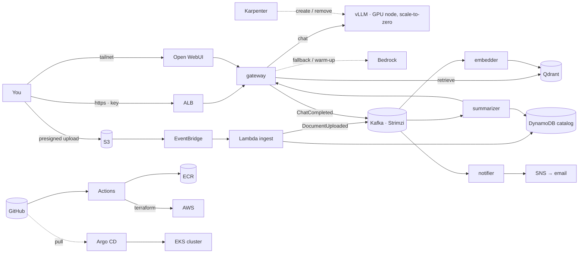

# PLAN — SteakLLM

A document-intelligence platform on AWS: drop a document in a bucket and it is ingested, indexed, summarized and tagged; chat over it from a browser; get alerted when a new document matches something you watch. Built as a portfolio project that a reviewer can rebuild from the README and defend in a design review.

Worked through with Claude under the teaching contract in `CLAUDE.md`: every step explained → shown → run → interpreted → checkpointed, one at a time. Tick boxes as we go. **Steps 1–2 are written in full; Steps 3–12 are architecture-level and get their full plan when we reach them.** Step 1 completed Aug 28 2026.

The earlier `../vllm_server/` project was the prototype. Nothing here depends on it; it can be torn down whenever we like.

---

## Decisions on record (Aug 28 2026)


| Question      | Decision                                                                                                                                                                                                                                                                        |
| ------------- | ------------------------------------------------------------------------------------------------------------------------------------------------------------------------------------------------------------------------------------------------------------------------------- |
| Cost posture  | Always-on small cluster, ~$100/mo idle target; GPU only on demand                                                                                                                                                                                                               |
| Product spine | Document intelligence (upload → index → summarize → alert → chat)                                                                                                                                                                                                           |
| Kafka's job   | Two logbooks:`documents` (pipeline events) and `chats` (usage events); each with independent consumer groups and replay                                                                                                                                                         |
| Lambda's job  | Event glue only: the S3 doorbell (validate · hash · record · produce) and the nightly GPU safety net. Never the model                                                                                                                                                        |
| The GPU       | Summoned by demand (Kafka lag or recent chats), removed after 15 idle minutes; Bedrock bridges the 3–5 minute cold start                                                                                                                                                       |
| Public door   | One: ALB + TLS + WAF in front of the gateway only, with a quota'd demo key. Everything else stays on the tailnet                                                                                                                                                                |
| Embeddings    | **Ollama** serves the embedding model (`bge-small`, 384-dim) both locally and in the cluster, behind the OpenAI `/v1/embeddings` contract. TEI publishes no arm64 image and the always-on node is Graviton (Step 5.1); the contract is the API, so the server stays swappable (ADR-0005) |
| Local dev LLM | Bedrock is the only local backend (the Mac has no NVIDIA GPU, so vLLM can't run there); a stub plays "vLLM is down" so the routing code is real from day one. vLLM itself arrives in the cluster at Step 9 with no service changes, because both speak the same OpenAI contract |

---

## The architecture in one page

**The story.** A user uploads a file through a presigned S3 URL. S3 tells EventBridge, EventBridge invokes the ingest Lambda, which validates the file, hashes it into a document ID, records `uploaded` in DynamoDB and writes one `DocumentUploaded` line into Kafka, then walks away. Three worker teams read that logbook at their own pace: the *embedder* chunks and embeds into Qdrant and writes `DocumentIndexed`; the *summarizer* asks the LLM (through the gateway, so it gets the same routing as chat) for a summary and tags, writes them to the catalog and emits `SummaryReady`; the *notifier* turns `SummaryReady` into an SNS alert when it matches the watch-list. Chat goes through a gateway that speaks the OpenAI contract and routes to vLLM on a GPU node that exists only while it's needed, or to Bedrock when it isn't. GitHub Actions tests, builds and scans every commit and runs Terraform; Argo CD keeps the cluster equal to the repo. The system map lives in `docs/system-map.html`.



**Routing policy (the gateway).** Every request asks "is vLLM healthy right now?" and routes on the answer; it never waits and never sticks. GPU off → Bedrock, and that request bumps the demand signal that summons the GPU. Warming → Bedrock. `/health` 200 → vLLM. Timeouts or errors → circuit breaker opens, Bedrock for a minute, then probe again. Every response carries `x-backend`. Switching mid-conversation is safe because the chat API is stateless. The summarizer, being asynchronous, waits for vLLM by default with a ten-minute maximum, then falls back to Bedrock (the `InsufficientInstanceCapacity` case, designed away).

**Security posture (the museum).** One public door: ALB with TLS and WAF, in front of the gateway only; nodes in private subnets; Grafana, Argo, Qdrant, Kafka and the Kubernetes API reachable only over the tailnet. Every request needs a key; the demo key is rate-limited per IP, token-capped per answer, capped per day, and can only search the demo collection. Each service wears its own IAM role; NetworkPolicies are default-deny. Uploads go through short-lived presigned URLs into a quarantine prefix; the bucket blocks public access. The public model has no tools and capped output. Budgets, per-key quotas, a one-node Karpenter cap and the nightly GPU kill put a lid on the wallet. ALB logs, gateway logs keyed by API key, and CloudTrail put every visitor on camera.

**Cost model (approximate, re-verify at execution).** EKS control plane ~$73/mo (cannot be paused). CPU node t4g.large ~$49 on-demand or ~$15–20 spot. ALB ~$16. NAT: ~$4 as an instance or ~$32 as a gateway. S3, ECR, DynamoDB, Lambda, EventBridge, SNS, Secrets Manager: ~$3–8. GPU g6.xlarge $0.81/hr only while summoned (each summon ≈ $0.07 of warm-up). Bedrock per token. Idle floor ≈ $100 with spot CPU node and NAT instance; ≈ $140 all on-demand.

**Every tool, its job, its rejected alternative.**


| Tool                                                           | Job                                                               | Alternative rejected                        |
| -------------------------------------------------------------- | ----------------------------------------------------------------- | ------------------------------------------- |
| Terraform                                                      | AWS from code: VPC, EKS, IAM, S3, DynamoDB, Lambda, Budgets       | Console clicks                              |
| GitHub Actions                                                 | CI: lint, test, build, scan, plan; CD for AWS via`apply` on merge | Jenkins                                     |
| Argo CD                                                        | CD for the cluster: cluster == git, pull-based, self-healing      | `kubectl apply` from CI                     |
| EKS                                                            | Place, heal, scale containers; schedule GPU pods                  | compose; k3s                                |
| Helm                                                           | Package manifests with per-environment values                     | Raw YAML                                    |
| Karpenter                                                      | Just-in-time GPU node, removed when empty                         | Managed node group + autoscaler             |
| KEDA                                                           | Turn demand (Kafka lag, recent chats) into replica counts         | HPA on CPU                                  |
| Kafka (Strimzi)                                                | Ordered, durable event log with independent readers and replay    | SQS (one reader, no replay); MSK (~$70+/mo) |
| Lambda                                                         | S3 doorbell; nightly GPU safety net                               | An always-running poller                    |
| EventBridge                                                    | Filtered routing of S3 events; schedules                          | S3 → Lambda direct                         |
| S3 / DynamoDB                                                  | Documents and weights; catalog and status                         | EBS; RDS                                    |
| Secrets Manager + ESO                                          | Secrets outside git and disk; rotation in one place               | `.env` files                                |
| IAM OIDC + Pod Identity                                        | Keyless CI; least-privilege hat per pod                           | Long-lived keys                             |
| ALB + ACM + WAF                                                | The one public door                                               | Tailnet-only; Cloudflare Tunnel             |
| Tailscale                                                      | The admin door                                                    | Bastion / VPN                               |
| Prometheus · Grafana · Alertmanager · Loki · OpenTelemetry | Numbers, charts, alerts, logs, traces                             | CloudWatch only                             |
| Bedrock                                                        | Serverless LLM: warm-up bridge, fallback, comparison              | GPU-off means chat-off                      |
| vLLM · Qdrant · Ollama · Open WebUI                         | Inference engine, vectors, embeddings (behind `/v1/embeddings`), chat UI | TEI: no arm64 image (ADR-0005)             |

**Standing principles.** Contracts over components. Layered security, each layer testable. Config from durable places. Pin versions, then distrust the pin. Budgets before actions, dollars included. Cattle, not pets. Events are facts in the past tense. Idempotency everywhere (S3 and Kafka both deliver at-least-once). Cost follows demand, not the clock. Every tool has a written "why" and a named alternative.

**Codebase standards (what a reviewer expects; applied in the step that owns each).** Retry and dead-letter topics for every consumer (Step 6). Graceful shutdown on SIGTERM with offsets committed (6). A `DocumentDeleted` path that removes S3 object, vectors and catalog row (4, 6, 10). Backups and one restore drill: DynamoDB PITR, Qdrant snapshots, versioned state (10). Timeouts, retries and a circuit breaker in the gateway (6). Resource requests and limits, probes, non-root multi-stage Dockerfiles (6, 8). Lockfiles plus Renovate (3). `checkov` for Terraform and `kube-linter` for manifests in CI (3). JSON logs carrying document ID and trace ID (6). Two or three SLOs with panels (11). Upload size and type limits, per-key rate limits, OpenAPI spec (6, 8). A catalog page showing `uploaded → indexed → summarized` (6). `Makefile`, `.env.example`, `CONTRIBUTING.md`, PR template, `LICENSE`, per-environment Helm values (1, 8).

---

## Session ritual

**Start:** `git pull` → `pre-commit run --all-files` → (from Step 7) `kubectl get nodes` and Argo health → (from Step 9) confirm vLLM replicas are 0 unless working.
**End:** recap lessons → tick boxes here → commit and push → (from Step 9) vLLM replicas 0, GPU node gone → the meter is off.

---

## Step 1 — Set up the git repo (full plan)

*Goal: the project has a home on GitHub, a robot checks every commit for leaked secrets before it leaves the laptop, and the repo's shape already matches the architecture.*

*Concept. A repo is the source of truth for everything that follows: Terraform will build AWS from it, Argo will build the cluster from it, and the pipeline will only ever deploy what's in it. So the very first habits matter more than any file: nothing secret is ever committed (the prototype's key leak, made structurally impossible), `main` only changes through pull requests, and the directory layout tells a stranger where each concern lives.*

- [X]  **1.1 Project root.** Create the folder and work from it for the rest of the project.
  `mkdir -p ~/Everything/Project/SteakLLM/SteakLLM && cd ~/Everything/Project/SteakLLM/SteakLLM`
  *Done when:* `pwd` prints that path.
- [X]  **1.2 Tools on the Mac.** `git`, `aws`, `terraform` are already installed; add the rest.
  `brew install gh kubectl helm uv pre-commit gitleaks` then `brew install terraform-linters/tap/tflint`
  (TFLint left Homebrew's main catalog because part of its code is under HashiCorp's BUSL license; it lives in the maintainers' own tap now, like Terraform itself in `hashicorp/tap`. Homebrew installs nothing if one name in the list is unknown.)
  Install Docker Desktop or OrbStack (needed in Step 5).
  *Reading it:* each of `gh --version`, `kubectl version --client`, `helm version`, `uv --version`, `pre-commit --version`, `gitleaks version`, `tflint --version`, `docker --version` prints a version. Record them in `docs/field-notes.md` §1.
  *Done when:* all eight print a version.
- [X]  **1.3 GitHub identity.** Sign in from the terminal so `gh` can create repos and PRs for us.
  `gh auth login` (GitHub.com → HTTPS → login with browser).
  *Done when:* `gh auth status` shows your account, and `git config --global user.name` / `user.email` match it.
- [X]  **1.4 Initialize.** `main` from the first commit; no `master` rename later.
  `git init -b main`
  *Done when:* `git status` says "On branch main, No commits yet".
- [X]  **1.5 `.gitignore` before anything else.** The list is the prototype's incident log turned into a file:
  `*.tfstate`, `*.tfstate.*`, `.terraform/`, `*.tfvars` with `!*.example.tfvars`, `.env`, `.env.*` with `!.env.example`, `*.pem`, `*.key`, `.venv/`, `venv/`, `__pycache__/`, `*.pyc`, `.pytest_cache/`, `.DS_Store`, `.obsidian/`, `node_modules/`, `dist/`. Note what is deliberately *not* ignored: `.terraform.lock.hcl` is committed, because it pins provider versions (principle: pin, then distrust the pin).
  *Done when:* `git check-ignore -v terraform.tfstate .env secrets.pem` prints a matching rule for each.
- [X]  **1.6 Skeleton.** Directories mirror the architecture; each gets a one-line `README.md` saying what lives there.

  ```
  docs/{adr,runbooks,chaos}   infra/{bootstrap,network,eks,data,pipeline}
  platform/                   charts/
  services/{contracts,gateway,embedder,summarizer,notifier,ingest}
  compose/                    .github/{workflows,ISSUE_TEMPLATE}
  ```

  Root files: `README.md` (one-paragraph pitch + "work in progress"), `PLAN.md` (this file), `CLAUDE.md`, `LICENSE` (MIT), `Makefile` (targets `help`, `lint`, `test`, `up`, `down`, `demo` — stubs that echo "not yet"), `.env.example`, `.editorconfig`, `CONTRIBUTING.md` (the teaching loop in three lines), `.github/pull_request_template.md` (what changed · why · how tested · plan output attached?).
  *Done when:* `tree -L 2 -a -I .git` matches the layout above and `make help` lists the targets.
- [X]  **1.7 Pre-commit hooks.** The robot editor's first three checks, running on the laptop before a commit exists.
  `.pre-commit-config.yaml` with `gitleaks` (secret scan), `terraform_fmt` (from the `pre-commit-terraform` hooks), `ruff` and `ruff-format`, plus the standard `end-of-file-fixer` and `trailing-whitespace`.
  `pre-commit install && pre-commit run --all-files`
  *Reading it:* every hook reports `Passed` or `Skipped (no files to check)`.
  *Done when:* a deliberate test — write `AWS_SECRET_ACCESS_KEY=AKIA...` into a scratch file and try to commit it — is **blocked** by gitleaks; then delete the file.
- [X]  **1.8 Full-tree secret scan.** Belt and braces before the first push.
  `gitleaks detect --source . --verbose`
  *Done when:* "no leaks found".
- [X]  **1.9 First commit.**
  `git add -A && git commit -m "chore: repo skeleton, hooks, plan"`
  *Done when:* `git log --oneline` shows one commit and the hooks ran during it.
- [X]  **1.10 Create the GitHub repo and push.** Decide visibility now: branch protection on the free plan only works on **public** repos, and there is nothing secret in the tree (that's what 1.7 and 1.8 guarantee). Recommended: public from day one; the commit history becomes part of the portfolio.
  `gh repo create SteakLLM --public --source=. --remote=origin --push --description "Document intelligence on EKS: Kafka, Lambda, vLLM/Bedrock, GitOps"`
  *Done when:* `gh repo view --web` opens the repo with the skeleton and README visible.
- [X]  **1.11 Protect `main`.** Pull request required, at least one approval not required (solo), status checks required (we'll name them in Step 3), linear history, no force-push, no deletion.
  `gh api -X PUT repos/{owner}/SteakLLM/branches/main/protection --input protection.json` (we write the JSON together), or Settings → Branches in the UI.
  *Done when:* `git push origin main` with a direct commit is **rejected**, and the same change through a PR is accepted.
- [X]  **1.12 Prove the loop.** One tiny change (a word in the README) through the real path.
  `git switch -c chore/prove-the-loop` → edit → commit → `gh pr create --fill` → `gh pr merge --squash --delete-branch` → `git switch main && git pull`.
  *Done when:* the merge commit is on `main`, the branch is gone, and the hooks ran on the commit.
- [X]  **1.13 Renovate or Dependabot.** Turn on automated dependency PRs now, while the repo is empty, so every pin we add from here is watched from birth.
  `.github/dependabot.yml` covering `github-actions`, `pip` (uv), `docker`, `terraform`; weekly.
  *Done when:* the Dependabot tab shows the ecosystems enabled.
- [X]  **1.14 Field notes.** Open `docs/field-notes.md` with §1 setup snapshot (tool versions, repo URL) and an empty incident log.

**Step 1 done when:** the repo is on GitHub with the skeleton; hooks pass and a fake secret was proven to be blocked; `main` cannot be pushed directly and one PR has been merged; Dependabot is on; field notes exist. No AWS resource has been touched yet, and nothing costs money.

---

## Step 2 — Bootstrap AWS once, by hand (full plan)

*Goal: the pipeline gets the two things it cannot create for itself, a place to keep Terraform's state and an identity to borrow, plus the budget alarm that must exist before anything can spend. Cost of this step: pennies.*

*Concept. Terraform needs somewhere to remember what it built (state), and the pipeline needs an identity, but a pipeline with no identity can't create either. So one small module, `infra/bootstrap`, is applied once from the laptop with local state; then it moves its own state into the bucket it just made. From then on the laptop never applies again. The OIDC provider is the trust between GitHub and AWS: GitHub signs a short-lived token naming the repo and branch a job runs from, and AWS lends a role to jobs that match. Two roles: `plan` may read everything and take the state lock, from any branch or pull request; `apply` may change things, from `main` or the `production` environment only. ADR-0001 records why `apply` starts broad and how it will be narrowed.*

- [X]  **2.1 Preflight.** Who am I, which Terraform, what already exists.
  `aws sts get-caller-identity` · `terraform version` · `aws iam list-open-id-connect-providers` · `aws budgets describe-budgets --account-id "$(aws sts get-caller-identity --query Account --output text)" --query 'Budgets[].BudgetName'`
  *Reading it:* the identity is your own IAM user in the right account; Terraform is **1.10 or newer** (else `brew upgrade hashicorp/tap/terraform`); the OIDC list has no `token.actions.githubusercontent.com` entry (if it does, we import it rather than create a duplicate); the budget list shows what the prototype left behind, so the new one gets a distinct name.
  *Done when:* all four answered and noted in field notes §1.
- [X]  **2.2 The module.** Files in `infra/bootstrap/`: `versions.tf` (Terraform ≥ 1.10, providers pinned), `providers.tf` (region, default tags), `variables.tf`, `state-bucket.tf`, `github-oidc.tf`, `budgets.tf`, `outputs.tf`, `bootstrap.example.tfvars`. Copy the example to `terraform.tfvars` (git-ignored) and fill in `github_owner` and `budget_email`. Read each file together; every resource has a comment saying why it exists.
  *Done when:* `terraform fmt -check -recursive infra/bootstrap` prints nothing (formatted) and `terraform.tfvars` shows as ignored in `git status`.
- [X]  **2.3 Init, validate, plan.** From `infra/bootstrap/`:
  `terraform init` (downloads the two providers, writes `.terraform.lock.hcl`, which we commit) · `terraform validate` · `terraform plan -out=tfplan`
  *Reading it:* **13 to add, 0 to change, 0 to destroy**: `random_id`, the bucket and its four settings (versioning, encryption, public-access block, lifecycle), the OIDC provider, two roles, two policy attachments, one inline policy, one budget. Read the trust policies in the plan output: `aud` = `sts.amazonaws.com`, `sub` = `repo:<owner>/SteakLLM:*` for plan and the two exact subjects for apply.
  *Done when:* the count matches and the trust policies read as intended.
- [X]  **2.4 Apply and verify.**
  `terraform apply tfplan` → five outputs. Then prove each piece from outside Terraform:
  `aws s3api get-bucket-versioning --bucket "$(terraform output -raw tfstate_bucket)"` → `Enabled` · `aws iam get-role --role-name steakllm-ci-apply --query Role.AssumeRolePolicyDocument` → the two subjects · `aws budgets describe-budget --account-id <id> --budget-name steakllm-monthly --query 'Budget.BudgetLimit'` → `100 USD`.
  *Done when:* all three checks pass and the outputs are pasted into field notes §1 (the role ARNs and bucket name are not secrets).
- [X]  **2.5 Move the module's own state into the bucket.** Add `backend.tf` with the bucket name from the output, `key = "bootstrap/terraform.tfstate"`, `encrypt = true`, `use_lockfile = true`; then `terraform init -migrate-state` (answer `yes`) and `terraform plan`.
  *Reading it:* the plan says **No changes**; `aws s3 ls "s3://<bucket>/bootstrap/"` lists `terraform.tfstate`; the local `terraform.tfstate` is now empty and the `.backup` is git-ignored.
  *Done when:* state lives in S3 and the plan is clean.
- [X]  **2.6 Tell GitHub, and prove the trust.** Role ARNs and the bucket name are configuration, not secrets, so they go in as repository *variables*:
  `gh variable set AWS_REGION --body us-east-1` · `gh variable set TFSTATE_BUCKET --body "$(terraform output -raw tfstate_bucket)"` · `gh variable set AWS_PLAN_ROLE_ARN --body "$(terraform output -raw ci_plan_role_arn)"` · `gh variable set AWS_APPLY_ROLE_ARN --body "$(terraform output -raw ci_apply_role_arn)"`
  Add `.github/workflows/oidc-smoke.yml` (manual trigger; requests an OIDC token, assumes the plan role, prints the identity) and run it: `gh workflow run oidc-smoke.yml && gh run watch`.
  *Reading it:* the job's `get-caller-identity` shows `assumed-role/steakllm-ci-plan/...` and `gh secret list` prints **nothing**.
  *Done when:* the run is green with the assumed role visible, and the repo holds zero AWS secrets.
- [X]  **2.7 Record it.** `docs/adr/0001-ci-identity.md` and `docs/adr/0002-terraform-state.md`; field notes §1 (bucket, role ARNs, account) and any incident; commit `infra/bootstrap/` with `.terraform.lock.hcl` through a PR.
  *Done when:* merged to `main`; this section ticked.

**Step 2 done when:** the bucket holds the bootstrap's own state; a GitHub workflow assumed the plan role with no stored key; the budget alarm exists; both ADRs are written; the laptop never needs to run `terraform apply` again.

---

## Step 3 — Build the CI/CD pipeline (full plan)

*Goal: from here on, every change is tested by robots before merge, and every infrastructure change is applied by the pipeline, never the laptop. The proof at the end: the ECR repositories arrive on `main` through a PR and are created in AWS by the `apply` role — the first real resources we never touch by hand.*

*Concept. Three workflows, one per question. `ci.yml` answers "is this commit healthy?" — the same checks pre-commit runs on the laptop, plus slower ones, on every push, so nothing depends on any laptop being set up. `plan.yml` answers "what would this PR do to AWS?" — it assumes the read-only plan role and posts the Terraform diff as a PR comment, so the reviewer reads code *and* consequences. `apply.yml` answers "make it so" — on merge to `main` it assumes the apply role, but only after pausing inside a GitHub Environment that waits for a human click; that click is the second key on the nuclear lock, and the `environment:production` OIDC subject means the apply role literally cannot be borrowed without it. Checks that need code we haven't written yet (pytest — Step 6, kube-linter — Step 8, Trivy — Step 6) join `ci.yml` in their own steps; `release.yml` (build and push service images) moves to Step 6 with the services themselves — a build workflow with nothing to build proves nothing. Cost: $0 in AWS; GitHub Actions on a private repo has 2,000 free minutes/month, our runs are minutes-long, and the budget alarm guards the rest.*

- [X]  **3.1 Preflight.** What the pipeline inherits: which workflows exist, what branch protection currently requires (from 1.11: `status_checks: null`), which OIDC subjects the roles trust (from 2.6: both name and ID forms), and that `gh secret list` is still empty.
  `ls .github/workflows` · `gh api repos/{owner}/SteakLLM/branches/main/protection --jq .required_status_checks` · `aws iam get-role --role-name steakllm-ci-plan --query 'Role.AssumeRolePolicyDocument.Statement[0].Condition'` · `gh secret list`
  *Done when:* all four answered and consistent with Steps 1–2's records.
- [X]  **3.2 `ci.yml` — the hygiene gate.** On every push and PR, jobs in parallel, each named so 3.3 can require them: **`gitleaks`** (full history, catches what a laptop without hooks pushed), **`terraform`** (`fmt -check -recursive`, then per-module `init -backend=false` + `validate` — no AWS access needed, so no role assumed), **`tflint`** (rules the compiler doesn't have: deprecated syntax, wrong instance types), **`checkov`** (static security scan of Terraform: public buckets, open security groups, missing encryption), **`ruff`** (lint + format check on all Python, today just the guard hook). Pin every action by version; Dependabot watches the pins from birth (1.13).
  *Done when:* the PR that adds `ci.yml` shows all five jobs green on itself.
- [X]  **3.3 Require the checks.** Update branch protection: the five job names become `required_status_checks` (strict mode: branch must be up to date with `main` before merge). From now on red X = unmergeable, the laptop hooks become a convenience, and CI is the enforcement.
  `gh api -X PATCH repos/{owner}/SteakLLM/branches/main/protection/required_status_checks --input -`
  *Done when:* a PR with a deliberately unformatted `.tf` file is blocked from merging, and fixing it unblocks it. Delete the test branch after.
- [X]  **3.4 `plan.yml` — consequences on every PR.** On `pull_request` touching `infra/**`: OIDC → `steakllm-ci-plan` (this is the first *real* use of 2.6's smoke-tested trust), `terraform init` against the S3 backend (the role's inline policy allows exactly this: read state, take the lock), `terraform plan -no-color`, and post the plan as a sticky PR comment (updated in place on each push, not appended). Matrix over `infra/*` modules — today only `bootstrap`.
  *Done when:* a no-op PR touching `infra/` shows a comment containing "No changes."
- [X]  **3.5 The `production` environment — the human gate.** Create GitHub Environment `production` with yourself as required reviewer. Jobs that reference it pause until approved, and — the part that makes it security rather than ceremony — their OIDC token's subject becomes `environment:production`, which is what the apply role's trust policy has been waiting for since 2.4. No approval, no matching subject, no credentials.
  `gh api -X PUT repos/{owner}/SteakLLM/environments/production --input -` (reviewer = your user id)
  *Done when:* the environment exists with one required reviewer shown in Settings → Environments.
- [X]  **3.6 `apply.yml` — make it so.** On `push` to `main` touching `infra/**`: job pinned to `environment: production`, OIDC → `steakllm-ci-apply`, `terraform plan -out=tfplan` then `terraform apply tfplan` (plan and apply in one job so what's applied is exactly what was just planned against post-merge state). Concurrency group per module so two merges queue instead of racing for the state lock.
  *Done when:* the workflow exists on `main`; its first real run is 3.8.
- [X]  **3.7 The first pipeline-managed module: `infra/ecr`.** Terraform for the five image repositories (`gateway`, `embedder`, `summarizer`, `notifier`, `ingest`): scan-on-push, lifecycle policy keeping the last ~10 images (untagged expire after 7 days — image storage is billable, ~$0.10/GB/mo), immutable tags. Own state key `ecr/terraform.tfstate` in the same bucket. Written on a branch, **never applied from the laptop**.
  *Done when:* the PR shows five green checks and a plan comment reading **10 to add** (5 repositories + 5 lifecycle policies).
- [X]  **3.8 Merge, approve, verify.** Merge the PR → `apply.yml` starts → pauses at `production` → you approve → apply runs as `steakllm-ci-apply`. Then prove it from outside: `aws ecr describe-repositories --query 'repositories[].repositoryName'` shows the five, and the CloudTrail event for `CreateRepository` names the assumed role, not your user.
  *Done when:* five repositories exist, created by the role; the laptop ran nothing but read commands.
- [X]  **3.9 Record it.** ADR-0003 (apply behind a human-approved Environment; rejected: auto-apply on merge, and plan-and-apply from the same PR run). Field notes: incidents, the pipeline's shape, first pipeline apply timestamp. Note `release.yml` deferred to Step 6 with the services it builds. Commit through a PR — which now must itself pass the very pipeline it documents.
  *Done when:* merged to `main`; this section ticked.

**Step 3 done when:** every PR shows the five checks and (for infra changes) a plan comment; merges to `main` apply only after your click, as the apply role; the five ECR repositories exist without the laptop ever running `terraform apply` for them; ADR-0003 is on `main`.

---

## Step 4 — Write the event contracts (full plan)

*Goal: before any service exists, the five messages they will pass through Kafka are written down as machine-checkable schemas, with a test that stops anyone from changing their meaning, and the idempotency rules that make at-least-once delivery safe. Cost: $0.*

*Concept. In an event-driven system the services never call each other; they leave notes in the logbook (Kafka) and read notes others left. The notes are the only agreement between them, so they are the first thing to write and the last thing to change — "contracts over components". Each note is an **event**: a fact in the past tense (`DocumentUploaded`, never `UploadDocument`), wrapped in a common **envelope** (who wrote it, when, about which document, which request it belongs to) so every reader handles every note the same way before looking inside. The contract language is **JSON Schema**: a JSON document that describes the shape another JSON document must have — required fields, types, patterns — checkable by a library in any language. Versioning is by file (`DocumentUploaded.v1`), and version 1 is frozen: fields may be *added* as optional, never removed or retyped; a breaking change is a new file, `v2`, that readers opt into. The **compatibility test** enforces that mechanically against a golden copy. Finally, both S3 and Kafka deliver **at least once** — a note may arrive twice — so the rules that make a second delivery harmless are written here as code: the document ID is `sha256` of the bytes (the same file always gets the same ID), the vector-store point ID is a deterministic hash of `(doc_id, chunk_index)` (re-embedding overwrites rather than duplicates), and every consumer is designed as an upsert keyed on those IDs. This is also the project's first Python package, so `uv`, `pytest` and the `ruff` rules get their real shape here, and `pytest` joins `ci.yml` earlier than the Step 3 summary assumed — the compatibility test must run in CI to mean anything.*

- [X]  **4.1 Preflight.** What exists and what we'll build on: `services/contracts/` (a README stub from 1.6), `uv` and its Python, and what the `ruff` hook already enforces.
  `ls services/contracts` · `uv --version` · `uv python list --only-installed` · `grep -A3 ruff .pre-commit-config.yaml`
  *Done when:* folder confirmed empty but present; a Python ≥ 3.12 available to `uv`.
- [X]  **4.2 The package skeleton.** `services/contracts/` becomes a `uv` project with the *src layout*: `pyproject.toml` (name `steakllm-contracts`, deps `jsonschema`, dev deps `pytest`), `src/steakllm_contracts/__init__.py`, `schemas/`, `examples/`, `tests/`. `uv sync` creates `.venv/` (git-ignored) and `uv.lock` (committed — the Python pin; Dependabot's `uv` job finally has a manifest and its weekly failure ends).
  *Done when:* `uv run python -c "import steakllm_contracts"` works and `uv.lock` exists.
- [X]  **4.3 The envelope.** `schemas/envelope.v1.schema.json` (JSON Schema 2020-12): `id` (UUID, unique per event, the dedupe key), `type` (one of the five names), `version` (integer, 1), `time` (RFC 3339 UTC), `doc_id` (64 hex chars, the sha256; `null` only for `ChatCompleted`), `trace_id` (32 hex, W3C trace-id, follows one request across every service), `source` (which service wrote it), `data` (the event-specific body, defined per event). Every field has a `description` — the schema is the documentation.
  *Done when:* `uv run python -c` validation of a hand-written envelope passes, and one with a bad `doc_id` fails with a readable message.
- [X]  **4.4 The five events.** One file each, `schemas/<Name>.v1.schema.json`, composing the envelope with `allOf` and fixing `type`, then defining `data`: `DocumentUploaded` (bucket, key, size, content type, sha256 — the same value as `doc_id`, on purpose), `DocumentIndexed` (collection, chunk count, embedding model), `SummaryReady` (summary, tags, model, backend `vllm|bedrock`, token counts), `DocumentDeleted` (reason), `ChatCompleted` (session, model, backend, token counts, latency, hashed key id, retrieved doc ids). Plus `examples/<Name>.json`, one valid example each — the fixtures every service's tests will reuse.
  *Done when:* `tests/test_examples.py` validates all five examples against their schemas, and a deliberately broken example fails.
- [X]  **4.5 The idempotency rules as code.** `src/steakllm_contracts/ids.py`: `doc_id(bytes) -> str` (sha256 hex) and `point_id(doc_id, chunk_index) -> str` (UUIDv5 in a fixed namespace, so the same chunk always maps to the same point). `tests/test_ids.py` proves determinism and that two different chunks never collide in the examples. The README states the three rules in plain words: same bytes → same ID; same chunk → same point; every consumer is an upsert, so running twice equals running once.
  *Done when:* tests pass and the README's rules section reads clearly to a non-engineer.
- [X]  **4.6 The compatibility test.** `tests/golden/v1.json` freezes, for each schema, the required fields and each field's type. `tests/test_compat.py` asserts the live schemas still contain every golden required field with the same type — additions are fine, removals and retypes fail with a message that says "this is a breaking change: create v2". The golden file is updated only by an explicit, reviewed commit.
  *Done when:* the test passes; temporarily deleting a required field from a schema makes it fail with that message; the change is reverted.
- [X]  **4.7 `pytest` joins `ci.yml`.** A sixth job: `uv sync` and `uv run pytest` in every `services/*` that has a `pyproject.toml`; added to the required checks in `.github/branch-protection.json` and PUT to GitHub. From here, breaking a contract is unmergeable.
  *Done when:* the PR shows six green checks, and `required_status_checks` lists `pytest`.
- [X]  **4.8 Record it.** ADR-0004 (JSON Schema, file-versioned, additive-only; rejected: Avro + Schema Registry, Protobuf, "Pydantic models are the contract"). Field notes: close the Dependabot `uv` open item, incidents. Plain-words README in `services/contracts/`. PR.
  *Done when:* merged to `main`; this section ticked.

**Step 4 done when:** five event schemas plus the envelope validate their examples; the compatibility test guards v1 in CI as a required check; `doc_id` and `point_id` exist as tested code; the folder README explains the rules in plain words; ADR-0004 is on `main`.

---

## Step 5 — Build the local dev stack (full plan)

*Goal: the whole platform's supporting cast runs on the Mac with one command, so Step 6's services can be built and tested against real Kafka, real object storage, a real vector store and a real LLM without touching the cluster. Cost: $0 for everything except Bedrock, which bills per token (pennies for this step); the meter is the Mac's RAM.*

*Concept. Every cloud component gets a **stand-in** that speaks the same protocol: MinIO for S3 (same API, same `aws s3` commands with `--endpoint-url`), DynamoDB Local for DynamoDB, a single-node Kafka for the cluster's Strimzi Kafka, Qdrant and TEI exactly as they will run in the cluster, and Bedrock itself for the LLM (the Mac has no NVIDIA GPU, so vLLM cannot run here — decision on record). The stand-ins are wired together by **Docker Compose**: one YAML file describing containers, their ports, volumes, health checks and start order, so `make up` is reproducible and `make down` leaves nothing behind. Kafka runs in **KRaft** mode — the broker keeps its own metadata, no ZooKeeper — which is what Strimzi will run too. **TEI** (Text Embeddings Inference) serves the embedding model `BAAI/bge-small-en-v1.5` on CPU: 384 dimensions, the same number already baked into the `DocumentIndexed` example. A tiny **stub** answers `503` on `/health` and plays "vLLM is down", so the gateway's routing policy (health check → fallback → circuit breaker) is exercised locally from day one and Step 9 needs no service changes. The services that will do the real work arrive in Step 6; here a throwaway `demo.py` drives every component through its API — the same calls the services will make — so the flow is proven before any service exists, and the script becomes the checklist for Step 6.*

- [X]  **5.1 Preflight.** Docker running and how much memory it is allowed (the stack wants ~5 GB); CPU architecture (`arm64` — every image must publish an arm64 build or run under slow emulation); which ports are free (9092 Kafka, 9000/9001 MinIO, 8000 DynamoDB, 6333 Qdrant, 8080 TEI, 8081 stub, 3000 Open WebUI); whether the account can see Bedrock models (`aws bedrock list-foundation-models --query 'modelSummaries[?contains(modelId, `haiku`) || contains(modelId, `nova`)].modelId'`); and the arm64 availability of each image (`docker manifest inspect`).
  *Reading it:* an image with no `arm64` manifest gets a noted alternative before we depend on it. Bedrock model *visibility* is not *access* — 5.6 handles access.
  *Done when:* all answered and noted in field notes §1; nothing pulled yet.
- [X]  **5.2 `.env` for the stack.** Grow `.env.example` with every value the stack needs (MinIO root user/password — dev-only defaults, documented as such; bucket, table and topic names; `AWS_PROFILE`/region for Bedrock; `BEDROCK_MODEL_ID`; `EMBEDDING_MODEL`). Copy to `.env` (git-ignored) and fill in the two real values (profile, model id). Compose reads `.env` automatically.
  *Done when:* `git check-ignore .env` matches; `.env.example` has no real value in it; `docker compose config` renders without warnings.
- [X]  **5.3 `compose/compose.yaml` — storage.** MinIO (with console) plus a one-shot `minio-init` container that creates the `documents` bucket; DynamoDB Local plus `dynamodb-init` that creates the `catalog` table (`doc_id` key, on-demand); Qdrant with a named volume. Every long-running service has a `healthcheck`; init containers use `depends_on: condition: service_healthy`.
  *Reading it:* `docker compose ps` shows `healthy` for the three, `exited (0)` for the inits.
  *Done when:* `aws --endpoint-url http://localhost:9000 s3 ls` lists `documents`; `aws --endpoint-url http://localhost:8000 dynamodb list-tables` lists `catalog`; `curl localhost:6333/healthz` answers.
- [X]  **5.4 Kafka, KRaft, single node.** The `apache/kafka` image with the KRaft env (one node is controller and broker), two listeners (inside the compose network and `localhost:9092` for the Mac), and a `kafka-init` container creating the topics from the contracts: `documents`, `documents.retry`, `documents.dlq`, `chats` — the retry and dead-letter topics the Step 6 consumers require.
  *Reading it:* produce a line with the container's `kafka-console-producer.sh`, consume it back with `kafka-console-consumer.sh --from-beginning`; topics listed with their partition counts.
  *Done when:* the round trip works from the Mac and all four topics exist.
- [X]  **5.5 Ollama and the vLLM-is-down stub.** Ollama (arm64-native; the TEI plan died in 5.1) serving `all-minilm` — 384 dimensions, the number already in the `DocumentIndexed` example — behind the OpenAI-compatible `/v1/embeddings` route, so the server stays swappable. Weights pulled once by an init container into a named volume. The stub: the smallest container that answers `503 Service Unavailable` on `/health` and `/v1/*` — the shape of a dead vLLM. Both healthchecked with real calls (`ollama list`; the stub's check asserts the 503).
  *Reading it:* `curl -s localhost:11434/v1/embeddings -d '{"model":"all-minilm","input":"steak"}'` returns one vector; `python -c` confirms `len == 384`; `curl -i localhost:8081/health` shows `503`.
  *Done when:* both true.
- [X]  **5.6 Bedrock access.** In the console, request access for one small chat model (`Anthropic Claude Haiku` or `Amazon Nova Micro` — whichever 5.1 showed; the cheapest that follows instructions). From the terminal: `aws bedrock-runtime converse --model-id "$BEDROCK_MODEL_ID" --messages '[{"role":"user","content":[{"text":"Reply with the single word: ready"}]}]' --query 'output.message.content[0].text'`. State the price per million tokens before the first call; each call here costs a fraction of a cent.
  *Done when:* the reply is `ready` and the model id is in `.env`; nothing else in AWS changed.
- [X]  **5.7 Open WebUI and `make up` / `make down`.** Open WebUI in the stack, pointed at the gateway's future address (`http://gateway:8000/v1`) with signup disabled and an admin account from `.env`. The `Makefile` targets become real: `up` = `docker compose up -d --wait`, `down` = `docker compose down` (volumes kept), `nuke` = `down -v` (human-only, states what is lost), `ps`, `logs`.
  *Reading it:* `make up` prints every service `Healthy`; the console at `localhost:3000` loads; `make down` and `docker ps` is empty.
  *Done when:* up → healthy → down, twice, with the second `up` faster (volumes cached).
- [X]  **5.8 `make demo` — the flow, by hand.** `compose/demo.py`, a `uv` script with inline dependencies (PEP 723: `# /// script` header, so `uv run compose/demo.py` needs no install), using the contracts package for `doc_id`, `point_id` and `validate`. It: (1) uploads `compose/sample/quarterly-report.pdf` to MinIO under `quarantine/`; (2) computes `doc_id`, builds a `DocumentUploaded`, validates it, produces it to `documents`; (3) consumes it back; (4) extracts text, chunks it, embeds each chunk with TEI, upserts into Qdrant with `point_id`; (5) writes the catalog row `indexed`; (6) searches Qdrant with a question and prints the best chunk; (7) asks Bedrock for a summary and three tags, validates a `SummaryReady`, produces it, writes the row `summarized`; (8) runs itself twice and shows the same point count and one catalog row — the idempotency rules, demonstrated.
  *Reading it:* the printed search hit is from the PDF; the summary is about the PDF; Qdrant's point count is identical after the second run.
  *Done when:* `make demo` twice → searchable, summarized, no duplicates; runtime and RAM noted in field notes §4.
- [X]  **5.9 Record it.** ADR-0005 (Compose with protocol-faithful stand-ins; rejected: LocalStack for everything, kind/k3d cluster on the laptop, mocking S3/Kafka in tests). Field notes: image versions and arm64 status, boot time, RAM at rest, Bedrock model and its price, incidents. `compose/README.md` plain words. PR. End with `make down`.
  *Done when:* merged to `main`; this section ticked; stack down.

**Step 5 done when:** `make up` brings MinIO, DynamoDB Local, Kafka, Qdrant, TEI, the stub and Open WebUI to healthy on the Mac; Bedrock answers from the terminal; `make demo` drives a PDF from MinIO to a searchable, summarized document with a catalog row, and running it twice proves idempotency; ADR-0005 is on `main`; `make down` leaves nothing running.

---

## Step 6 — Build the five services, locally, with tests (full plan)

*Goal: the five workers exist as real code — tested, containerised, running against the local stack — and a file dropped into MinIO becomes searchable and summarized within 60 seconds with no human in the loop. The first chaos drill passes, and the images are in ECR. Cost: Bedrock per token (pennies), ECR storage (~$0.10/GB-month once images exist), CI minutes (free on a public repo).*

*Concept. Every service is a `uv` project cast from the contracts mould (Step 4), and they share one small library, `steakllm-common`, so the five services don't reimplement the same four things: **settings** from the environment (pydantic-settings — the `.env` keys become typed fields, missing ones fail at start-up, not at 3 a.m.), **JSON logs** carrying `doc_id` and `trace_id` on every line (so Loki can follow one document across five services in Step 8), the **consumer loop** (read a batch, handle each event idempotently, commit offsets; on failure retry with backoff, then park the event on `documents.retry`, then on `documents.dlq` — a dead-letter topic is where one poison message goes so it never blocks the log), and **graceful shutdown** (on SIGTERM finish the batch in hand, commit offsets, exit — Kubernetes sends SIGTERM and waits 30 s; a worker that ignores it loses or duplicates work). Three workers are consumers (embedder, summarizer, notifier); ingest is an S3-event handler with a local runner; the gateway is a FastAPI server speaking the OpenAI contract. Each gets a multi-stage, non-root **Dockerfile** (build in one stage with `uv`, copy only the environment into a slim runtime stage that runs as an unprivileged user), liveness and readiness **probes** (`/healthz` answers "process alive", `/readyz` answers "dependencies reachable"), and unit tests with **moto** (an in-process fake of S3/DynamoDB — fast, no stack) plus integration tests against `make up` that run in CI too. The **routing policy** lives in the gateway: probe vLLM's `/health` with a short timeout; 200 → vLLM, anything else → Bedrock and bump the demand signal; after N failures the **circuit breaker** opens and Bedrock is used for a minute without probing, then one probe is let through (half-open). The stub plays the dead vLLM. The **delete path** is built here: `DocumentDeleted` makes the embedder drop the document's points, the summarizer clear its summary, and ingest remove the object and the row. The first **chaos drill** — kill the embedder mid-batch, restart, no duplicates — is the idempotency rules meeting reality. Finally **`release.yml`** (deferred from Step 3) builds multi-arch images tagged with the git SHA and pushes them to the five ECR repositories through a dedicated, ECR-push-only role; the Helm-values bump waits for the charts (Step 8).*

**Movement I — the shared shape**

- [X]  **6.1 Preflight and the service template.** `make up` healthy; `make demo` still green; Python 3.12 via `uv`; Docker `buildx` for multi-arch builds (`docker buildx ls`). Then the decisions on record before code: five independent `uv` projects plus one shared library (not a workspace — ADR-0006), the Kafka consumer-group names, the retry/DLQ policy (3 attempts with backoff → `documents.retry` → 3 more → `documents.dlq`), the log line shape (`ts, level, service, msg, doc_id, trace_id, event_id, …`), and the probe routes.
  *Done when:* preflight answered; the template and policies are written into `services/README.md` and Thomas has read them.
- [X]  **6.2 `services/common` — `steakllm-common`.** `settings.py` (every `.env` key as a typed field; local defaults only for endpoints), `logging.py` (JSON to stdout, `bind(doc_id=…, trace_id=…)`), `kafka.py` (producer with key = `doc_id`; the consumer loop: batch, idempotent handler, offsets committed after the batch, retry/DLQ routing, SIGTERM-aware), `clients.py` (S3, DynamoDB, Qdrant, embeddings, Bedrock — one factory each, endpoint from settings), `health.py` (a tiny `/healthz` `/readyz` server for consumers, which have no HTTP otherwise). Unit tests with moto and a fake broker; one integration test that round-trips the consumer loop on the local stack, including a forced failure landing in `documents.dlq`.
  *Done when:* `uv run pytest` green in `services/common`; the DLQ integration test shows the parked event with its error in the headers.

**Movement II — the five services**

- [ ]  **6.3 Ingest.** `services/ingest`: `handler(event, context)` in the Lambda shape (an S3 `ObjectCreated` record from EventBridge): fetch metadata, enforce size and MIME limits, stream-hash (`doc_id_from_stream`), write the catalog row `uploaded`, produce `DocumentUploaded`; a second entry point handles `ObjectRemoved` → `DocumentDeleted` + row removal. A local runner (`uv run steakllm-ingest watch`) polls MinIO's bucket notifications (MinIO can publish to Kafka natively, but the handler must be exercised, so the runner feeds it synthetic records). Rejections (too big, wrong type) go to a `rejected/` prefix and a `DocumentDeleted` with reason `quarantine_rejected`.
  *Done when:* unit tests (moto) cover accept / reject / delete; `make demo`'s step 1 is replaced by the runner producing the same event.
- [ ]  **6.4 Embedder.** `services/embedder`: consumes `documents`; on `DocumentUploaded`: fetch, verify sha256, extract text (PDF, Markdown, plain text), chunk, embed via `/v1/embeddings`, upsert with `point_id`, catalog `indexed`, produce `DocumentIndexed`; on `DocumentDeleted`: delete the document's points (by `doc_id` filter). Batch size and concurrency from settings. KEDA will scale it on lag in Step 9; nothing here assumes one replica.
  *Done when:* unit tests for chunking, idempotent upsert and delete; integration: an event on the topic becomes points in Qdrant; a second identical event changes nothing.
- [ ]  **6.5 Summarizer.** `services/summarizer`: consumes `documents`; on `DocumentUploaded`: fetch the text (reuse the embedder's extractor from common), call the **gateway's** `/v1/chat/completions` with `model=llm` (so it inherits the routing policy — it never talks to Bedrock or vLLM directly), parse the JSON summary + tags, catalog `summarized`, produce `SummaryReady` with `backend` and token counts from the gateway's response headers. The wait-for-vLLM policy: `prefer_vllm_for_seconds` (default 600) then fall back — locally the stub is always down, so the fallback path is what runs. On `DocumentDeleted`: clear summary and tags.
  *Done when:* unit tests with a fake gateway; integration: a `SummaryReady` appears with `backend=bedrock`.
- [ ]  **6.6 Notifier.** `services/notifier`: consumes `documents`; on `SummaryReady`: match tags and summary against a watch-list (settings: a list of terms; Step 10 moves it to DynamoDB), and send through a **sink** — `stdout` locally, SNS in the cloud (same interface, chosen by settings). Idempotent by event id (a resent `SummaryReady` must not send twice: the sink records sent event ids in the catalog row).
  *Done when:* unit tests for matching and dedupe; integration: a matching summary prints one notification, a replay prints none.
- [ ]  **6.7 Gateway, part 1 — chat and the routing policy.** `services/gateway` (FastAPI): `/healthz`, `/readyz`, `/v1/models` (`llm`, `docs`), `/v1/chat/completions` for `llm` with streaming; the backend chooser: probe vLLM `/health` (300 ms timeout) → vLLM (OpenAI passthrough) or Bedrock (Converse, translated to the OpenAI response shape); circuit breaker (open after 3 failures, 60 s, half-open probe); every response carries `x-backend` and `x-tokens-in/out`; `ChatCompleted` produced to `chats`. API keys from settings (a map of hashed key → name and quotas), `Authorization: Bearer` required, 401 otherwise.
  *Done when:* unit tests for the chooser and the breaker (state machine, no network); integration: with the stub down every answer is `x-backend: bedrock`; Open WebUI at `localhost:3000` chats through the gateway.
- [ ]  **6.8 Gateway, part 2 — documents.** `model=docs`: embed the question, search Qdrant (top-k, demo collection for the demo key), build the prompt with citations (doc id, chunk), answer through the same chooser. Per-key quotas (requests per minute, tokens per day — in-memory now, DynamoDB in Step 10) → 429 with `Retry-After`. `POST /v1/uploads` → presigned MinIO/S3 PUT URL into `quarantine/` with size and type limits; `DELETE /v1/documents/{doc_id}` → `DocumentDeleted`. `GET /catalog` — one HTML page: every document with `uploaded → indexed → summarized`, summary, tags. OpenAPI at `/docs` with descriptions.
  *Done when:* integration: presigned upload → the runner ingests → `docs` answers a question about the file with a citation; the catalog page shows the three stages; a key over quota gets 429.

**Movement III — containers, the end-to-end test, the drill, the release**

- [ ]  **6.9 Dockerfiles and the services in Compose.** One multi-stage `Dockerfile` per service (`uv` build stage → `python:3.12-slim` runtime, `USER app`, `HEALTHCHECK`), built with the context at `services/` so `common` and `contracts` are visible; `.dockerignore`. Compose gains a `services` profile with the five, probes wired to healthchecks, `make up` starts them; Open WebUI now lists `llm` and `docs`. Image sizes recorded.
  *Done when:* `make up` shows twelve healthy services; `docker images` shows five images under 400 MB each (Ollama excluded).
- [ ]  **6.10 The end-to-end test.** `tests/e2e/test_pipeline.py` at the repo root: upload a file through the gateway's presigned URL, poll the catalog until `summarized`, ask `docs` about it — asserting the whole trip takes **under 60 s**. Runs against `make up` locally and in CI (`ci.yml` gains an `e2e` job that boots the stack on the runner; Bedrock via OIDC with the plan role granted `bedrock:InvokeModel` — a laptop-applied bootstrap change, recorded).
  *Done when:* the test passes locally and in CI, timing printed and recorded.
- [ ]  **6.11 Chaos drill 1 — kill the embedder mid-batch.** Upload ten files, `docker kill` the embedder while it is working, restart it, wait. Assert: every document reaches `indexed`, Qdrant holds exactly `sum(chunk_count)` points, no duplicates, offsets committed. Write it up in `docs/chaos/01-embedder-kill.md`: what we expected, what happened, what we changed.
  *Done when:* the drill passes twice and the write-up is on the branch.
- [ ]  **6.12 `release.yml` and the images in ECR.** A third CI role, `steakllm-ci-release` (bootstrap, laptop-applied, trust `main` only, permissions: ECR push to the five repositories and nothing else — narrower than apply, recorded in ADR-0001's spirit). `release.yml` on push to `main` touching `services/**`: `buildx` multi-arch (arm64 for the Graviton node, amd64 for runners and colleagues), tags `sha-<7>` and `main`, Trivy image scan (fail on critical), push to ECR. `ci.yml` gains Trivy config scanning of the Dockerfiles. The Helm-values bump waits for Step 8's charts.
  *Done when:* `aws ecr describe-images` shows five images tagged with the merge SHA, pushed by the release role (CloudTrail), scanned on push with no criticals.
- [ ]  **6.13 Record it.** ADR-0006 (five projects + one library vs a workspace; retry/DLQ policy; consumers idempotent by design), field notes (timings, image sizes, incidents), `services/README.md` in plain words, `README.md` roadmap. PR — through the pipeline that now runs six checks plus e2e.
  *Done when:* merged; this section ticked; `make down`.

**Step 6 done when:** drop a file → searchable and summarized within 60 s locally with no human step, end to end, in CI too; chaos drill 1 passes and is written up; five images are in ECR pushed by the release role; the delete path removes object, points, summary and row; ADR-0006 is on `main`.

---

## Steps 7–12 (architecture-level; each gets its full plan when we reach it)

- [ ]  **Step 7 — Build the network and the cluster with Terraform.** VPC across two AZs with private subnets for nodes, the NAT decision (instance vs gateway) recorded as an ADR, free gateway endpoints for S3 and DynamoDB; EKS with one always-on CPU node group (t4g.large) and the core add-ons; Argo CD installed by Terraform and pointed at `platform/`. Every resource tagged `Project=steakllm`. Then the drill: `terraform destroy` and `apply`, timed. *Done when:* one node is Ready, Argo is synced, the rebuild time is recorded, and the budget alarm has not fired.
- [ ]  **Step 8 — Deploy the platform services by GitOps.** Merging YAML into `platform/` brings up kube-prometheus-stack, Loki, Strimzi with the `documents` and `chats` topics plus retry and dead-letter topics, Qdrant, TEI, Open WebUI, External Secrets bound to Secrets Manager, Pod Identity roles per service, the ALB with ACM and WAF in front of the gateway only, the Tailscale operator for Grafana and Argo, and default-deny NetworkPolicies. *Done when:* everything is Synced and Healthy, a forbidden network path is proven blocked, `https://<domain>/healthz` answers and Grafana does not answer from the internet.
- [ ]  **Step 9 — Add the GPU pool with Karpenter and move vLLM in.** A Karpenter NodePool limited to one g6.xlarge with a GPU taint, the NVIDIA device plugin, model weights mirrored in S3 (no NAT egress per cold start), the vLLM chart at zero replicas, and KEDA scaling it on Kafka lag or recent chats with a fifteen-minute idle scale-down. The nightly Lambda terminates any GPU that survives. The prototype instance can be destroyed once this works. *Done when:* summon-to-`/health` 200 is under eight minutes with no clicks, idle removes the node, and the load-test table is recorded.
- [ ]  **Step 10 — Wire the cloud event pipeline and run the drills.** The documents bucket (public access blocked, quarantine prefix, lifecycle rules, EventBridge notifications), the ingest Lambda in the VPC with a dead-letter queue, DynamoDB with point-in-time recovery, SNS with your email subscribed, and the workers deployed by Argo. Then the drills, each written up in `docs/chaos/`: kill the embedder mid-batch, delete the Kafka broker pod, disable the Lambda during uploads, replay the log to rebuild Qdrant from nothing, exercise the delete path, and restore the catalog from a backup. *Done when:* upload → searchable and a summary email in under 90 s, and all six drills pass.
- [ ]  **Step 11 — Bedrock fallback, tracing, alerts and the cost dashboard.** Bedrock model access and the gateway's role; the routing policy live with `x-backend` on every response; `ChatCompleted` feeding a usage and cost dashboard (tokens per GPU-hour and $/Mtok beside Bedrock's price); OpenTelemetry traces propagated through Kafka headers; Alertmanager rules with a runbook each; the SLOs written down with a panel each; a nightly eval job over a fixed question set on both backends. *Done when:* with the GPU at zero chat still answers via Bedrock and the dashboard shows the split, one trace spans upload to summary, and every alert has a runbook.
- [ ]  **Step 12 — Polish for the portfolio.** README with the pitch, the system map, the tool table, the cost table, a demo GIF, rebuild instructions and the drill results; ADRs for every "why" (Kafka vs SQS, EKS vs k3s, Strimzi vs MSK, NAT instance vs gateway, Karpenter vs node groups, Lambda vs in-cluster ingest, DynamoDB vs Postgres, ALB vs tailnet-only, create/destroy vs stop/start GPU); demo mode on the public door with the quota'd key and the demo collection; a five-minute walkthrough; `docs/design-review.md` with the twenty questions a reviewer will ask. *Done when:* a stranger can understand and rebuild the system from the README and try the demo without being able to spend your money.

---

## Stretch (pick by curiosity)

- [ ]  Batch job queue: a `jobs` topic with paced workers (backpressure against the single GPU)
- [ ]  Spot GPU node with interruption handling (two-minute warning → drain → Bedrock takes over)
- [ ]  Kafka with three brokers across AZs, `min.insync.replicas=2`
- [ ]  Bedrock Knowledge Bases vs our pipeline on the same documents
- [ ]  LiteLLM in front of the gateway for per-team keys and rate limits
- [ ]  Big-metal session: DeepSeek V4-Flash on rented H200s, served through the same gateway as `model=flash`
