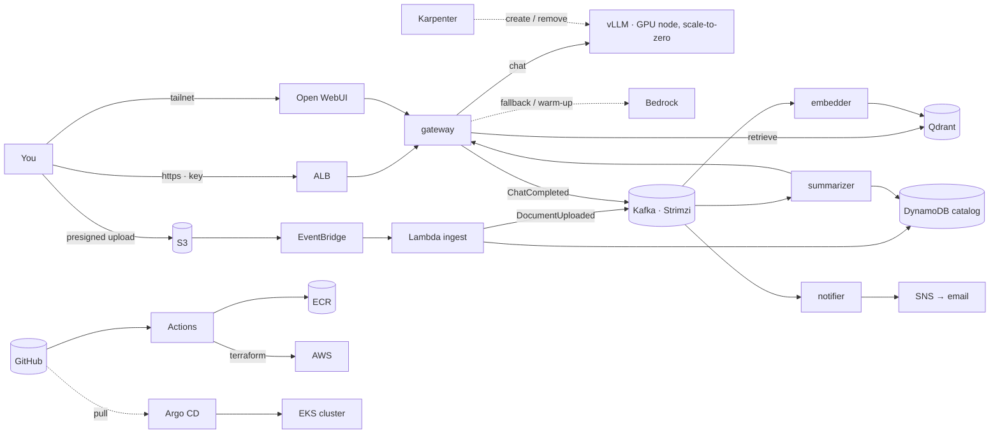

# SteakLLM -- A Learning Path

**Document intelligence on AWS.** Drop a document into a bucket and it is ingested, indexed, summarized and tagged; chat over your documents from a browser; get an alert when a new document matches something you watch. Self-hosted inference on a GPU that exists only while it's needed, with Amazon Bedrock as the bridge and the fallback. Everything is built from code, deployed by pipeline, observable, and able to fail one piece at a time without losing work.

> **Status: work in progress — Step 1 of 12 (repository and pipeline foundations).** Nothing is deployed yet. The roadmap below is ticked as steps complete; the plan itself is in [`PLAN.md`](PLAN.md).

## What it does

A user uploads a file through a short-lived presigned S3 URL. S3 tells EventBridge, EventBridge invokes a Lambda that validates the file, hashes it into a document ID, records `uploaded` in DynamoDB and writes one `DocumentUploaded` event into Kafka, then walks away. Three independent worker teams read that log at their own pace: the **embedder** chunks and embeds the document into Qdrant, the **summarizer** asks the LLM for a summary and tags and writes them to the catalog, and the **notifier** turns a matching summary into an email or Slack alert. Chat goes through a **gateway** that speaks the OpenAI API contract and routes each request to vLLM on a scale-to-zero GPU node when it's healthy, or to Bedrock when it isn't. Uploading and chatting never wait on each other, and if the GPU is off, the documents simply wait in the log until it's back.

## Architecture

The full map with every arrow labeled, and a toggle to isolate each of the three loops (upload, chat, delivery), is in [`docs/system-map.html`](docs/system-map.html) (open it in a browser). Every abbreviation is expanded in the [glossary](docs/glossary.md).

Three loops share one cluster. The **upload path** is event-driven and eventually consistent: the catalog shows each document moving `uploaded → indexed → summarized`. The **chat path** is request/response: every request asks "is vLLM healthy right now?" and routes on the answer, never waits, never sticks, and says which backend answered in an `x-backend` header. The **delivery loop** never touches the other two at runtime: GitHub Actions lints, tests, builds, scans and plans every commit; on merge it pushes images to ECR and applies Terraform to AWS through a short-lived OIDC role; Argo CD pulls the manifests and keeps the cluster equal to the repository.

## Why each tool

| Tool                                                                  | Its job here                                                                       | What we'd lose without it                                     |
| --------------------------------------------------------------------- | ---------------------------------------------------------------------------------- | ------------------------------------------------------------- |
| Kafka (Strimzi)                                                       | Ordered, durable event log with independent readers and replay                     | Two consumers of one event; rebuilding the index from history |
| Lambda + EventBridge                                                  | The S3 doorbell and the nightly GPU safety net; runs only when something happens   | A process polling S3 all day                                  |
| EKS + Karpenter + KEDA                                                | Place and heal services; summon the GPU node on demand and remove it when idle     | A GPU billing 24/7 or a hand-run start/stop                   |
| Terraform                                                             | AWS from code, applied by the pipeline                                             | Console clicks nobody can reproduce                           |
| GitHub Actions + Argo CD                                              | CI for every commit; CD for AWS (Terraform) and for the cluster (GitOps)           | Deploying by SSH                                              |
| DynamoDB + S3 + Qdrant                                                | Catalog and status; documents and model weights; vectors                           | State living on one machine                                   |
| Bedrock                                                               | Serverless LLM for the 3–5 minute GPU cold start and for fallback                 | Chat going dark whenever the GPU is off                       |
| Prometheus · Grafana · Loki · OpenTelemetry                        | Numbers, charts, logs, and one trace across the whole pipeline                     | Guessing which hop is slow                                    |
| Secrets Manager · IAM OIDC · Pod Identity · NetworkPolicies · WAF | No secret in git or on disk; one least-privilege role per service; one public door | The prototype's leaked key, again                             |

The complete table with the alternative rejected for each choice is in [`PLAN.md`](PLAN.md#the-architecture-in-one-page); the reasoning behind each decision will live in [`docs/adr/`](docs/adr/).

## Roadmap

- [ ]  **1.** Set up the git repo — skeleton, secret-scanning hooks, protected `main`, first PR
- [ ]  **2.** Bootstrap AWS once by hand — Terraform state bucket, GitHub OIDC roles, budget alarms
- [ ]  **3.** CI/CD pipeline — lint, test, scan, plan on PR, apply on merge, images to ECR
- [ ]  **4.** Event contracts — versioned schemas and the idempotency rules
- [ ]  **5.** Local dev stack — Kafka, MinIO, DynamoDB Local, Qdrant, TEI, Open WebUI on the laptop
- [ ]  **6.** The five services with tests — gateway, embedder, summarizer, notifier, ingest
- [ ]  **7.** Network and cluster — VPC, EKS, the always-on CPU node, Argo CD
- [ ]  **8.** Platform services by GitOps — monitoring, Kafka, Qdrant, secrets, the one public door
- [ ]  **9.** GPU pool — Karpenter, KEDA, vLLM summoned on demand
- [ ]  **10.** Cloud event pipeline and chaos drills — S3, EventBridge, Lambda, DynamoDB, SNS
- [ ]  **11.** Bedrock fallback, tracing, alerts, SLOs, cost dashboard
- [ ]  **12.** Portfolio polish — demo mode, ADRs, walkthrough, public repo

## Cost

Designed for roughly **$100/month idle** (EKS control plane, one small always-on node, the load balancer) plus **$0.81 per GPU-hour only while the GPU is summoned**. Budget alarms exist before the cluster does. The full cost model and the levers are in [`PLAN.md`](PLAN.md#the-architecture-in-one-page).

## Rebuild from nothing

Arrives with Step 12. Until then, [`PLAN.md`](PLAN.md) is the build log: each step is written as explain → command → expected output → done-when, and is ticked when it's met.

## Lineage

This project replaces an earlier single-machine prototype (vLLM, Open WebUI, Qdrant, Prometheus and Grafana in one docker-compose on one GPU instance, rebuilt by Terraform). The prototype's measured numbers and incidents shaped the principles here: contracts over components, budgets before actions, cattle not pets, idempotency everywhere, and cost that follows demand rather than the clock.

## License

MIT — see [`LICENSE`](LICENSE).
