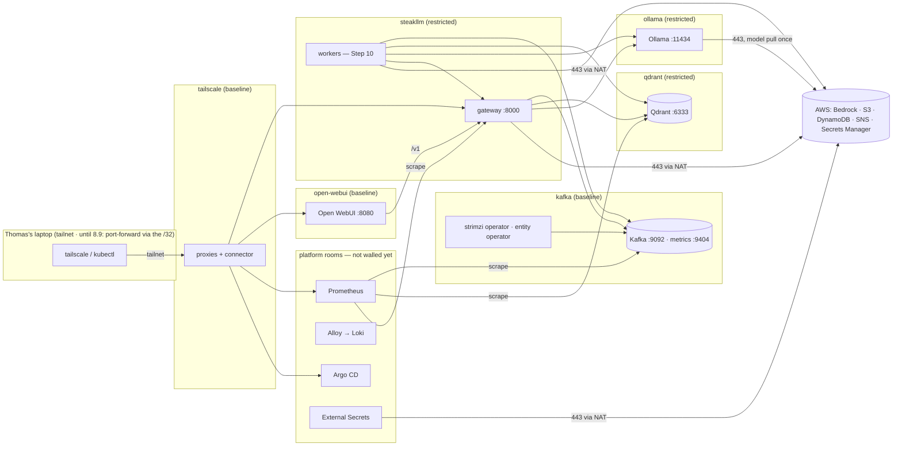

# System map — who may talk to whom (Step 8)

The museum's floor plan: rooms (namespaces), what lives in each, and the doors between them. Every arrow below is a NetworkPolicy in `platform/network-policies/`; anything not drawn is denied in the application rooms. Platform rooms (grey) are not walled until Step 10.

## Rooms

| Namespace | Pod Security | Lives here | Walls |
|---|---|---|---|
| `steakllm` | restricted | gateway (8.8), the four workers (Step 10) | default-deny; egress to Kafka, Qdrant, Ollama, AWS:443; ingress from Open WebUI, Prometheus, Tailscale, itself |
| `kafka` | baseline | Strimzi operator, `steakllm` Kafka (KRaft, 1 node), entity operator | default-deny; ingress 9092 from `steakllm` and itself, 9404 from Prometheus; egress within the room and to the API server |
| `qdrant` | restricted | Qdrant | default-deny; ingress 6333 from `steakllm` and Prometheus |
| `ollama` | restricted | Ollama + model volume, pull job | default-deny; ingress 11434 from `steakllm` and itself; egress 443 (the pull) |
| `open-webui` | baseline | Open WebUI + its redis | default-deny; ingress 8080 from Tailscale; egress to the gateway only |
| `monitoring` | privileged (warn baseline) | Prometheus, Alertmanager, Grafana, node-exporter, kube-state-metrics | open (platform) |
| `logging` | privileged (warn baseline) | Loki, Alloy | open (platform) |
| `argocd` | — | Argo CD | open (platform) |
| `external-secrets` | restricted | ESO | open (platform) |
| `tailscale` | baseline | operator, proxies, connector (8.9) | open (platform) |

## Doors

- **Public door:** none until Step 12 (`aws elbv2 describe-load-balancers` is empty).
- **Admin door:** the tailnet (8.9). Until then, `kubectl port-forward` from the one allowed address.
- **The way out:** the NAT instance (ADR-0007) for AWS APIs and image pulls; S3 and DynamoDB take the free gateway endpoints.

## The proof (8.10)

A throwaway pod in `default` cannot reach `steakllm-kafka-bootstrap.kafka.svc:9092` (the connection times out); the gateway's pod can (its `/readyz` is 200, which is a Kafka metadata call); Prometheus still scrapes every target. Recorded in `PLAN.md` 8.10 with the date.
